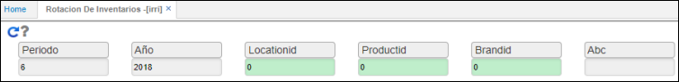
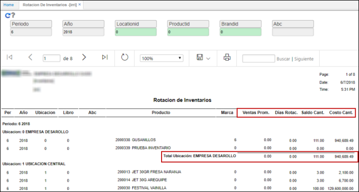

# IRRI - Rotación de Inventarios

El reporte IRRI permite visualizar información referente al cálculo de rotación de inventario del proceso de niveles de stock.  

El reporte puede ser filtrado por periodo, año, ubicación, producto en específico, marca y clasificación ABC.  

Al consultar el reporte con los filtros deseados, visualizaremos información de la rotación de inventario por ubicación, las ventas promedio de cada producto, días de rotación, el saldo actual de unidades y el costeo del saldo del inventario a precio de costo.  

También permite visualizar un total por ubicación y en general.  

El reporte puede ser exportado en PDF, Word o Excel.  

