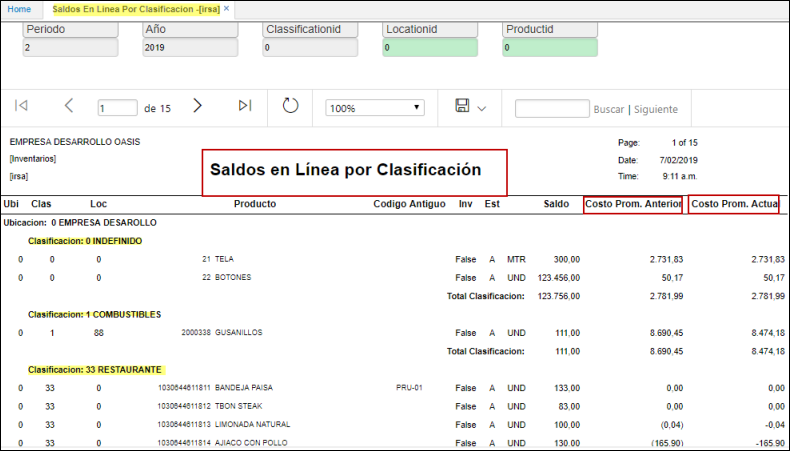

# Saldo en Línea por Clasificación - IRSA

Reporte que permite verificar los saldos en linea por su clasificación, este a su vez permite el filtro de sus datos por: periodo, año, clasificación, ubicacion y Producto.  
Adicional en el reporte **IRSA** puede verificar los costos promedio anteriores y el costo promedio actual; de cada uno de los productos con saldo.

**Periodo:** mes que se desea consultar.  
**Año:** año que desea filtrar.  
**Clasificación:** codigo del BCLA donde se parametrizo el producto.  
**Producto:** Producto *[BPRO]* por el cual se desea consultar, puede utilizar el zoom de busqueda (doble click).  
**Localización:** Locación por la que se desea filtrar segun BUBI, puede utilizar el zoom de busqueda (doble click).  

