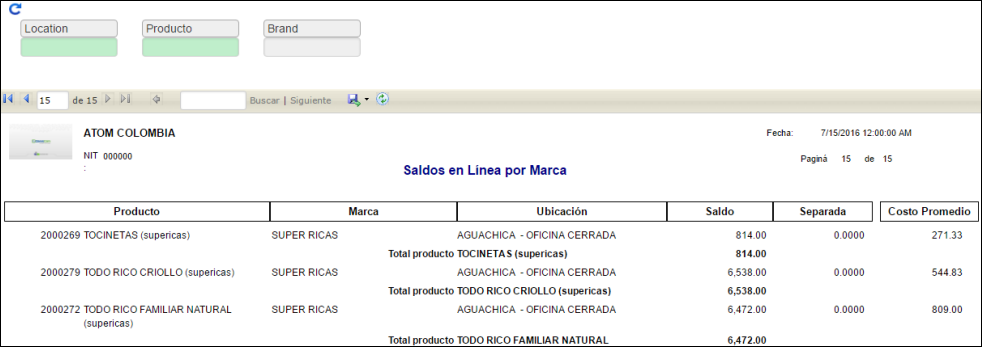

# Saldo Actual por Marca - IRSAQ

Reporte que permite verificar los saldos de productos por su respectiva marca, este a su vez permite el filtro de sus datos por Locación, Producto y Marca.  

**Producto:** Producto por el cual se desea consultar.  
**Locación:** Locación por la que se desea filtrar.  
**Marca:** Marca asociada a los productos.  

