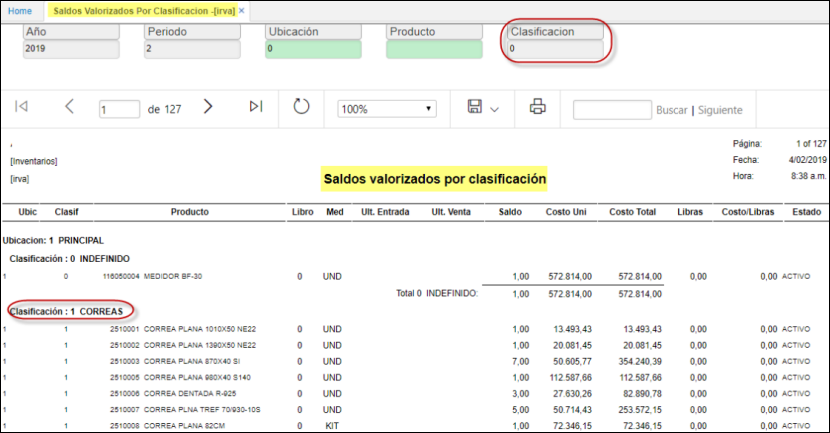

# Saldos Valorizados por Clasificacion - IRVA

El informe de Valorización de Saldos del módulo del módulo de inventarios inventarios **IRVA** permite verificar el saldo en unidades, costo unitario y costo total del inventario a corte de mes.
Este informe adicionalmente permite verificar si en el inventario presenta inconsistencias en saldos y costos acumulados
  

**Año:** Año de la consulta.  
**Periodo:** Mes que desea consultar
**Ubicación:** Ubicación donde se parametrizo segun BUBI.  
**Producto:** Producto por el cual se desea consultar; posee el zoom de busqueda del **BPRO**.  
**Clasificacion:** esta se determina sugun la parametrizacion dada al producto en **BCLA** Basico de Clasificaciones.  

