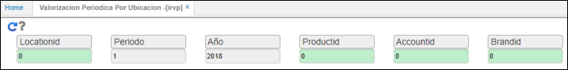
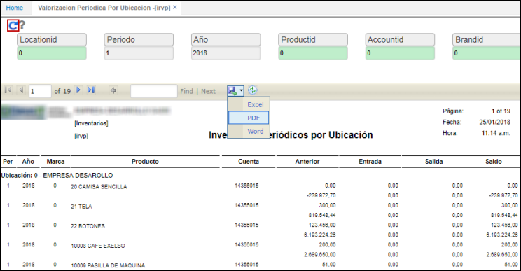

# IRVP - Valorización Periódica por Ubicación

El reporte **IRVP** permite ver los saldos periódicos de inventario por ubicación. El reporte cuenta con unos filtros que permiten facilitar y definir mejor la consulta.  

Ingresamos los datos para la consulta.  

**LocationId:** digitar o seleccionar del zoom la ubicación de donde se desea hacer la consulta de saldos. Si se desean consultar los saldos de todas las ubicaciones ingresamos el número cero (0).  
**Periodo:** ingresar el periodo de consulta.  
**Año:** ingresar el año de consulta.  
**ProductId:** si la consulta se realiza a un producto en específico ingresar el id o seleccionarlo del zoom, de lo contrario, ingresar el número cero (0) para consultar todos los productos.  
**AccountId:** ingresar el número de cuenta contable correspondiente a la consulta. Ingresamos el número cero (0) si la consulta se realiza para todas las cuentas.  
**BrandId:** seleccionar del zoom la marca correspondiente a la consulta.  

Ingresada la información, damos click en el botón  y el sistema arrojará la información. Este reporte puede ser descargado en formato Excel, PDF o Word.  

