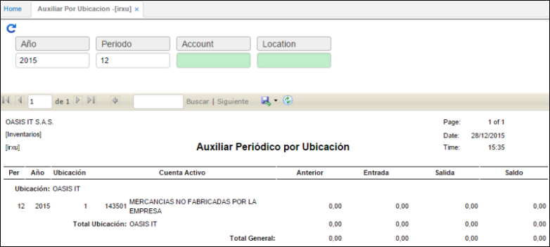

# Auxiliar por Ubicación - IRXU

Este reporte arroja la información de periodo, año, ubicación, cuenta Activo, Anterior Entrada, salida y saldo de auxiliar de inventarios por ubicación, permitiendo realizar filtro por año, periodo, cuenta o localización.  

**Año:** Año que se desea consultar.  
**Periodo:** Mes que se desea consultar.  
**Account:** Cuenta por la que se desea filtrar.  
**Localización:** Número de identificación de localización por el que se desea filtrar.  

