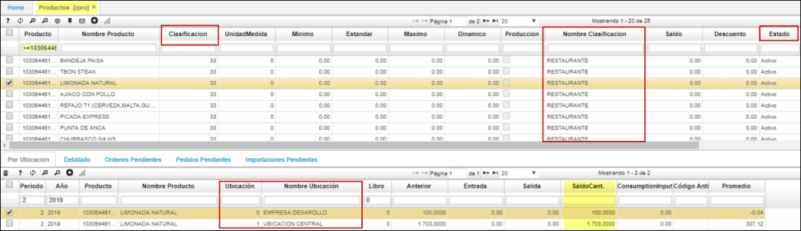
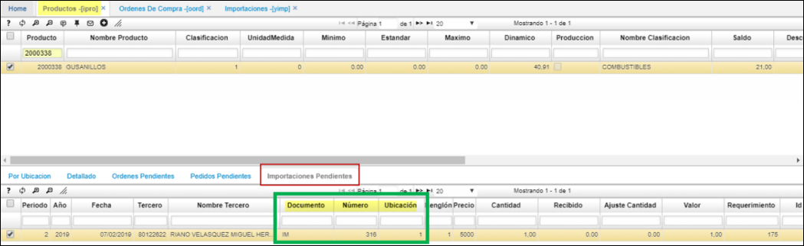
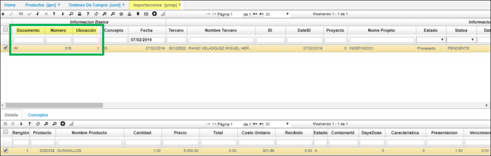
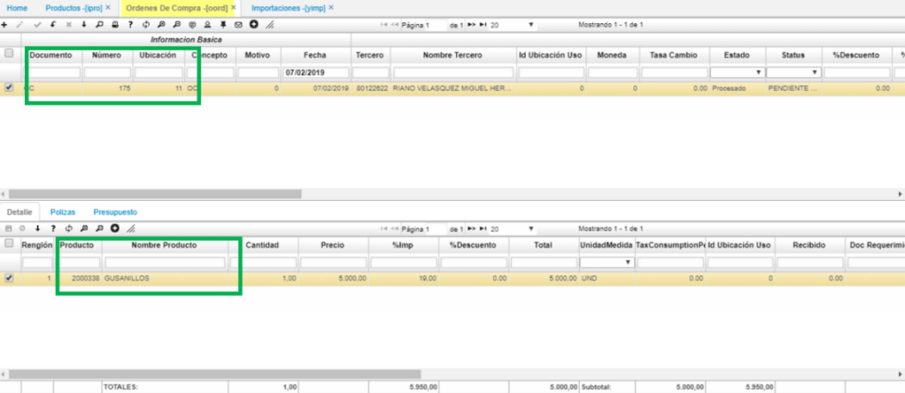

# PRODUCTOS -Saldos - IPRO

Esta aplicación tiene como objetivo mantener una consulta en línea de los **saldos** o existencias actuales de los productos en las bodegas (detalle). Todos los movimientos afectan en línea los saldos, por tanto cualquier consulta tendrá los datos actualizados.  
Productos [IPRO]  

**Código:**       Identificación numérica del producto.                        
**Nombre:**       Nombre especifico del producto.                        
**Clasificación:**Código y nombre de la clasificación del producto indicado, [BCLA].                        
**Unidad Medida:** Hace referencia a la unidad de medida del producto ejemplo, unidad [BMED].
**País Origen:**  Nombre del país origen de donde viene el producto, [BUBG].  
**Estado:**       Estado en el cual se encuentra el producto, Activo, Inactivo.  

## En [IPRO], pestaña 'Importaciones Pendientes'
Esta Pestaña se utiliza para para listar las importaciones **[YIMP]** pendientes; por cada uno de los productos.
Ejemplo:

* Importación [YIMP]

* ORDEN DE COMPRA  [OORD].

