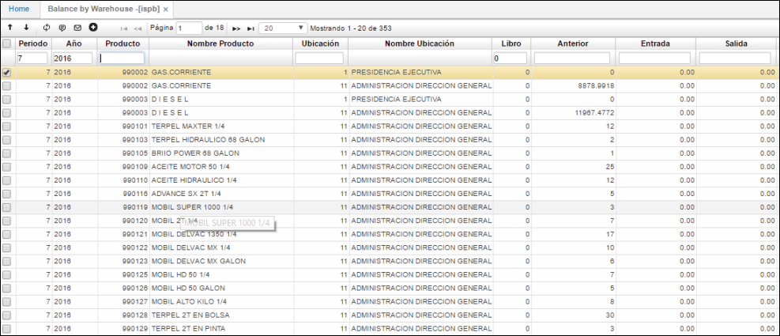

# Saldos por Bodega - ISPB

Aplicación que permite la consulta de los saldos periódicos por Bodega.  

**Periodo:**  Hace referencia al mes de la consulta.  
**Año:** Hace referencia al año de la consulta.  
**Ubicación:** Número de ubicación de la empresa en donde se encuentra el producto.  
**Producto:** Código asignado al producto, anteriormente parametrizado en **BPRO**.
**Libro:** Hace referencia al libro consultado.  
**Anterior:** Saldo que viene de periodos anteriores.  
**Entrada:** Cantidad de unidades que ingresan de un producto en un periodo.  
**Salida:** Número de unidades que salen del inventario en un periodo.  
**Saldo cantidad:** Cantidad existente de unidades de un producto en determinado periodo.  

