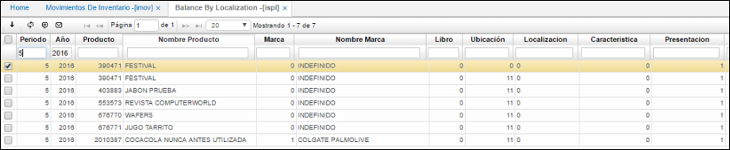

# Saldos por Localización - ISPL

Aplicación que permite la consulta de saldos periódicos por localización.

**Periodo:**  Hace referencia al mes de la consulta.  
**Año:** Hace referencia al año de la consulta.  
**Producto:** Código asignado al producto, anteriormente parametrizado en **BPRO**.  
**Nombre de producto:** Nombre asociado al producto.  
**Marca:** Marca parametrizada en el producto.  
**Nombre Marca:** Nombre de la marca parametrizada.  
**Libro:** Hace referencia al libro consultado.  
**Ubicación:** Número de ubicación de la empresa en donde se encuentra el producto.  
**Característica:** Código de la característica que se puede atribuir al producto.  
**Presentación:** Forma de presentación del producto  
**Vencimiento:** Fecha de vencimiento del producto.  
**Control:** Número de serial o consecutivo asignado a productos que vende la empresa y poder así identificarlos y llevar un control sobre ellos.  
**Lote:** Lote asociado al producto.  
**Anterior:** Saldo que viene de periodos anteriores.  
**Entrada:** Cantidad de unidades que ingresan de un producto en un periodo.  
**Salida:** Número de unidades que salen del inventario en un periodo.
**Saldo cantidad:** Cantidad existente de unidades de un producto en determinado periodo.  

