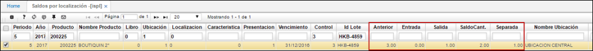

# Saldos por Localización - ISPL

Aplicación que permite la consulta de saldos periódicos por localización.

**Periodo:**  Hace referencia al mes de la consulta.  
**Año:** Hace referencia al año de la consulta.  
**Producto:** Código asignado al producto, anteriormente parametrizado en **BPRO**.  
**Nombre de producto:** Nombre asociado al producto.  
**Marca:** Marca parametrizada en el producto.  
**Nombre Marca:** Nombre de la marca parametrizada.  
**Libro:** Hace referencia al libro consultado.  
**Ubicación:** Número de ubicación de la empresa en donde se encuentra el producto.  
**Característica:** Código de la característica que se puede atribuir al producto.  
**Presentación:** Forma de presentación del producto  
**Vencimiento:** Fecha de vencimiento del producto.  
**Control:** Número de serial o consecutivo asignado a productos que vende la empresa y poder así identificarlos y llevar un control sobre ellos.  
**Lote:** Lote asociado al producto.  
**Anterior:** Saldo que viene de periodos anteriores.  
**Entrada:** Cantidad de unidades que ingresan de un producto en un periodo.  
**Salida:** Número de unidades que salen del inventario en un periodo.  
**Saldo cantidad:** Cantidad existente de unidades de un producto en determinado periodo.  

### Inventario Periódico e Inventario Cíclico

La aplicación **ISPL** permite validar que el inventario haya sido ajustado correctamente, esto luego de haber procesado los documentos de entradas y salidas anteriormente en la aplicación [**IMOV - Movimientos de Inventarios**](http://docs.oasiscom.com/Operacion/scm/inventarios/imovimient/imov).  

Podemos filtrar por periodo, año y ubicación para que el sistema nos arroje los productos a los cuales se les realizó inventario. Igualmente, si deseamos consultar los productos a los cuales se les realizaron documentos de ajustes en la aplicación [**IMOV - Movimientos de Inventarios**](http://docs.oasiscom.com/Operacion/scm/inventarios/imovimient/imov), ingresamos el código del producto en el campo _Producto_ y de ser necesario las demás características que se asocien al mismo.  

En este caso, consultaremos el producto _200225_ al cual se le realizó un documento de Salida de Inventario.  

En la imagen podemos observar en el campo _Anterior_ la cantidad de existencias del producto consultado que registraba el sistema, al realizar el inventario se indicó que de dicho producto solo se encontraban dos unidades, por lo tanto el sistema realizó el documento de Salida de Inventario por una unidad.  

