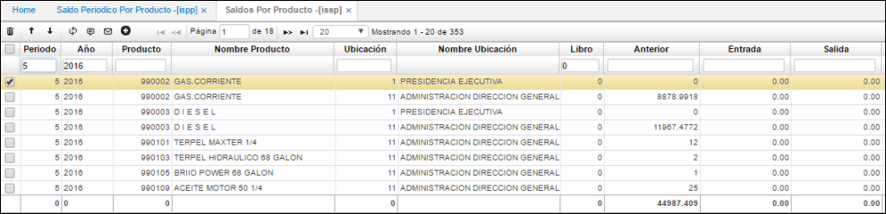
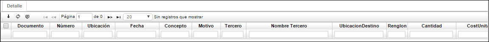

# Saldos de Inventario - ISSP

Aplicación que permite la consulta de saldos del módulo de inventarios por producto.  

**Periodo:**  Hace referencia al mes de la consulta.  
**Año:** Hace referencia al año de la consulta.  
**Producto:** Código asignado al producto, anteriormente parametrizado en **BPRO**.  
**Nombre de producto:** Nombre asociado al producto.  
**Ubicación:** Número de ubicación de la empresa en donde se encuentra el producto.  
**Libro:** Hace referencia al libro consultado.  
**Anterior:** Saldo que viene de periodos anteriores.  
**Entrada:** Cantidad de unidades que ingresan de un producto en un periodo.  
**Salida:** Número de unidades que salen del inventario en un periodo.  
**Saldo cantidad:** Cantidad existente de unidades de un producto en determinado periodo.  
**Consumo:**  Número de unidades consumidas internamente por la empresa de un determinado producto.  

Existe una pestaña llamada Detalle en la aplicación **ISSP**, que nos permite verificar los movimientos asociados a los productos del registro maestro.  

**Documento:** Documento del movimiento asociado al producto.  
**Numero:** Numero consecutivo del movimiento asociado al producto.  
**Ubicación:** Ubicación del movimiento.  
**Fecha:** Fecha del movimiento.  
**Concepto:** Concepto del movimiento.  
**Motivo:** Motivo del movimiento.  
**Tercero:** Tercero asociado al movimiento.  
**Nombre de Tercero:** Nombre de tercero asociado al movimiento.  
**Renglón:** Renglón de detalle asociado al movimiento.  
**Cantidad:** Cantidad de productos a los que se realizó el movimiento.  
**CostUnitary:** Costo unitario por cada producto.  
**Vencimiento:** Fecha de vencimiento parametrizada en el movimiento.  
**Lote:** Lote asociado al producto en el movimiento.  

