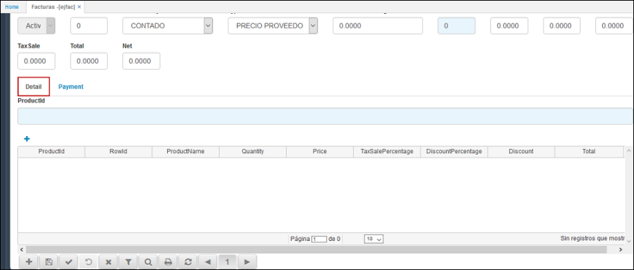

# EJFAC - Facturas

La aplicación **EJFAC** es la versión Post-Touch para facturación, adaptable para tablets y dispositivos móviles, cumpliendo con la misma función de la versión web.  

Los campos que sean de fondo azul indican que tienen zoom, en el cual pueden consultar datos relacionados con el nombre del campo, para acceder se hace doble click sobre el mismo.  

**DocumentId:** Documento parametrizado con anterioridad en la aplicación [**BDOC - Documentos**](http://docs.oasiscom.com/Operacion/common/bsistema/bdoc). Este documento puede ser FA (Factura) o DE (Devolución). Este campo consta con un zoom, en el cual al dar doble click se pueden consultar los documentos disponibles.  

**NumberId:** Consecutivo de documento automático.  
**LocationId:** Ubicación de punto de venta.  
**Date:** Fecha de registro de la factura.  
**ConceptId:** Iniciales del concepto por el cual se desea realizar el documento. Los conceptos se deben parametrizar previamente en la aplicación [**BCON - Conceptos**](http://docs.oasiscom.com/Operacion/common/bsistema/bcon), en este caso el concepto puede ser FA (Factura) o DE (Devolución).  
**MotiveId:** Este se encuentra definido como 0.  
**ClientId:** Número de identificación del cliente al cual se le realiza el documento.  
**ClientName:** El nombre del cliente el sistema lo arroja automáticamente después de diligenciar el número de identificación.  
**State:** El estado es asignado por el sistema, al crear una nueva factura el estado será _Activo_, al confirmarla pasará a _Procesado_ o si la factura es anulada su estado será _Anulado_.  
**VendorId:** Número de identificación de la persona que se encuentra facturando.  
**ConditionPaymentId:** Representa un acuerdo establecido con clientes y proveedores en forma de tipos de descuento y plazos de pago, las diferentes opciones de condición de pago se encuentran parametrizadas en la aplicación [**BCND - Condiciones de Pago**](http://docs.oasiscom.com/Operacion/common/bcomer/bcnd).  

**TypePriceId:** seleccionar el tipo de precio que se asignará a la factura. Los tipos de precio deben estar previamente parametrizados en la aplicación [**FBTP - Tipo de Precio**](http://docs.oasiscom.com/Operacion/scm/facturacion/fbasica/fbtp).

**DiscountPercentage:** Si se desea que el total de la factura tenga un porcentaje de descuento se debe ingresar en este campo el número y este hará el descuento en el valor total de la factura.  
**WarehouseId:** ingresar el Id del almacén que realiza el documento.  
**Brute:** valor bruto del total del documento que se realiza.  
**Discount:** valor del descuento.  
**Subtotal:** valor subtotal del documento.  
**TaxSale:** ingresar el valor por impuesto a las ventas.  
**Total:** ingresar el valor total del documento.  

En la parte derecha de la ventana se encuentra la pestaña _Detalle_, en donde se seleccionará el producto correspondiente al documento que se realiza, ya sea que se factura o se realiza devolución.  

**ProductId:** ingresar el código del producto o seleccionarlo desde el zoom, para ingresar dar doble click sobre el campo, seleccionar el producto y cerrar la ventana del zoom.  

Seleccionado el producto, se debe dar click en el botón  para que este sea adjuntado a la lista de productos.  

