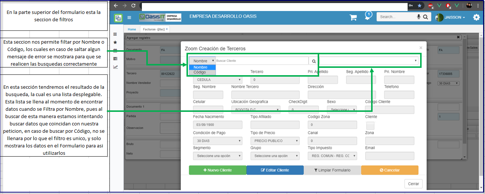
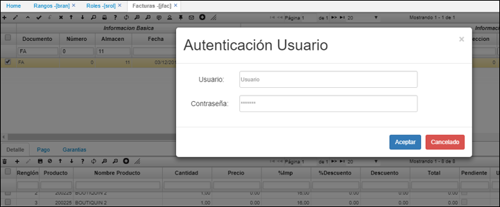

# Facturas - JFAC

**Menú**

* [JFAC - Facturas](http://docs.oasiscom.com/Operacion/scm/pos/jcajero/jfac#jfac---facturas)
* [Liquidación por Vencimiento](http://docs.oasiscom.com/Operacion/scm/pos/jcajero/jfac#liquidación-por-vencimiento)
* [Fidelización de clientes](http://docs.oasiscom.com/Operacion/scm/pos/jcajero/jfac#fidelización-de-clientes)

## [**JFAC - Facturas**](http://docs.oasiscom.com/Operacion/scm/pos/jcajero/jfac#jfac---facturas)

Aplicación que permite elaborar facturas o devoluciones que se realicen en el punto de venta, estas son discriminadas por turnos para tener control sobre la cantidad de cajeros existentes.  

**Documento:** Documento parametrizado con anterioridad en el sistema. Este documento puede ser FA (Factura) o DE (Devolución).  
**Número:** Consecutivo de documento automático.  
**Ubicación:** Ubicación de punto de venta.  
**Fecha:** Fecha de registro de la factura.  
**Concepto:** Iniciales del concepto por el cual se desea realizar el documento Éste se debe parametrizar previamente en el sistema, en este caso el concepto puede ser FA (Factura) o DE (Devolución).  
**Motivo:**  Este se encuentra definido como 0.  
**Vendedor:** Número de identificación de la persona que se encuentra facturando.  
**Condición de Pago:** Representa un acuerdo establecido con clientes y proveedores en forma de tipos de descuento y plazos de pago, las diferentes opciones de condición de pago se encentran parametrizadas en la opción BCND.  
**Tipo de precio:** Precio debidamente parametrizado en la aplicación FBTP.  
**Tercero:** Número de identificación del tercero al cual se carga el movimiento.  

En este se encuentran parametrizados dos tipos de Zooms que se visualizan al dar clic derecho. El primero es buscar cliente y el segundo crear tercero.  

El zoom _**“buscar cliente”**_ que realiza la búsqueda de clientes para la selección de estos Cuando se despliega la ventana emergente Zoom, encontramos diferentes campos por los que podemos realizar el filtro, ejemplo en el campo tercero podemos buscar la cédula o el número de identificación del cliente o en el nombre tercero podemos poner el nombre del cliente, o su apellido para encontrarlo.  

Cómo podemos ver, al hacer clic en el nombre del cliente y dar aceptar el sistema trae automáticamente el nombre del tercero.  

El zoom _**“Crear Cliente”**_ permite realizar de manera directa la creación de un nuevo cliente.  

Al ingresar en este en la parte superior se evidencia un signo + el cual hace referencia a la creación de un nuevo registro, al seleccionarlo se evidencian los campos que permiten realizar la adición de un nuevo cliente.  

Al generarse el nuevo registro debemos diligenciar los siguientes campos cómo mínimo:  

En el caso que el registro nuevo sea de cliente, los campos requeridos son:  

* Tercero  
* Campos nombres y apellidos  
* Nombre Tercero  
* Tipo Cliente   
* Tipo de precio  

En caso que el cliente sea una empresa debemos tener en cuenta lo siguiente:  

* Tercero  
* Nombre Tercero  
* Tipo Cliente  
* Tipo de precio  
* Check digit  

Al terminar de ingresar los datos, en especial los requeridos se selecciona sobre el botón guardar de la parte superior de la ventana del zoom y se da click sobre el botón aceptar de la parte inferior.  

Para ingresar sobre la factura el cliente creado, se selecciona sobre el registro nuevo y automáticamente queda ingresado en el campo tercero del formulario JFAC - Facturas.  

Si se desea que el total de la factura tenga un porcentaje de descuento se debe ingresar en el campo **“% porcentaje”** y este hará el descuento en el valor total de la factura.  

Al realizar una factura en JFAC, es posible relacionar una solicitud de crédito realizada previamente en la aplicación **CSOL - Solicitudes de Crédito**, para ello, en el zoom _Número1_ seleccionaremos la solicitud que corresponda a la factura que se registra, este zoom permite ver el saldo de la solicitud del crédito para conocer el valor por el cual se puede realizar la factura.  

Posteriormente damos click sobre el botón _Guardar_.  

### [Pestaña _Detalle_](http://docs.oasiscom.com/Operacion/scm/pos/jcajero/jfac#pestaña-detalle)

En la pestaña “Detalle” en la parte inferior de la aplicación, existe la opción de inserción de producto mediante el lector de código de barras, este funciona ubicándose en el campo producto y utilizando el lector se realiza la lectura del código de barras del producto, de esta manera se registra la venta del producto y se completará la información en los campos Nombre Producto, Cantidad, Precio y %Descuento (Si aplica). Igualmente, en caso de no contar con el lector del código de barras en el campo producto se puede registrar manualmente el código del producto y al dar TAB se diligencian los campos de nombre de producto, cantidad precio y %Descuento (Si aplica), si el producto no trae asociado un % descuento, podemos ingresarlo manualmente y este se aplicará solo al producto al que se ingresó.  

### [Cambio de campos con credenciales](http://docs.oasiscom.com/Operacion/scm/pos/jcajero/jfac#cambio-de-campos-con-credenciales)

Esta funcionalidad permite al usuario la modificación de los campos _Precio_, _% Descuento_ y _Descuento_ cuando dichos campos estén bloqueados, donde pedirá credenciales de usuario y permita la modificación de los mismos.  

##### Parametrización

Para poder modificar dichos campos primero se debe realizar una parametrizacion en la opcion [**BRAN - Rangos**](http://docs.oasiscom.com/Operacion/common/btercer/bran), en donde por documento y por rol definimos que rangos de valores tiene permitido el usuario ingresar.   

El campo _Tipo_ tiene tres letras importantes con relación de los rangos permitidos en los campos, en donde consta de las siguientes caracteristicas:  

**P:** Precio
**D:** % Descuento
**V:** Descuento (valor)

Los campos de _Mínimo_ y _Máximo_ son los encargados de indicar los rangos permitidos que puede ingresar el rol asociado.  

Seguidamente, en la aplicación [**SROL - Roles**](http://docs.oasiscom.com/Operacion/system/sacceso/srol), en el detalle en la pestaña _Campos_, definimos que campos no serán editables, con el fin de que cuando se abra la aplicación y se inserte o actualice algún valor de los campos parametrizados, podamos realizar el funcionamiento de cambio de valor.  

En campo renglón, indicar a que tab queremos afectar, es decir, el **Renglón 0** afectará al maestro y el **Renglon 1** al primer tab del detalle, y así con los que se deseen.  

##### Proceso

Una vez realizadas las parametrizaciones en las anteriores aplicaciones, vamos a verificar el funcionamiento en la opcion **JFAC - Facturas**.  

En el siguiente ejemplo tomamos como referencia la factura: Documento: FA, Numero: 0, Almacen: 11.  

En el detalle que se ve editable, utilizaremos el campo de _Precio_, en donde el valor que actualmente tiene es de 123, ahora solo damos doble click sobre el campo y veremos que se muestra una modal solicitando credenciales de usuario.  

La autenticación del usuario solicitará el usuario y su contraseña, el sistema lo que hará una vez demos click en el botón _Aceptar_ es validar que el usuario exista, este usuario puede ser cualquiera al que inició sesion en la aplicación.  

Haremos un ejemplo del funcionamiento, en donde ingresaremos datos erroneos.  

El mensaje de error sólo valida que el usuario exista, más no que la contraseña esté correcta, pues no es necesario realizar una serie de validaciones a fondo ya que no es un inicio de sesion normal a la aplicación.  

Si utilizamos un usuario existente y damos click en _Aceptar_, se mostrará el mensaje de **Usuario Válido**. Una vez el sistema autentica el usuario, se visualizará otra pestaña en donde podremos realizar el cambio del valor de nuestro campo.  

El valor que ingresaremos será 3.5, donde al ser el campo de _Precio_ este restará el valor digitado.  

El valor que estaba en el campo _Precio_ era de 123 y con el valor de 3.5 quedará a 119.5.  

En el campo **% Descuento**, ingresaremos un valor de 123 en donde saldrá un error indicando que el valor no se encuentra en el rango permitido y mostrará los rangos Minimos y Maximos en los que se puede modificar.  

Si ingresamos un valor entre los rangos permitidos, el sistema dejará ingresar el valor al detalle.  

_**Nota:** En la opcion del BRAN - Rangos, se pueden parametrizar diferentes Rangos a diferentes Roles, pero si un usuario tiene más de un Rol, el sistema tomará el de menor jerarquía, es decir, si un usuario tiene el Rol 18, y el Rol 100, tomará la parametrización del Rol 18._  

### [Pestaña _Pago_](http://docs.oasiscom.com/Operacion/scm/pos/jcajero/jfac#pestaña-pago)

Permite realizar la modificación de la forma de pago de la factura, en el campo forma de pago se debe modificar la misma, puede ser efectivo, débito, crédito entre otros, esto se parametriza previamente en el sistema en la aplicación BFOR. Igualmente, en esta pestaña se puede consultar el valor de la factura y el impuesto del mismo.  

Si el cliente nos entrega un monto mayor al total de la factura y la forma de pago es “efectivo”, podemos visualizar el cambio, o como comúnmente es llamado “vueltas” en el campo del registro maestro “Cambio”, ingresando el monto inicial dado por el cliente en el campo total. Ejemplo:  

Tenemos nuestra factura por un valor de $50.170 y en estado activo.  

En el campo valor ingresaremos el monto que nos entrega el cliente y guardamos, en este caso el cliente nos dio la suma de $60.000.  

Por último, procesamos la factura y verificamos el campo cambio, que nos indicara el valor a devolver al cliente (Note que el campo _“valor”_, vuelve a su estado original: el valor total de la factura.)  

Si no se desea realizar el proceso de cambio, al terminar de realizar la factura, también se debe procesar el registro en el botón **_Procesar_**, este cambiará el estado de activo a procesado, indicando que la factura quedo terminada e impidiendo que sus datos sean modificados.  

Al procesar, el registro sobre el maestro se puede evidenciar los campos Valor Bruto, descuento, Subtotal, impuesto, Total, Neto y de la misma manera se encuentra un campo tipo Check con nombre impreso que nos indica si la factura ya fue procesada o no.  

**Nota:** Para realizar la impresión del Boucher de la factura se debe dar clic sobre el botón imprimir, teniendo en cuenta que el registro de factura debe estar procesado.  

En caso de tener parametrizada la forma de pago Nómina, se puede tener la opción de imprimir un voucher que nos indica el nombre del tercero y el valor a descontar por nómina, cómo se muestra a continuación.  Dando click sobre el botón “Imprimir Colilla”.  

### [Pestaña _Garantías_](http://docs.oasiscom.com/Operacion/scm/pos/jcajero/jfac#pestaña-garantías)

A través de esta pestaña el usuario podrá asignar garantías a los productos facturados en el maestro.  

Creamos un nuevo registro y diligenciamos los datos, seguidamente

## [Liquidación por Vencimiento](http://docs.oasiscom.com/Operacion/scm/pos/jcajero/jfac#liquidación-por-vencimiento)

Esta funcionalidad realiza la liquidación de diferentes precios de un mismo producto con base a los vencimientos que este tenga. Esto, con previa parametrización en las opciones [**WVAR - Variables**](http://docs.oasiscom.com/Operacion/dss/bsc/wbasica/wvar#parametrización-liquidación-por-vencimiento) y [**FDES - Descuentos**](http://docs.oasiscom.com/Operacion/scm/facturacion/fprecio/fdes#parametrización-liquidación-por-vencimiento). (_Ver aplicaciones_)  

Al crear una factura en JFAC e ingresar al zoom para seleccionar el producto, podremos ver que según las fechas de vencimiento el sitema tomó el descuento.  

## [Fidelización de clientes](http://docs.oasiscom.com/Operacion/scm/pos/jcajero/jfac#fidelización-de-clientes)

El proceso de _Fidelización de Clientes_ permite que por cada compra que realice un cliente, este acumule puntos que podrá redimir en una próxima compra.  

#### Parametrización

Inicialmente se requiere hacer la siguiente parametrización.  

[**BTER - Terceros**](http://docs.oasiscom.com/Operacion/common/btercer/bter#parametrizaci%C3%B3n-fidelizaci%C3%B3n-de-clientes)  

En la aplicación **BTER** se deben registrar los clientes que podrán acumular puntos. En el momento del registro, se deberá marcar el flag _**Frecuente**_ ubicado en la pestaña del detalle llamada _Ventas_, esto permitirá al sistema identificar que por cada compra que realice dicho cliente, este acumulará puntos.  

[**FDES - Descuentos**](http://docs.oasiscom.com/Operacion/scm/facturacion/fprecio/fdes#parametrizaci%C3%B3n-fidelizaci%C3%B3n-de-clientes)

En la aplicación **FDES** se deberá crear un registro correspondiente a _Tarifa Puntos_, en el cual indicaremos el rango de **fecha inicial** y **fecha final** en el cual aplicará la adquisición de puntos por compras. Por ejemplo, el cliente podrá adquirir puntos por sus compras desde el 4 de julio del 2018 hasta el 31 de julio del 2018.  

También se deberá registrar en el campo **Tarifa** el valor que definirá cada cuanto acumularán puntos los clientes y en el campo **Tariff Substraction** se indica la cantidad de puntos que adquirirá de acuerdo con la tarifa. Por ejemplo, por cada 100 pesos del valor de la compra, el cliente acumulará un punto, es decir, que si un cliente hace una compra de 1.000 pesos tendrá 10 puntos.  

[**BFOR - Descuentos**](http://docs.oasiscom.com/Operacion/common/bcomer/bfor#parametrización-fidelización-de-clientes)

En la aplicación **BFOR** se debe parametrizar la forma de pago _Redención Puntos_, la cual se asignará como forma de pago en la compra del cliente que quiera usar sus puntos acumulados.  

**Forma Pago:** ingresar el consecutivo que corresponda teniendo en cuenta las formas de pago ya registradas.  
**Nombre forma pago:** asignar el nombre _Redención Puntos_.  
**Tipo:** seleccionar el tipo _Puntos_.  
**Código:** ingresar el código _PUR_.  

#### Proceso Fidelización de Clientes  

De acuerdo con la parametrización anterior, en la aplicación **JFAC** se realizará la factura de compra del cliente registrado en la aplicación [**BTER - Terceros**](http://docs.oasiscom.com/Operacion/common/btercer/bter#parametrizaci%C3%B3n-fidelizaci%C3%B3n-de-clientes).  

El valor de la compra fue de 1.786 pesos, es decir, que el cliente acumuló 17 puntos.  

Seguidamente, ingresamos a la aplicación [**ASSP - Saldos de Clientes**](http://docs.oasiscom.com/Operacion/crm/mercadeo/wfidelizacion/assp#fidelizaci%C3%B3n-de-clientes) a verificar los puntos acumulados.  

## [Redimir puntos acumulados](http://docs.oasiscom.com/Operacion/scm/pos/jcajero/jfac#redimir-puntos-acumulados)

Si un cliente desea redimir sus puntos acumulados o una parte de ellos en alguna compra, se debe crear normalmente la factura en la aplicación **JFAC** y en la pestaña del detalle _Pago_ ingresar un renglón en donde la forma de pago sea _PUNTOS_.  

A continuación, veremos un ejemplo en donde la compra realizada por el cliente tiene un valor subtotal de $700.  

Ahora en la pestaña _Pago_ ingresaremos la forma de pago _PUNTOS_ en la cual se indicará la cantidad de puntos que desea redimir el cliente para esa compra. En caso de que la cantidad de puntos no cubra el total del valor de la factura, se debe ingresar la(s) otra(s) formas de pago con las cuales se completará el pago.  

En el siguiente ejemplo el cliente redimirá 100 puntos, estos son ingresados en el campo **Valor**. Como la compra era por un total de $833, el sistema creó la forma de pago _EFECTIVO_ con el saldo restante teniendo en cuenta la condición de pago ingresada en el maestro la cual era _CONTADO_.  

Finalmente, se procesa la factura y se verifican los saldos de puntos acumulados en la aplicación [**ASSP - Saldos de Clientes**](http://docs.oasiscom.com/Operacion/crm/mercadeo/wfidelizacion/assp#saldo-al-redimir-puntos-acumulados) para el cliente correspondiente. Vale aclarar que como el cliente redimió sólo 100 puntos en el ejemplo anterior y tuvo que pagar el restante que eran $733, obtuvo 7 puntos más.  

Verificamos el nuevo saldo de puntos acumulados en [**ASSP - Saldos de Clientes**](http://docs.oasiscom.com/Operacion/crm/mercadeo/wfidelizacion/assp#saldo-al-redimir-puntos-acumulados).  

Aquí finaliza el proceso de _fidelización de clientes_.  

