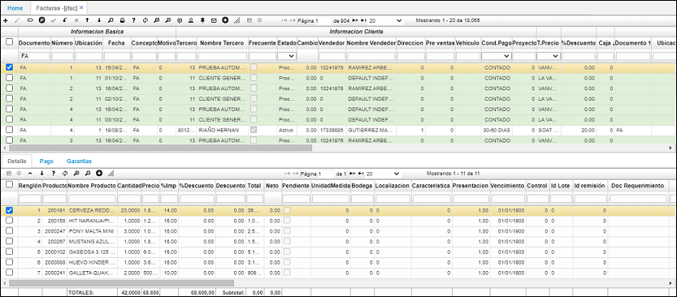
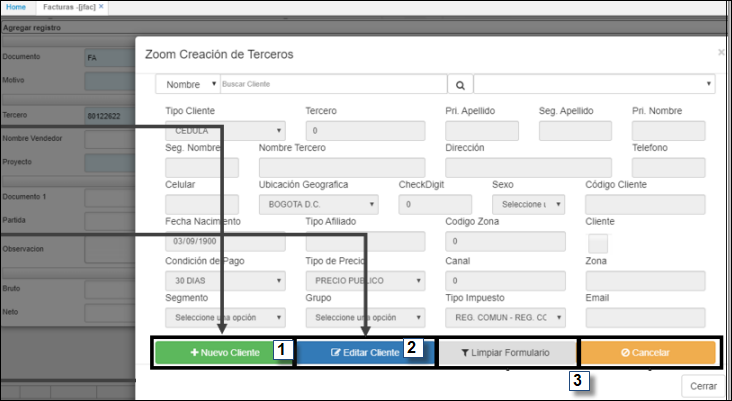
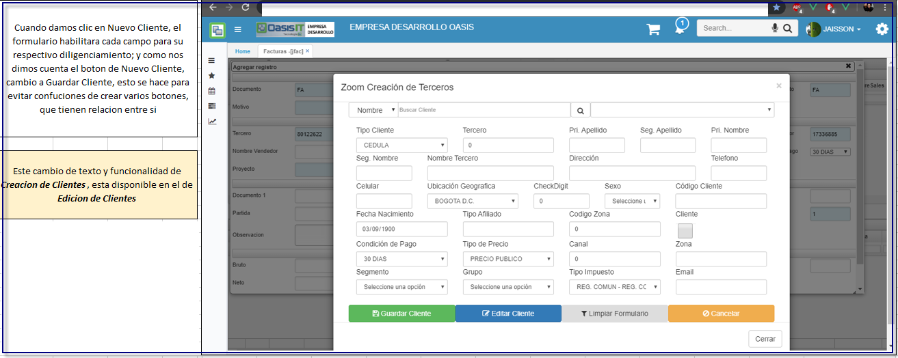
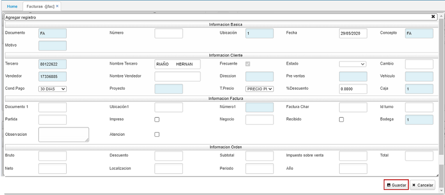

# Facturas - JFAC

Aplicación que permite elaborar facturas o devoluciones que se realicen en el punto de venta, estas son discriminadas por turnos para tener control sobre la cantidad de cajeros existentes.  

**Documento:** Documento parametrizado con anterioridad en el sistema. Este documento puede ser FA (Factura) o DE (Devolución).  
**Número:** Consecutivo de documento automático.  
**Ubicación:** Ubicación de punto de venta.  
**Fecha:** Fecha de registro de la factura.  
**Concepto:** Iniciales del concepto por el cual se desea realizar el documento Éste se debe parametrizar previamente en el sistema, en este caso el concepto puede ser FA (Factura) o DE (Devolución).  
**Motivo:**  Este se encuentra definido como 0.  
**Vendedor:** Número de identificación de la persona que se encuentra facturando.  
**Condición de Pago:** Representa un acuerdo establecido con clientes y proveedores en forma de tipos de descuento y plazos de pago, las diferentes opciones de condición de pago se encentran parametrizadas en la opción BCND.  
**Tipo de precio:** Precio debidamente parametrizado en la aplicación FBTP.  
**Tercero:** Número de identificación del tercero al cual se carga el movimiento.  

En este se encuentran parametrizados dos tipos de Zooms que se visualizan al dar clic derecho. El primero es buscar cliente y el segundo crear tercero.  

El zoom _**“buscar cliente”**_ que realiza la búsqueda de clientes para la selección de estos Cuando se despliega la ventana emergente Zoom, encontramos diferentes campos por los que podemos realizar el filtro, ejemplo en el campo tercero podemos buscar la cédula o el número de identificación del cliente o en el nombre tercero podemos poner el nombre del cliente, o su apellido para encontrarlo.  

Cómo podemos ver, al hacer clic en el nombre del cliente y dar aceptar el sistema trae automáticamente el nombre del tercero.  

El zoom _**“Crear Cliente”**_ permite realizar de manera directa la creación de un nuevo cliente.  

Al ingresar en este en la parte superior se evidencia un signo + el cual hace referencia a la creación de un nuevo registro, al seleccionarlo se evidencian los campos que permiten realizar la adición de un nuevo cliente.  

Al generarse el nuevo registro debemos diligenciar los siguientes campos cómo mínimo:  

En el caso que el registro nuevo sea de cliente, los campos requeridos son:  

* Tercero  
* Campos nombres y apellidos  
* Nombre Tercero  
* Tipo Cliente   
* Tipo de precio  

En caso que el cliente sea una empresa debemos tener en cuenta lo siguiente:  

* Tercero  
* Nombre Tercero  
* Tipo Cliente  
* Tipo de precio  
* Check digit  

Al terminar de ingresar los datos, en especial los requeridos se selecciona sobre el botón guardar de la parte superior de la ventana del zoom y se da click sobre el botón aceptar de la parte inferior.  

Para ingresar sobre la factura el cliente creado, se selecciona sobre el registro nuevo y automáticamente queda ingresado en el campo tercero del formulario JFAC - Facturas.  

Si se desea que el total de la factura tenga un porcentaje de descuento se debe ingresar en el campo **“% porcentaje”** y este hará el descuento en el valor total de la factura.  

Al realizar una factura en JFAC, es posible relacionar una solicitud de crédito realizada previamente en la aplicación **CSOL - Solicitudes de Crédito**, para ello, en el zoom _Número1_ seleccionaremos la solicitud que corresponda a la factura que se registra, este zoom permite ver el saldo de la solicitud del crédito para conocer el valor por el cual se puede realizar la factura.  

Posteriormente damos click sobre el botón _Guardar_.  

### [Pestaña _Detalle_](http://docs.oasiscom.com/Operacion/scm/pos/jcajero/jfac#pestaña-detalle)

En la pestaña “Detalle” en la parte inferior de la aplicación, existe la opción de inserción de producto mediante el lector de código de barras, este funciona ubicándose en el campo producto y utilizando el lector se realiza la lectura del código de barras del producto, de esta manera se registra la venta del producto y se completará la información en los campos Nombre Producto, Cantidad, Precio y %Descuento (Si aplica). Igualmente, en caso de no contar con el lector del código de barras en el campo producto se puede registrar manualmente el código del producto y al dar TAB se diligencian los campos de nombre de producto, cantidad precio y %Descuento (Si aplica), si el producto no trae asociado un % descuento, podemos ingresarlo manualmente y este se aplicará solo al producto al que se ingresó.  

### [Pestaña _Pago_](http://docs.oasiscom.com/Operacion/scm/pos/jcajero/jfac#pestaña-pago)

Permite realizar la modificación de la forma de pago de la factura, en el campo forma de pago se debe modificar la misma, puede ser efectivo, débito, crédito entre otros, esto se parametriza previamente en el sistema en la aplicación BFOR. Igualmente, en esta pestaña se puede consultar el valor de la factura y el impuesto del mismo.  

Si el cliente nos entrega un monto mayor al total de la factura y la forma de pago es “efectivo”, podemos visualizar el cambio, o como comúnmente es llamado “vueltas” en el campo del registro maestro “Cambio”, ingresando el monto inicial dado por el cliente en el campo total. Ejemplo:  

Tenemos nuestra factura por un valor de $50.170 y en estado activo.  

En el campo valor ingresaremos el monto que nos entrega el cliente y guardamos, en este caso el cliente nos dio la suma de $60.000.  

Por último, procesamos la factura y verificamos el campo cambio, que nos indicara el valor a devolver al cliente (Note que el campo _“valor”_, vuelve a su estado original: el valor total de la factura.)  

Si no se desea realizar el proceso de cambio, al terminar de realizar la factura, también se debe procesar el registro en el botón **_Procesar_**, este cambiará el estado de activo a procesado, indicando que la factura quedo terminada e impidiendo que sus datos sean modificados.  

Al procesar, el registro sobre el maestro se puede evidenciar los campos Valor Bruto, descuento, Subtotal, impuesto, Total, Neto y de la misma manera se encuentra un campo tipo Check con nombre impreso que nos indica si la factura ya fue procesada o no.  

**Nota:** Para realizar la impresión del Boucher de la factura se debe dar clic sobre el botón imprimir, teniendo en cuenta que el registro de factura debe estar procesado.  

En caso de tener parametrizada la forma de pago Nómina, se puede tener la opción de imprimir un voucher que nos indica el nombre del tercero y el valor a descontar por nómina, cómo se muestra a continuación.  Dando click sobre el botón “Imprimir Colilla”.  

### [Pestaña _Garantías_](http://docs.oasiscom.com/Operacion/scm/pos/jcajero/jfac#pestaña-garantías)

A través de esta pestaña el usuario podrá asignar garantías a los productos facturados en el maestro.  

Creamos un nuevo registro y diligenciamos los datos, seguidamente

