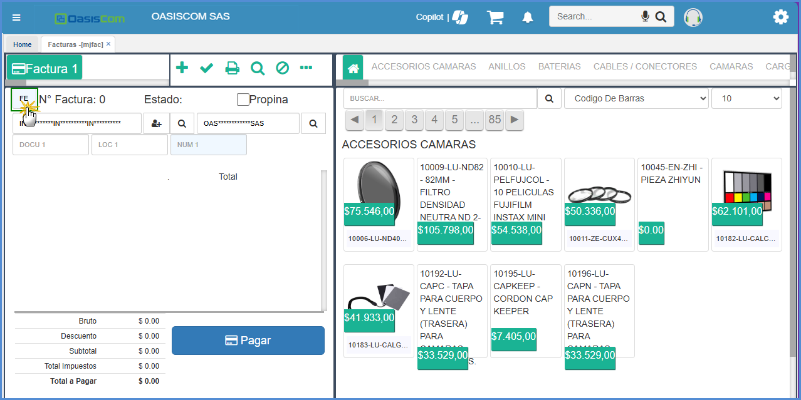

# MJFAC - Facturas

La aplicación MJFAC permite crear facturas por la compra de productos seleccionados mediante la versión post - touch de OasisCom.  

Para crear una factura, damos click en el botón _Agregar_.  

A continuación, seleccionamos los productos a comprar y estos se verán reflejados en la ventana del medio.  

Si deseamos filtrar la búsqueda de los productos, seleccionamos la opción deseada como se muestra a continuación y digitamos el dato correspondiente.  

En la parte inferior la aplicación nos mostrará el valor bruto, descuento, subtotal, total de impuesto y valor total de la factura los cuales se irán acumulando dependiendo del producto y las cantidades seleccionadas.  

En la parte inferior izquierda, podremos seleccionar la forma de pago de la factura.  

Al crear la factura, la condición de pago es asignada automáticamente y se puede ver reflejada en la aplicación **JFAC - Facturas**, allí consultaremos por la fecha en la que se realizó la factura y de ser necesario modificamos dicha condición de pago.  

El precio del producto se visualiza de acuerdo a la parametrización de la aplicación [**BUBI - Ubicaciones Organización**](http://docs.oasiscom.com/Operacion/common/borgan/bubi), en esta aplicación el sistema tomará el precio de la ubicación según lo indicado en el campo _TypePriceDepend_. Si en dicho campo está seleccionada la opción _Ubicación_, se tomará el precio de la aplicación [**BUBI - Ubicaciones Organización**](http://docs.oasiscom.com/Operacion/common/borgan/bubi), es decir, lo indicado en el campo _Tipo Precio_.  

Si por el contrario, en el campo _TypePriceDepend_ está seleccionada la opción _Ninguno_, el sistema tomará la parametrización del tipo de precio de la aplicación [**BTER - Terceros**](http://docs.oasiscom.com/Operacion/common/btercer/bter).  

Parametrización de [**BTER - Terceros**](http://docs.oasiscom.com/Operacion/common/btercer/bter).  

Con esta nueva parametrización el precio del producto en la opción **MJFAC** cambia:  

#### Creación de terceros mediante MJFAC

La aplicación MJFAC permite la creación de terceros dando click en el botón señalado a continuación.  

Se abrirá una ventana donde ingresaremos los datos del tercero, al dar click en el botón _Guardar_, se crea el tercero en la aplicación [**BTER - Terceros**](http://docs.oasiscom.com/Operacion/common/btercer/bter). Es importante diligenciar el tipo de cliente.  

El sistema mediante un mensaje de control informará que el tercero ha sido creado correctamente.  

Consultamos en la aplicación [**BTER - Terceros**](http://docs.oasiscom.com/Operacion/common/btercer/bter) la creación del tercero.  

Finalmente, seleccionados los productos a comprar, las cantidades, la forma de pago y verificada la condición de pago, debemos procesar la factura.  

Esta factura la podremos ver en la aplicación **JFAC - Facturas** al consultar por la fecha en que se realizó.  

### FUNCIONALIDADES EN MJFAC

#### Búsqueda de terceros

El botón  permite consultar los terceros creados y ya existentes en OasisCom.  

Damos click en el botón de búsqueda y el sistema nos arrojará un zoom con todos los terceros. En este zoom también podremos filtrar por número de identificación de un tercero en específico para facilitar la consulta.  

#### Zoom de Documento

Esta funcionalidad nos permite seleccionar el documento con el que se realizará la factura.  

Damos doble click y seleccionamos el documento.  

#### Zoom para relacionar documentos

La aplicación MJFAC, cuenta con una función que permite relacionar los pedidos con el documento a realizar, esto, teniendo en cuenta el tercero y el documento.  

En el campo _Docu1_ ingresamos el documento a relacionar, por ejemplo PD (Pedidos) y damos doble click en el zoom _Num1_ para seleccionar de los pedidos existentes, el correspondiente al documento que se realiza.  

Al seleccionar el pedido, se observará el producto en MJFAC.  

#### Botón _Buscar_   

Cuando demos click en el botón _Buscar_, este nos mostrará las facturas Activas y Procesadas de la fecha actual, para así poder utilizarlas y realizar las diferentes operaciones: Procesar, Reversar.  

Como podemos ver en el resultado del Zoom tenemos varios documentos en estado _Activo_ y _Procesado_, al seleccionar alguno de ellos el ícono de "buscar" cambiará según el estado del documento seleccionado.  

  

Es decir, si el documento seleccionado se encuentra en estado _Activo_ el ícono que se reflejará será el de _Procesar_. Si una factura se encuentra en estado _Activo_, pendiente de ser procesada, el fondo del detalle estará habilitado para realizar todo tipo de accciones.  

Si por el contrario, seleccionamos un documento que se encuentre en estado _Procesado_, el ícono que se reflejará será el de _Reversar_. Si el documento tiene estado _Procesado_ el fondo estará en color Gris y no permitirá ediciones.  

