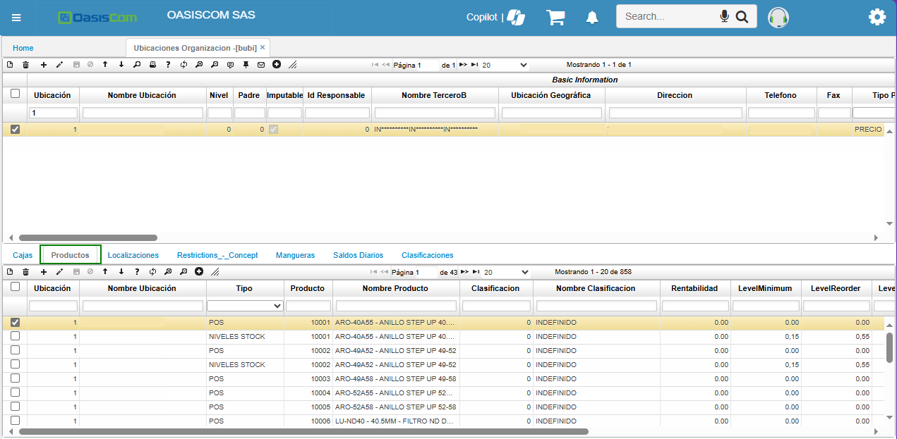

# Facturas - MJFAC

La aplicación **MJFAC - Facturas** permite crear facturas por la compra de productos seleccionados. 

* [Parametrización de Productos](#parametrización-de-productos)
* [Botón Cambiar Condiciones de Factura](#botón-cambiar-condiciones-de-factura)
* [Primer Nivel de Busqueda de Productos](#primer-nivel-de-busquedad-de-productos)
* [Segundo Nivel de Busqueda de Productos](#segundo-nivel-de-busquedad-de-productos)
* [Creación de la Factura](#creación-de-la-factura)

Se ingresa a la aplicación **MJFAC - Facturas**

Para que los productos se visualicen a nivel de la aplicación, se ingresa en el programa **BUBI - Ubicaciones Organización** el cual se realiza la configuración.

En la aplicación **BUBI - Ubicaciones Organización** donde se realiza el punto de venta

En la pestaña **Productos** se indica los productos, donde se indica: 
- Ubicación, que es el punto de venta. 
- Tipo: Debe ser POS
- Producto: Los codigos que estan en esta aplicación, son los mismos que deben estar en la aplicación [**BPRO - Productos**](https://docs.oasiscom.com/Operacion/common/bprodu/bpro) 

Se visualiza la aplicación [**BPRO - Productos**](https://docs.oasiscom.com/Operacion/common/bprodu/bpro) donde esta la información de los productos que se encuentran en la aplicación **BUBI - Ubicaciones Organización** .

Una vez validado el proceso de configuración, para el **MJFAC - Facturas**,  se ejecuta el botón  para crear la factura  

Cuando se habilite la factura, hay un Zoom el cual contiene los documentos que se utilizan para las facturas.

Al momento de ejecutar ese **Zoom**, saldra una ventana emergente donde se reflejan los documentos parametrizados. Los cuales son parametrizados en la aplicación [**BDOC - Documentos**](https://docs.oasiscom.com/Operacion/common/bsistema/bdoc)

# [Botón Cambiar Condiciones de Factura](#botón-cambiar-condiciones-de-factura)

Al ejecutar este botón

Saldra una venta el cual muestra donde se puede ver los **Tipos de Precios**, Lo cual esta parametrizado en la aplicación [**FBTP - Tipos de Precio**]( https://docs.oasiscom.com/Operacion/scm/facturacion/fbasica/fbtp).

También se encuentra el campo **Condiciones de Pago** y se encuentra parametrizado en la aplicación 

En la aplicación **MJFAC - Facturas** se tienen unas clasificaciones que se deben tener en cuenta para el proceso de busquedad de productos 

# [Primer Nivel de Busqueda de Productos ](#primer-nivel-de-busquedad-de-productos)

Todos los productos cuentan con una clasificación, lo cual esta en la aplicación [**BPRO - Productos**](https://docs.oasiscom.com/Operacion/common/bprodu/bpro) en el Campo **Clasificación** 

Los cuales estan parametrizados en la aplicación [**BCLA - Clasificaciones**](https://docs.oasiscom.com/Operacion/common/bprodu/bcla)  

Cada clasificación tiene un número y un nombre. El campo de Nombre, son los mismos nombres que se encuentran en el **MJFAC - Facturas**, dependiendo de como se categorice las clasificaciones y se asignen a los productos. 

# [Segundo Nivel de Busqueda de Productos](#segundo-nivel-de-busquedad-de-productos)

Para este segundo método de busqueda para los productos

- Para el código de barras esto se parametriza por el [**BPRO - Productos**](https://docs.oasiscom.com/Operacion/common/bprodu/bpro) en el campo EanChar, que al momento de leer el producto con el producto, se vea reflejado en el sistema. 

- Nombre de Producto: Cada nombre del producto se escribe en la barra de busquedad.
- Código de Producto: Se digita el código correspondiente del producto.

>**Nota:** Los productos deben estar establecidos con los precios y eso se verifica y parametriza en la aplicación [**FPRE - Precios**](https://docs.oasiscom.com/Operacion/scm/facturacion/fprecio/fpre).

# [Creación de la Factura](#creación-de-la-factura)

A nivel del **MJFAC - Facturas** solo se cuentan con la parametrización de los documentos **DE** y **FE**.

Para adicionar o crear clientes nuevos

 
 Y se abrira una ventana emergente para el cliente.

 

Para consultar clientes, se ejecuta el botón de la lupa si ya esta creado.

Se asigna el vendedor con el Zoom.

Una vez verificado estos parametros, se procede a seleccionar algun producto que se requiera. 

Seleccionar los tres puntos que se encuentran en la palabra **LOTE** 

Al momento de seleccionar los tres puntos, aparece una ventana emergente

La cual indica el mismo producto, pero diferente **LOTE** Y **LOCALIZACIÓN**

Esto permite que se pueda visualizar donde puede sacar y donde tiene disponibilidad del producto.

Se selecciona el número **%0.00** y este al momento abrira una ventana 

Se ejecuta los datos y saldra **Usuario Valida** para que se pueda continuar el proceso. 

Al momento de ejecutar el botón **Aceptar** 

Al momento de terminar el proceso, se efectura la factura 

