# MJFACM - Facturas

La aplicación **MJFACM** del módulo POS, permite crear las facturas de venta de los servicios prestados por Lavaderos de Vehículos.  

Para crear una factura nueva damos click en el botón .  

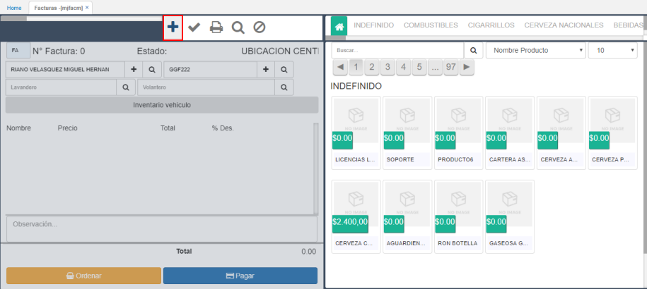

**Cliente:** En el campo resaltado en la siguiente imagen, ingresaremos el cliente que obtendrá el servicio.  

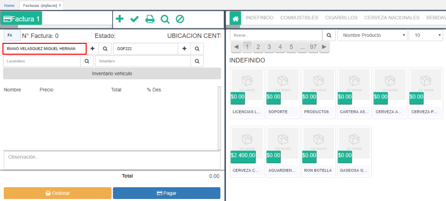

* Si el cliente es nuevo, lo crearemos en el sistema dando click en el botón 

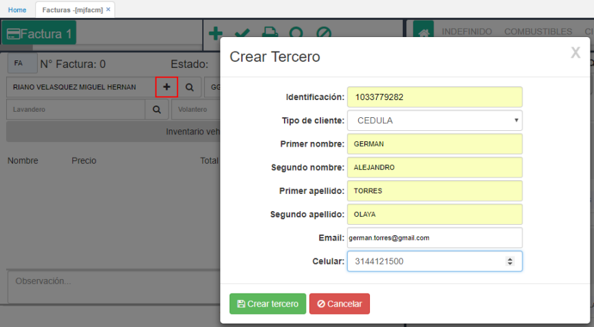

* Si el cliente ya se encuentra registrado en la base de datos, damos click en el botón  y consultamos por número de identificación.  

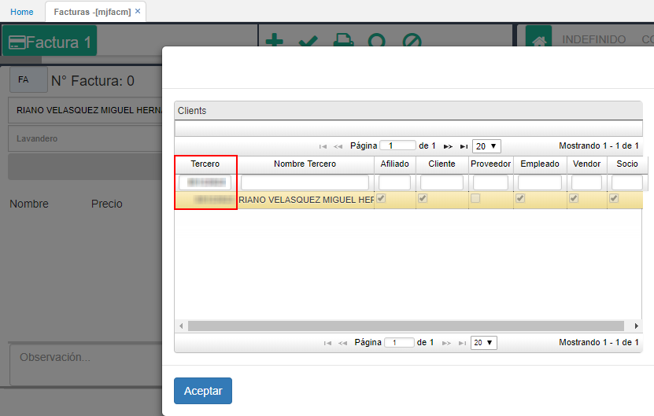

**Vehículo:** Seguidamente, ingresaremos el vehículo del cliente al cual se le prestará los servicios.  

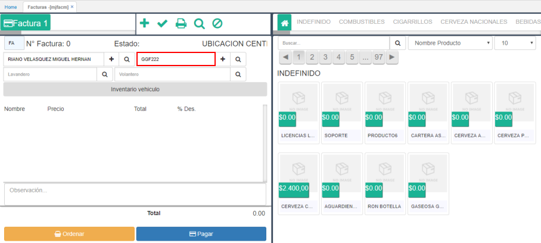

* Si es un vehículo nuevo, damos click en el botón  y registramos la información. El campo _Tercero_ traerá por defecto el cliente seleccionado en el campo anterior.  

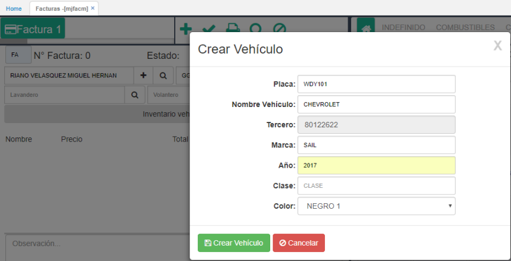

* Si por el contrario el vehículo se encuentra registrado en la base de datos, damos click en el botón  y lo seleccionamos del zoom. El sistema traerá los vehículos que estén asociados al cliente ingresado.  

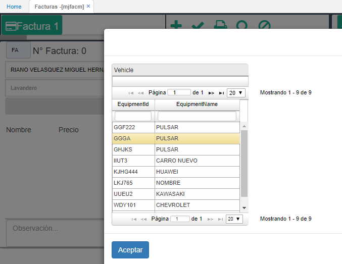

**Lavandero:** en el campo _lavandero_, seleccionaremos del zoom la persona que prestará el servicio al cliente.  

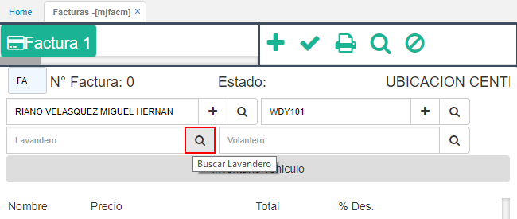

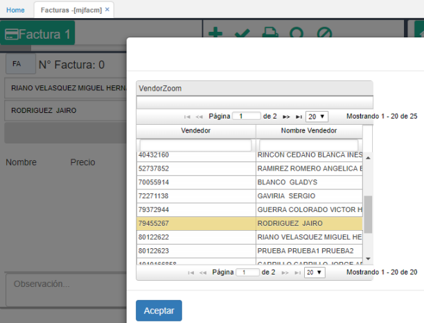

**Volantero:** en este campo seleccionaremos la persona que guió el cliente hacia el lavadero para la prestación de los servicios.  

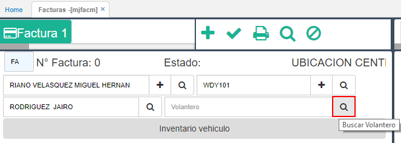

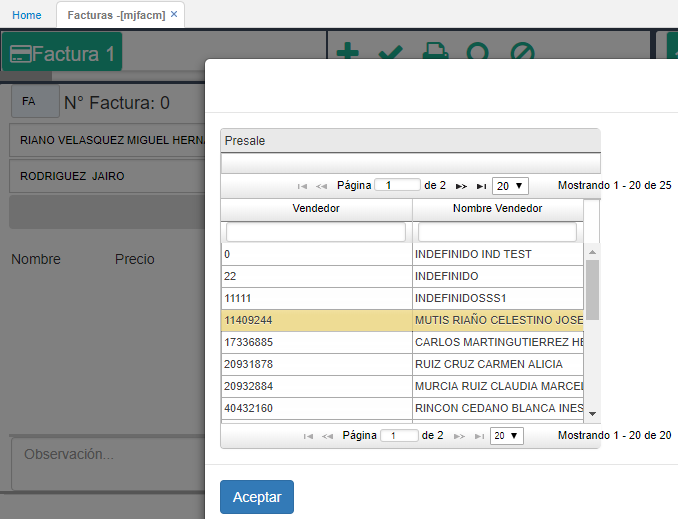

**Producto:** de la parte derecha de la pantalla, seleccionamos el o los productos que desea el cliente. 

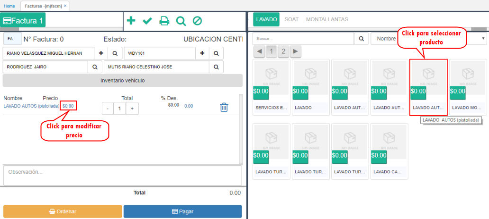

Seleccionado el producto, damos click en el **Precio** para modificarlo y asignar el valor correspondiente.  

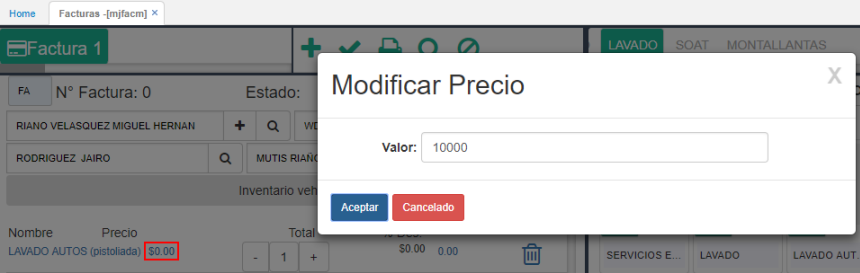

**Inventario vehículo:** para seleccionar los artículos o características con las que el cliente entrega el vehículo, damos click en el botón marcado en la siguiente imagen y marcamos los correspondientes.  

**Nota:** cada empresa de lavadero podrá definir los artículos o caracteristicas que considere se deban incluir en el inventario del vehículo, esto desde la aplicación [**BMOT - Motivos**](http://docs.oasiscom.com/Operacion/common/bsistema/bmot) consultando por documento _FA_ y concepto _FA_.  

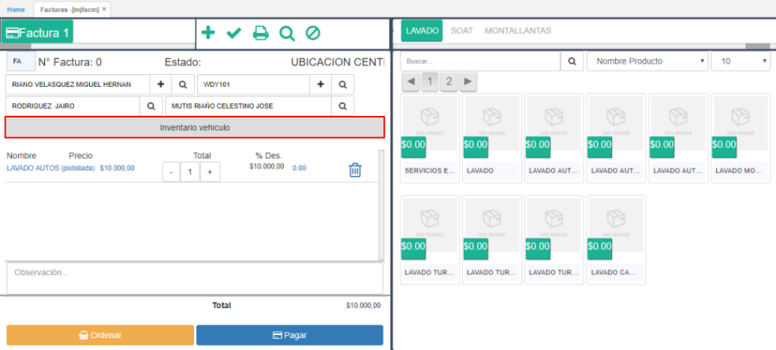

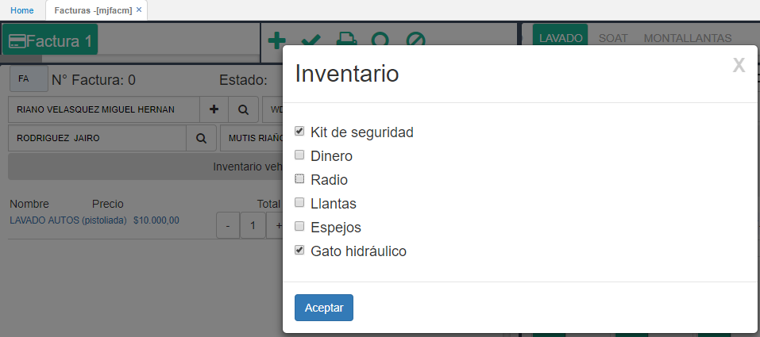

**Observación:** en este campo se ingresarán las observaciones que se crean pertinentes mencionar.  

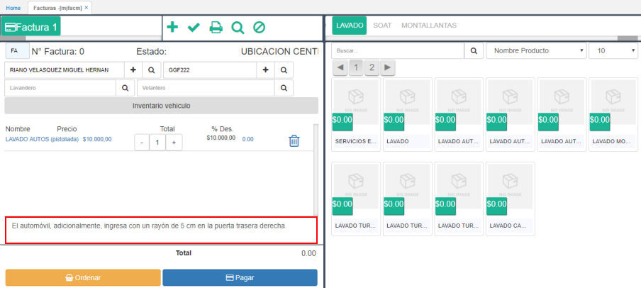

**Ordenar:** una vez se ingresan los servicios que se realizarán al vehículo, se da click en _Ordenar_ para generar la orden de trabajo que se entregará al cliente.  

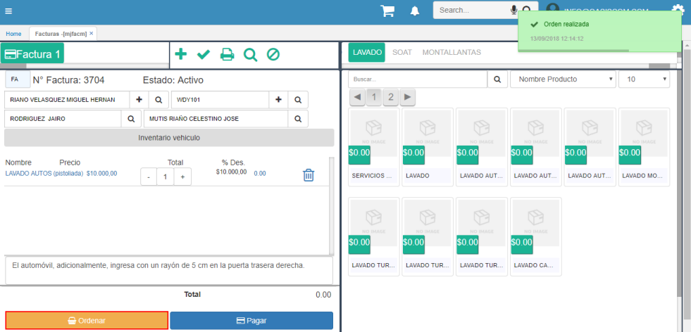

En la orden de trabajo se podrá ver los datos del cliente y del vehículo, los servicios que se prestarán, el inventario del vehículo, el valor total a pagar, el operario que realizó los servicios, las observaciones en caso de que las haya y la firma del responsable de realizar la orden.  

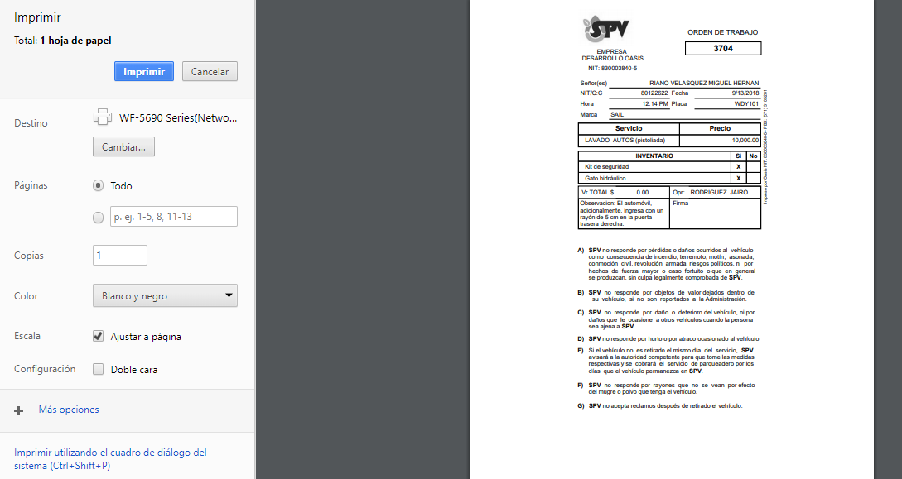

Una vez el vehículo se encuentra listo para ser entregado, el cliente deberá realizar el pago. Para ello, damos click en el botón **Pagar** y allí seleccionamos la forma de pago, el cual puede ser un valor con tarjeta y el saldo en efectivo, entre otras opciones.  

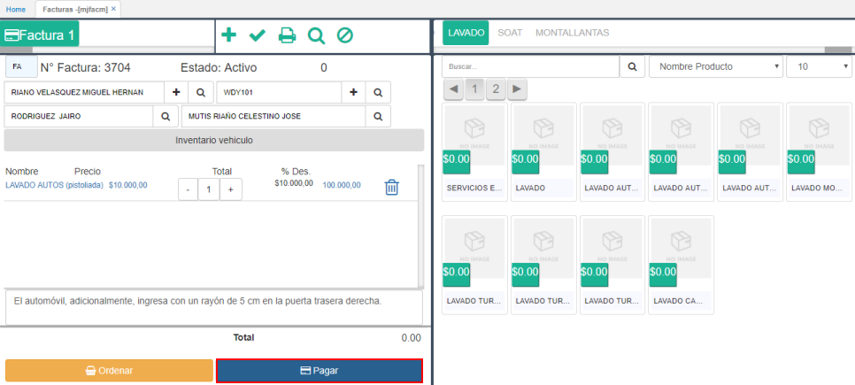

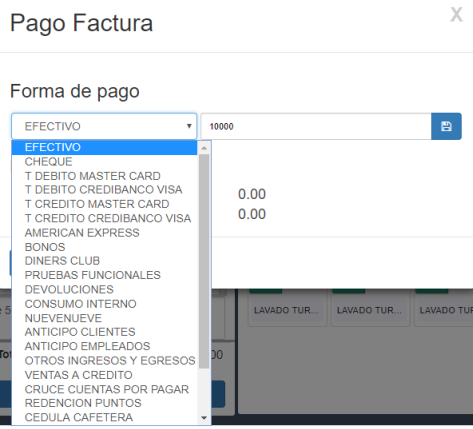

En este caso, seleccionaremos la forma de pago _Efectivo_ para todo el valor. Seguidamente, debemos guardar esta forma de pago que se verá reflejada en el _Detalle Pago_.  

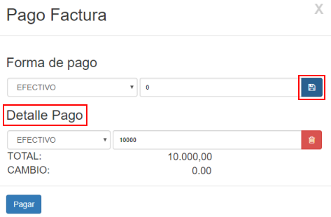

Finalmente, damos click en el botón _Pagar_ e imprimiremos la factura de venta.  