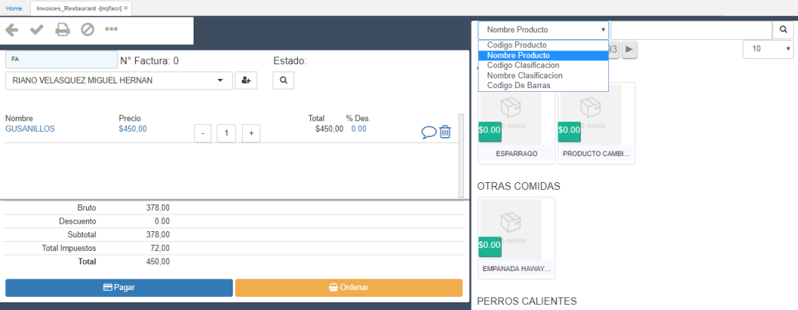
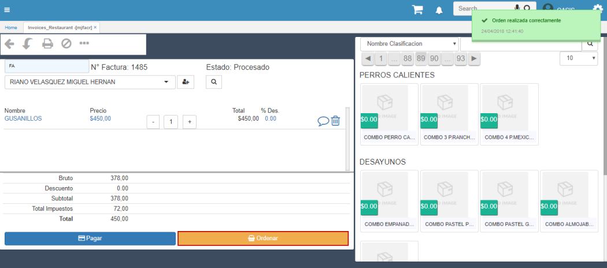
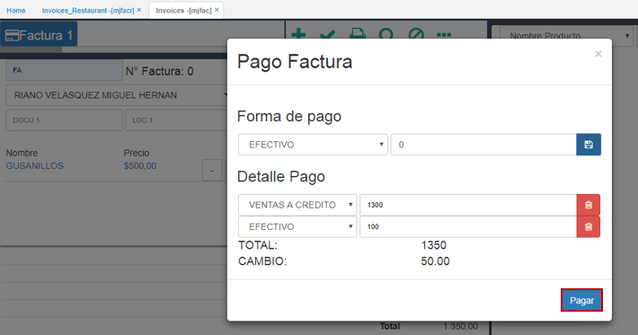

# MJFACR - Facturas (Restaurante)

La aplicación MJFACR permite la creación de facturas (similar a la opción MJFAC), con la diferencia que se realiza por localizaciones, es decir, por las mesas existentes del lugar.  

En la opción **MJFAC**, se visualizan las mesas que se tengan en la parametrización de la ubicación, esto para que se puedan realizar facturas acorde a la cantidad de mesas.  

Una de las caracteristicas del **MJFACR**, es que cuando se crean facturas el color cambia a _naranja_ y con un texto indica si está **Disponible** u **Ocupada**.  

Cuando se accede a la mesa que está **Ocupada**, esta mostrará la factura correspondiente y sus productos. La aplicación tiene un filtro para consultar los productos que se relacionarán a la factura. 

Otras de las caracteristicas es que permite categorizar los productos, esto basado en la clasificación que cada producto tenga.  

Al seleccionar los productos del pedido, damos click en el botón _Ordenar_ y el sistema arrojará un mensaje indicado que la orden se realizó correctamente, además la factura quedará procesada. Si se desea agregar otro producto a la orden, se debe reversar la factura y agregarlo.  

Para efectuar el pago de la factura, damos click en el botón _Pagar_, seleccionamos la forma de pago, ingresamos el valor y damos click en el botón . Este guardará la forma de pago y calculará el valor de cambio en caso de que aplique.

Damos click en _Aceptar_.  

