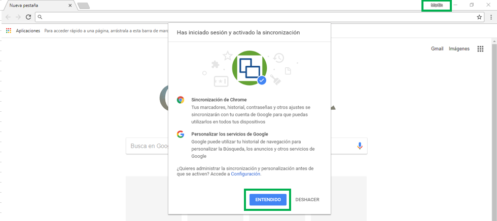

# MJFACR - Facturas (Restaurante)

La aplicación MJFACR permite la creación de facturas (similar a la opción MJFAC), con la diferencia que se realiza por localizaciones, es decir, por las mesas existentes del lugar.  

En la opción **MJFAC**, se visualizan las mesas que se tengan en la parametrización de la ubicación, esto para que se puedan realizar facturas acorde a la cantidad de mesas.  

Una de las caracteristicas del **MJFACR**, es que cuando se crean facturas el color cambia a _naranja_ y con un texto indica si está **Disponible** u **Ocupada**.  

Cuando se accede a la mesa que está **Ocupada**, esta mostrará la factura correspondiente y sus productos. La aplicación tiene un filtro para consultar los productos que se relacionarán a la factura. 

Otras de las caracteristicas es que permite categorizar los productos, esto basado en la clasificación que cada producto tenga.  

Al seleccionar los productos del pedido, damos click en el botón _Ordenar_ y el sistema arrojará un mensaje indicado que la orden se realizó correctamente, además la factura quedará procesada. Si se desea agregar otro producto a la orden, se debe reversar la factura y agregarlo.  

Para efectuar el pago de la factura, damos click en el botón _Pagar_, seleccionamos la forma de pago, ingresamos el valor y damos click en el botón . Este guardará la forma de pago y calculará el valor de cambio en caso de que aplique.

Damos click en _Pagar_.  

Al dar click en el botón _Pagar_ la factura será procesada automáticamente.  

## [Impresión de facturas](http://docs.oasiscom.com/Operacion/scm/pos/jcajero/mjfacr#impresión-de-facturas)

La funcionalidad en OasisCom consiste en imprimir facturas directamente desde cualquier lugar a ciertas impresoras.  

La configuración inicial se realiza por medio de la sesión que realicemos, para ello utilizamos Google Chrome, en donde prodecemos a iniciar sesión, para ello es necesario utilizar lo siguiente:  

**Correo:** info_oasis@oasis.com.co
**Contraseña:** ventas

Una vez iniciada la sesión, nos mostrará una ventana en donde indica temas de sincronización y personalización, solo damos en el boton de _Entendido_.  

Ahora debemos ingresar las impresoras a nuestra cuenta, para ello, en el buscador del navegador escribimos: **chrome://devices**, esto para que nos permita parametrizar las impresoras que estan en la red de la empresa.  

Se mostrará la siguiente página y damos click en el boton _Añadir Impresoras_, automáticamente se visualizarán las impresoras disponibles en Red de OasisCom.  

Luego, se verán todas las impresoras disponibles para agregarlas a nuestra cuenta, en este ejemplo solo marcaremos la primera impresora.  

Una vez seleccionada nuestra impresora, damos en el botón **Añadir Impresoras**.  

Una vez agregada las impresora, damos click en el botón **Administrar impresoras**, el cual nos direccionará a otra vista en donde se encuentran nuestras impresoras.  

Ahora seleccionamos la impresora y luego en _Detalles_ para que así podamos tomar el **número de identificación** que genera sobre la impresora.  

En los detalles veremos bastantes caracteristicas de la impresora, pero debemos tomar el código generado nombrado **ID de Impresora**.  

**NOTA:** Algo muy importante para poder utilizar esta impresora es agregar el usuario que Google Print genera, este usuario es de vital importancia compartirlo, ya que no podriamos imprimir absolutamente nada.  

_**print-service-oasiscom@calm-drive-148918.iam.gserviceaccount.com**_  

Para compartir a nuestro usuario damos click en el botón **Compartir** y luego agregamos el usuario como se muestra en la imagen.  

Cuando hacemos click en el botón **Compartir**, se agrega el usuario a la impresora e indicará que tiene permisos para imprimir.  

Realizada toda la parametrización de la impresora a través de Google Cloud Print, ahora solo debemos realizar la parametrización en OasisCom, para ello, primero configuramos los formatos que tendrá esta opción en la aplicación **SPRO - Programas**.  

En la opción [**BUBI - Ubicaciones Organización**](http://docs.oasiscom.com/Operacion/common/borgan/bubi), en la pestaña de Clasificación, parametrizamos el formato que deberá tomar esa clasificación y adicional a esto indicamos la impresora a la cual se debe direccionar para imprimir.  

En la aplicación **MJFACR** de Punto de Venta de Restaurante hacemos el proceso de crear nuestra factura, luego seleccionamos nuestros productos y una vez echo esto, podemos dar click en el botón de **Ordenar** para que imprima en la o las impresoras parametrizadas.  

Adicional a esto, la aplicación ejecuta un procedimiento almacenado que realiza una modificación al campo de **_Estado_** del detalle de la opción JFAC, en donde este es el indicador para que luego cuando a la misma factura, se realice otra orden no incluya estos productos marcados.  

El procedimiento marca con la letra **O** que indica **Orden**.  

Si el proceso funciona correctamente el sistema mostrará el ícono de la impresora, además la cantidad de impresiones se estan realizando.  

