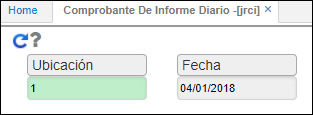
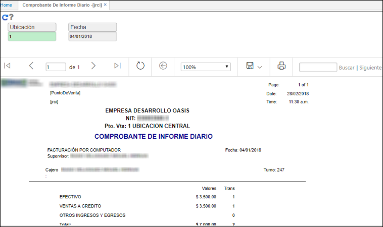
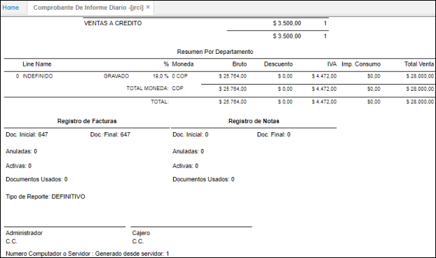

# JRCI - Comprobante de Informe Diario

El reporte **JRCI** permite visualizar la información diaria por ubicación de los turnos registrados en **JTUR - Turnos**.  

Ingresamos a la aplicación JRCI e ingresamos la _ubicación_ que corresponde al punto de venta de consulta y la fecha.  

Ahora generamos el reporte dando click en el botón .  

En el reporte, podremos ver la cantidad de transacciones que se realizaron en efectivo y a crédito.  

En la parte inferior del reporte veremos un resumen por departamento, en donde se ve desglozado el valor total de la venta en: valor bruto, descuento, IVA e impuesto al consumo. Igualmente, el reporte indica el consecutivo de factura con el que inició operación en el día y el número de consecutivo con el que terminó, entre otros detalles.  

El reporte puede ser extraído en formato de Excel, PDF o Word.  