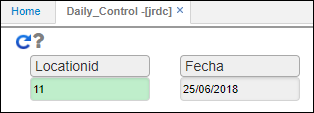

# JRDC - Planilla de Control Diario

El reporte **JRDC** permite ver las operaciones realizadas a un vehículo por día.  

Consultamos por ubicación y fecha.  

Al consultar el reporte, arrojará la información de la siguiente manera:  

El reporte puede ser exportado en formato PDF, Word o Excel.  

_En formato PDF_.  

