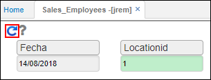
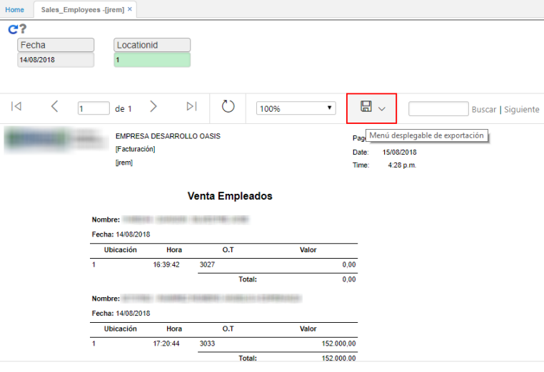
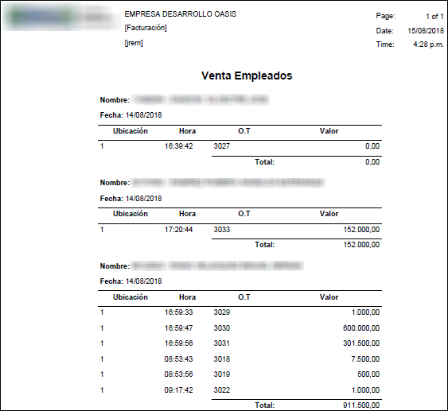

# JREM - Ventas por Empleado

El reporte **JREM** permite ver las ventas realizadas por cada empleado filtrando por fecha y ubicación.  

Ingresamos a la aplicación, consultamos por la fecha y ubicación deseada y damos click en el botón _Generar_.  

Al consultar el reporte tendremos una vista como la siguiente. El reporte puede ser exportado en formato PDF, Word o Excel.  

En formato PDF.  

