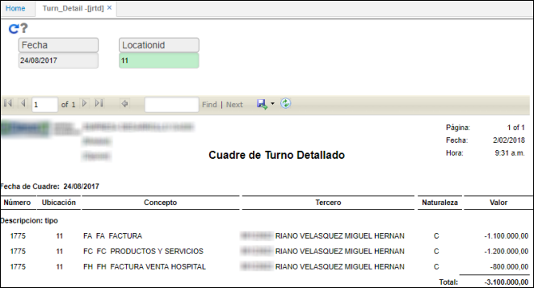

# JRTD - Detalle de Turno

El reporte **JRTD** muestra las transacciones  que se registraron para un turno durante una fecha específica. Esta información corresponde al detalle de la aplicación JTUR - Turnos.  

Ingresamos la fecha de consulta, la ubicación y damos click en el botón .

