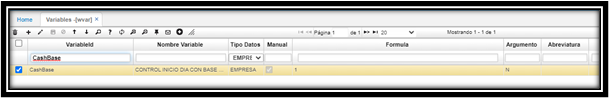
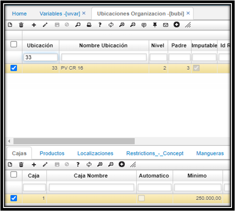

# Base de Efectivo - JTBA

En el momento de confirmar un documento, si no existe un inicio de caja saltara un mensaje: de control indicando que se debe dar inicio a el turno con la **base de caja**,  esta operación se realiza por medio de la opción **JTBA**.  

##**Parametrizacion**

Para el control Base de Caja en el cierre y apertura de turnos se debe configurar la variable de empresa CashBase en WVAR (Variables).  

  

Adicional se debe tener una base de caja inicial **BUBI**.  

  

En el momento de confirmar un documento, si no existe un inicio de caja saltara un mensaje: de control indicando que se debe iniciar el turno con la **base de caja**,  esta operación se realiza por medio de la opción **JTBA**.  

