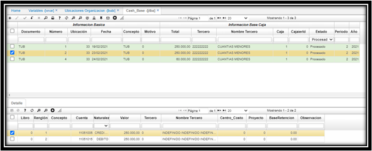
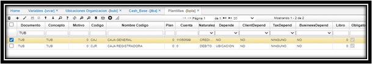
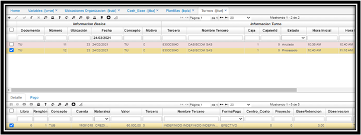
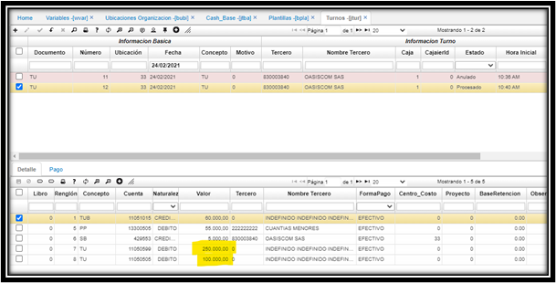

# Base de Efectivo - JTBA

En el momento de confirmar un documento, si no existe un inicio de caja saltara un mensaje: de control indicando que se debe dar inicio a el turno con la **base de caja**,  esta operación se realiza por medio de la opción **JTBA**.  

## **Parametrizacion**

Para el control Base de Caja en el cierre y apertura de turnos se debe configurar la variable de empresa CashBase en WVAR (Variables).  

  

Adicional se debe tener una base de caja inicial **BUBI**.  

  

En el momento de confirmar un documento, si no existe un inicio de caja saltara un mensaje: de control indicando que se debe iniciar el turno con la **base de caja**,  esta operación se realiza por medio de la opción **JTBA**.  

  

El detalle se diligencia automáticamente con la configuración pertinente en el **BPLA**.  

  

Al confirmar la opción JTBA se creará un turno **(JTUR)**, para ese día y esa caja con el valor indicado de la base de caja.    

  

Con esta Base de caja ya se pueden realizar los movimientos pertinentes y al cerrar el turno el sistema verificara sobre el efectivo reponer la base de caja inicialmente y el restante lo llevara a la caja del punto.  

  

