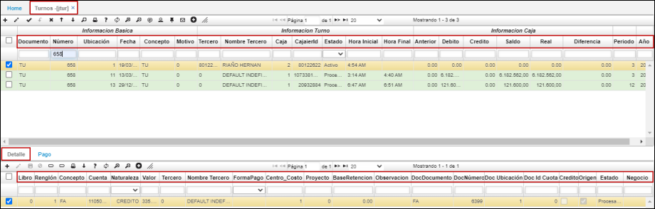
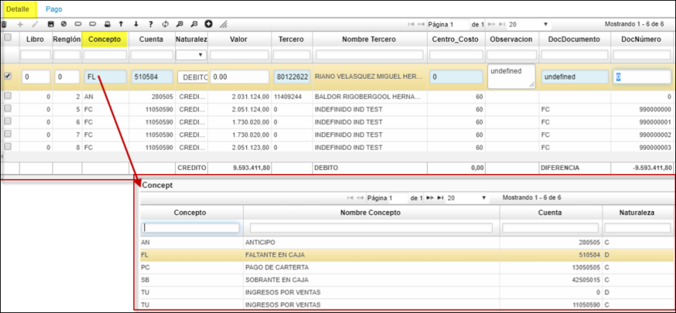
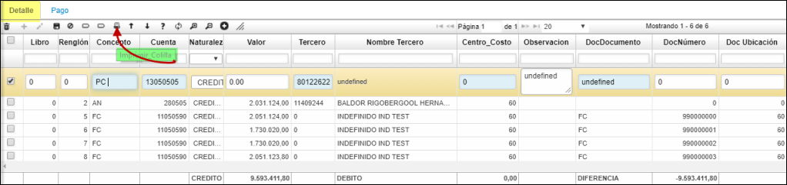
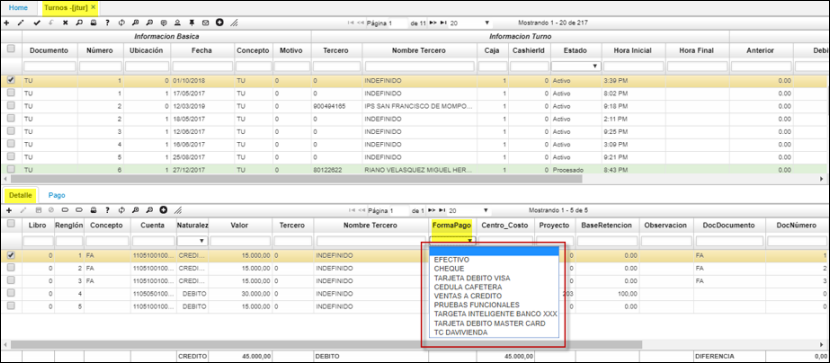

# Turnos - JTUR

Aplicación cuya funcionabilidad es resumir las transacciones realizadas en un determinado lapso o turno; donde al procesar cada factura, devoluciones u otros documentos parametrizados, estos se insertarán automáticamente en el detalle del turno **[JTUR]**.  

  

**Documento:** parametrizado desde el **[BDOC].**  
**Número:** Consecutivo de documento automático.  
**Ubicación:** Ubicación de punto de venta - **[BUBI]**.  
**Fecha:** Fecha de registro de la factura.  
**Concepto:** Éste se debe parametrizar en basico de documentos **[BDOC]**.  
**Motivo:**  Este se encuentra definido como "cero" y se realiza en el **[BMOT]**.  
**Tercero:** Número de identificación de la persona encargada del turno.  
**Caja:** numerico parametrizado en el basico de ubicaciones.  
**Cajero/a:** numero de identificacion del responsable de la caja registradora.  
**Estado:** activo, procesado, anulado segun sea el caso.  
**Hora inicial:** horario de inicio de labores del turno ejemplo turnos de ocho horas.  
**Hora Final:** horario de finalizacion de labores del turno ejemplo turnos de ocho horas.  

**Periodo:** Este campo se llena automaticamente, al insertar el registro.  
**Año:** Campo que se llena automaticamente, al insertar el registro.   

* En el detalle del turno se visualizan las transacciones realizados según sea la cantidad de facturas o notas del punto de venta.  

  

Desde el basico de documentos **[BDOC]** se parametrizan los: Abonos, sobrantes, faltantes etc. Que podrán ser editados en el detalle del turno **[JTUR]**.  

Para revisar cuanto facturó el cajero en su turno, ingresamos a revisar el turno en la aplicación **[JTUR]** - Turnos, nos dirigimos al menú y seleccionamos la opción.  

* Existen dos formas de realizar la apertura del turno: una es realizar la primera factura de venta y al confirmarla, automáticamente se abre el **[JTUR]**. La segunda forma es desde el **[JTUR]** realizar la inserción y guardar.  

La forma correcta de confirmar o procesar un turno es realizar la equivalencia entre: el valor de las facturas, menos notas que se registran en el detalle del JTUR vs. las formas de pago que resumen en la tercera pestaña del turno denominada **Pagos**.  

* Existe un formato tipo tirilla. Desde el detalle del Turno **(JTUR)** para el caso donde el cliente realiza abonos o pagos parciales, estos podrán ser impresos con el botón "imprimir colilla" tipo recibo de caja.  

Se realiza Adecuación en el detalle del **JTUR (turnos)**, donde permite seleccionar las formas de pago para los recaudos realizados en abonos de efectivo; por conceptos como separación de mercancía.  
Para este escenario se agrego el campo **forma de pago** en el detalle del **JTUR**.   

  

********

