# Turnos - JTUR

Aplicación cuya funcionalidad es resumir las transacciones realizadas en un determinado lapso o turno; donde al procesar cada factura, devoluciones u otros documentos parametrizados, estos se insertarán automáticamente en el detalle del turno **JTUR**.  

* [Diligenciamiento JTUR](http://docs.oasiscom.com/Operacion/scm/pos/jsuperv/jtur#diligenciamiento-jtur)   
* [Realización de abonos](http://docs.oasiscom.com/Operacion/scm/pos/jsuperv/jtur#realización-de-abonos)  
* [Impresión Colilla](http://docs.oasiscom.com/Operacion/scm/pos/jsuperv/jtur#impresión-colilla)  
* [Cierre del turno](http://docs.oasiscom.com/Operacion/scm/pos/jsuperv/jtur#cierre-del-turno)  

## [Diligenciamiento JTUR](http://docs.oasiscom.com/Operacion/scm/pos/jsuperv/jtur#diligenciamiento-jtur)  

  

**Documento:** parametrizado desde el **BDOC.**  
**Número:** Consecutivo de documento automático.  
**Ubicación:** Ubicación de punto de venta - **BUBI**.  
**Fecha:** Fecha de registro de la factura.  
**Concepto:** Éste se debe parametrizar en basico de documentos **BDOC**.  
**Motivo:**  Este se encuentra definido como "cero" y se realiza en el **BMOT**.  
**Tercero:** Número de identificación de la persona encargada del turno.  
**Caja:** numerico parametrizado en el basico de ubicaciones.  
**Cajero/a:** numero de identificacion del responsable de la caja registradora.  
**Estado:** activo, procesado, anulado segun sea el caso.  
**Hora inicial:** horario de inicio de labores del turno ejemplo turnos de ocho horas.  
**Hora Final:** horario de finalizacion de labores del turno ejemplo turnos de ocho horas.  

**Periodo:** Este campo se llena automaticamente, al insertar el registro.  
**Año:** Campo que se llena automaticamente, al insertar el registro.   

* En el detalle del turno se visualizan las transacciones realizados según sea la cantidad de facturas o notas del punto de venta.  

  

Desde el basico de documentos **BDOC** se parametrizan los: abonos, sobrantes, faltantes etc. que podrán ser editados en el detalle del turno **JTUR**.  

Para revisar cuánto facturó el cajero en su turno, ingresamos a revisar el turno en la aplicación **JTUR** - Turnos, nos dirigimos al menú y seleccionamos la opción.  

* Existen dos formas de realizar la apertura del turno: una es realizar la primera factura de venta y al confirmarla, automáticamente se abre el **JTUR**. La segunda forma es desde el **JTUR** realizar la inserción y guardar.  

La forma correcta de confirmar o procesar un turno es realizar la equivalencia entre: el valor de las facturas, menos notas que se registran en el detalle del JTUR vs. las formas de pago que resumen en la tercera pestaña del turno denominada **Pagos**.  

* Existe un formato tipo tirilla. Desde el detalle del Turno **JTUR** para el caso donde el cliente realiza abonos o pagos parciales, estos podrán ser impresos con el botón "imprimir colilla" tipo recibo de caja.  

Se realiza Adecuación en el detalle del **JTUR (turnos)**, donde permite seleccionar las formas de pago para los recaudos realizados en abonos de efectivo; por conceptos como separación de mercancía.  
Para este escenario se agregó el campo **forma de pago** en el detalle del **JTUR**.   

  

## [Realización de abonos](http://docs.oasiscom.com/Operacion/scm/pos/jsuperv/jtur#realización-de-abonos)

El siguiente manual describe el procedimiento sobre la realización de recibos de caja en la aplicación JTUR – Turnos

Para la realización de los recibos de caja primero se debe realizar la apertura del turno ya sea realizando una factura o creando el turno. 
Para realizar un registro ya sea por pago sistecredito o por el sistema de apartado se debe adicionar un registro en el detalle del Turno dando clic en el botón 

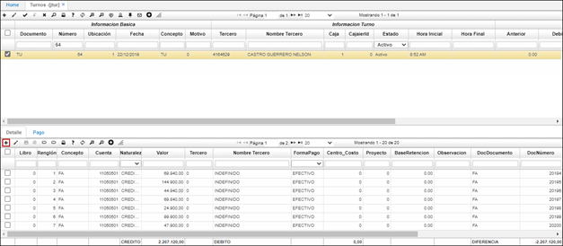

El sistema mostrara un nuevo renglón en el detalle, donde se debe seleccionar el concepto dando doble clic en el campo para que este traiga automáticamente la cuenta. 

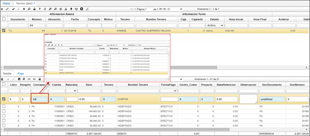

Cuando se selecciona el concepto el sistema inserta los campos correspondientes como la cuenta y naturaleza, el usuario debe diligenciar los campos de valor, el tercero al cual se realiza el anticipo, la forma de pago y por último si se requiere realizar una observación del documento realizado. El campo de tercero es importante ya que al momento de realizar la factura debemos diligenciar el tercero para que el sistema nos muestre el abono o anticipo que realizo el cliente. 

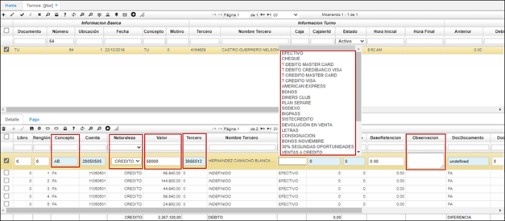

Luego de guardar el registro se debe procesar para que el sistema afecte la caja.

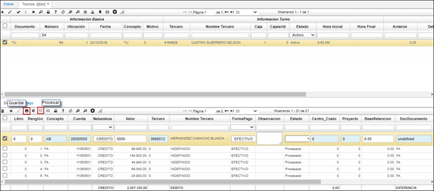

### [Impresión Colilla](http://docs.oasiscom.com/Operacion/scm/pos/jsuperv/jtur#impresión-colilla)

Si se requiere y el cliente solicita la entrega de un comprobante de pago sobre el abono realizado, en la parte superior del detalle se encuentra el icono de imprimir 

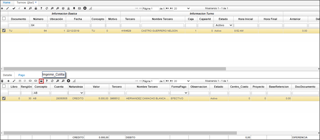

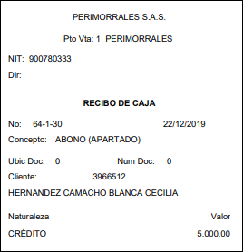

## [Cierre del turno](http://docs.oasiscom.com/Operacion/scm/pos/jsuperv/jtur#cierre-del-turno)

Para realizar el cierre del turno, buscamos el número de identificación del turno en la factura para colocarlo en el campo **_Número_** de esta aplicación **JTUR**.  En el detalle se pueden observar las facturas asociadas a este turno. Al lado del detalle, encontramos la pestaña **_Pago_**; en esta pestaña encontramos el total de las facturas realizadas por turno, discriminando la forma de pago de cada una y el valor. Una vez validada esta información con el cajero y verificado que físicamente tenga el mismo dinero en las diferentes modalidades de pago, se procesa el registro para realizar el cierre de caja. De esta manera, no podrán ingresar más facturas a este turno sino que se creará un turno diferente.  

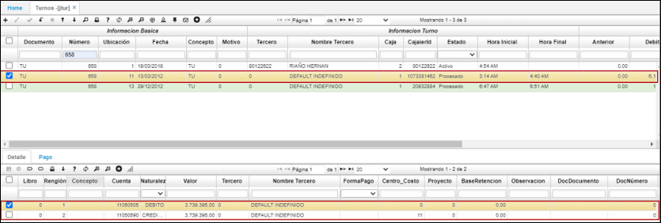  

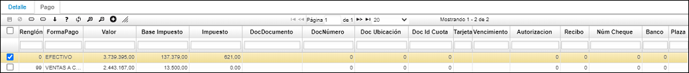  

En caso de que el cierre de caja no cuadre, se puede realizar un faltante o sobrante en la misma aplicación **JTUR** en la pestaña detalle.  Se adiciona un registro (+) y en el campo **_Concepto_** se define si es un faltante **_FA_**, es decir que hizo falta dinero, o si es un sobrante **_SB_** en caso de que haya más dinero del facturado, se asocia a la cuenta contable correspondiente, el valor y la cédula del cajero.  Al tener la caja cuadrada, se procede a procesar el turno.  Cabe aclarar que esta actividad no la realiza el cajero sino el supervisor.

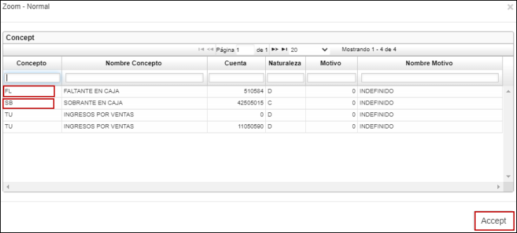  

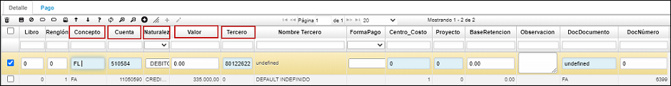  

Ahora se revisa la aplicación **Turno pago - JRTP**.  En esta aplicación hay varios campos, pero se consulta por el campo **_Número_** y se escribe el mismo número de turno.  En este, se ve cuántas facturas están asociadas al turno.  Estas facturas están discriminadas por fecha, consecutivo, estado, condición de pago y forma de pago, el total de cada factura y por último, el total de cada turno. 

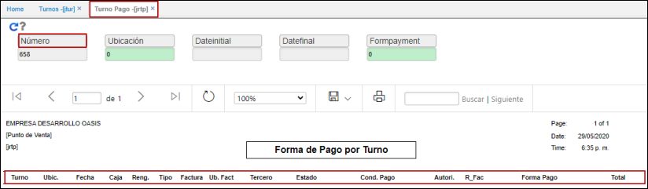

