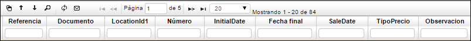

# Ajuste a Contratos de Venta - VAJO

**Documento:** Ajuste al contrato de Venta - AV.  
**Número:** consecutivo generado automáticamente.  
**Ubicación:** Número de ubicación de la empresa la cual realiza el ajuste.  
**Fecha:** fecha en la cual se realiza el ajuste.  
**Concepto:** doble clic y seleccionar si es AV – Ajuste o RC – Renueva Contrato.  
**Tercero:** Identificación numérica del tercero al cual se le realiza el ajuste en el contrato.  
**Nombre Tercero:** Nombre del tercero al cual se le realiza el ajuste en el contrato.  
**Estado:** Estado del ajuste: Activo, Procesado, Anulado.  

**Documento:** Tipo de documento al cual se le realiza el ajuste, CV si es un contrato.  
**Tipo Precio:** doble clic y seleccionar el Tipo de Precio.  
**Observación:** Observaciones acerca del ajuste al contrato si las hay.  

La aplicación **VAJO** Ajuste a Contratos de Venta consta de una ventana inferior llamada Detalle en la cual se puede observar información más explícita del contrato seleccionado.  

**Renglón:** número del renglón, se genera automáticamente.  
**Producto:** Número asignado al contrato a registrar, parametrizado previamente en BPO.  
**Nombre Producto:** Nombre de contrato a registrar, parametrizado previamente en BPRO.  
**%Imp:** porcentaje de impuesto que tiene el producto.  
**Product PurchaseId:**  
**Cantidad:** cantidad de contratos del producto que se va adquirir por parte del cliente.  

