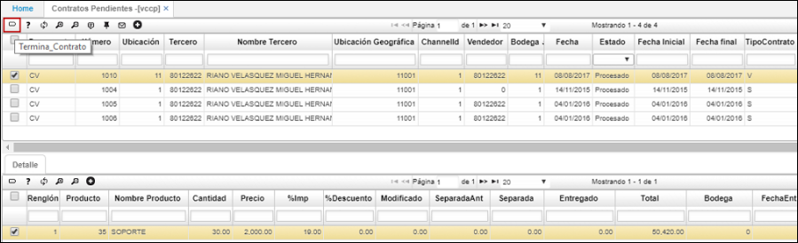
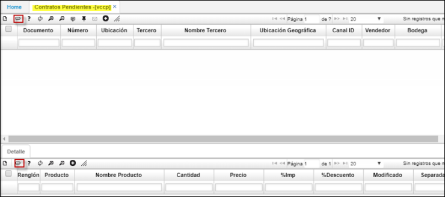
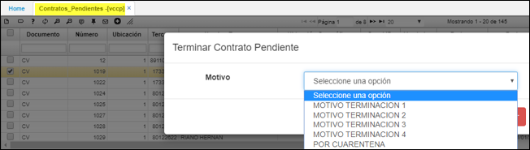
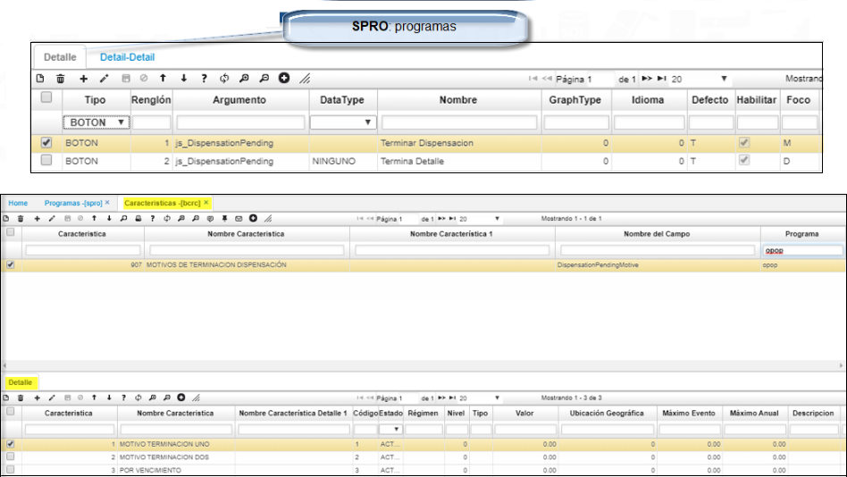

# Contratos pendientes

La aplicación VCCP permite terminar los contratos que se requiera y se encuentren pendientes.  

##Terminacion de contrato.##  
Existen dos formas para terminar la contrato:  
Desde el **maestro** o por cada uno de los item en el **detalle**.  
Al ejecutar el boton indicado (terminar_contrato)*, se aplicara para todo el documento.  

  
* Para el primer caso desde el maestro:le indicaremos el motivo por el cual terminamos la orden.  
  

* Para terminar un ítem (detalle) se puede indicar el motivo por el cual se terminó, se crean lista desplegable del BCRC.  
	Se debe de realizar la siguiente parametrizacion desde el **SPRO** y desde las caracteristicas **BCRC**.  
	  

