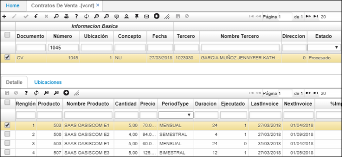
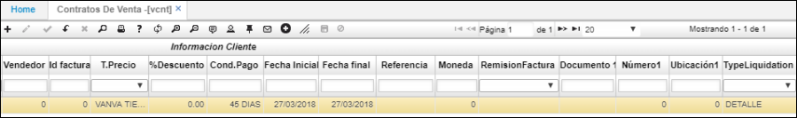
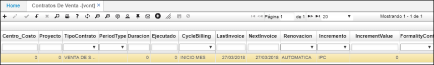
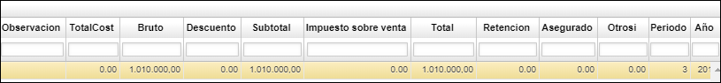
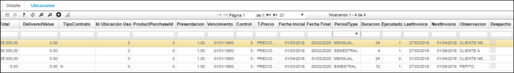
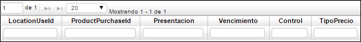
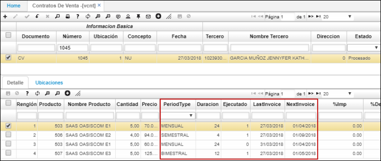

---
layout: default
title: Contratos
permalink: /Operacion/scm/ventas/vcontrato/vcnt
editable: si
---

# Contratos de Venta - VCNT

La aplicación VCNT permite realizar el registro de los contratos de venta.  




**Documento:** doble clic y seleccionar tipo de documento CV – Contratos de venta.  
**Número:** número generado automáticamente.  
**Ubicación:** Número de ubicación de la empresa la cual realiza el documento.  
**Fecha:** fecha en que se registra el contrato de venta.  
**Concepto:** doble clic y seleccionar el concepto del contrato de venta.  
**Tercero:** identificación numérica del tercero al que se le realizará el contrato.  
**Nombre Tercero:** nombre del tercero al que se le realizará el contrato.  
**Estado:** Estado del contrato: Activo, Procesado, Anulado.  




**Vendedor:** identificación numérica del vendedor.  
**Tipo precio:** doble clic y seleccionar tipo de precio.  
**%Descuento:** Porcentaje del descuento que se haya acordado.  
**Condición pago:** doble clic y seleccionar condición de pago del contrato.  
**Initial Date:** fecha inicial del contrato.  
**Fecha final:** fecha final del contrato.  
**Moneda:** moneda en la que se acuerda el contrato.  




**Tipo contrato:** tipo de contrato de venta - V.  
**Period Type:** Tipo de periodo.  
**CycleBilling:** ciclo de facturación.  
**Lastinvoice:** fecha de la última factura emitida.  
**NextInvoice:** fecha de la siguiente factura a emitir.  



**Observación:** observación sobre el contrato si existe.  
**ProjectId:** número del proyecto.  
**Bruto:** valor bruto del contrato.  
**Descuento:** valor en cifras del descuento acordado.  
**Subtotal:** resta del valor bruto menos el descuento.  
**TaxSale:** valor del impuesto sobre el contrato.  
**Total:** suma del subtotal más el impuesto.  
**Retención:** valor de retención (si aplica).  

La aplicación **VCNT** Contratos de venta consta de una ventana inferior llamada _Detalle_ en la cual se puede observar información más explícita del contrato seleccionado.



**Renglón:** número del renglón, se genera automáticamente.  
**Producto:** Número asignado al contrato a registrar, parametrizado previamente en BPO.  
**Nombre producto:** Nombre de contrato a registrar, parametrizado previamente en **BPRO.**  
**Cantidad:** cantidad de contratos del producto que se va adquirir por parte del cliente.  
**Precio:** precio registrado en el contrato del producto adquirido por el cliente.  
**%Imp:** porcentaje de impuesto que tiene el producto.  
**%descuento:** porcentaje del descuento acordado para el contrato.  
**Estado:** Estado del contrato: Activo, Procesado, Anulado.  
**Tipo Contrato:** según tipo de contrato: Venta, arriendo.  




**ProductPurchaseId:** Identificación del producto de compra.  
**Vencimiento:** Fecha de vencimiento del producto.  
**Tipo Precio:** doble clic y seleccionar tipo de precio.  

Los datos de los campos _Tipo de periodo_, _Duración_, _Ejecutado_, _Última Factura_ y _Próxima Factura_ se toman de cada renglón del detalle, ya que se puede tener un mismo contrato con renglones de productos y servicios con diferentes vigencias de facturación pero con un solo contrato (suscripción).  






