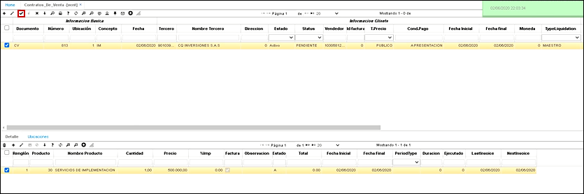

# Contratos de Venta - VCNT

* [Contratos de Venta - Registro](http://docs.oasiscom.com/Operacion/scm/ventas/vcontrato/vcnt#contratos-de-venta---registro)
* [Contratos de Venta - Cápita Evento](http://docs.oasiscom.com/Operacion/scm/ventas/vcontrato/vcnt#contratos-de-venta---cápita-evento)

## [Contratos de Venta - Registro](http://docs.oasiscom.com/Operacion/scm/ventas/vcontrato/vcnt#contratos-de-venta---registro)

La aplicación **VCNT** permite realizar el registro de los contratos de venta. 

Para este ejemplo crearemos un contrato con el concepto de implementaciones.  Agregamos un nuevo registro **+**.  

**Documento:** En este campo seleccionamos *CV* que hace referencia a contratos de ventas.  
**Ubicación:** Número de ubicación de la empresa la cual realiza el documento.  
**Concepto:** Seleccionamos el concepto del contrato de venta, en este caso es *IM* que corresponde a implementación.  
**Fecha:** Fecha en que se está creando el contrato.  
**Tercero:** Identificación numérica del tercero al que se le realizará el contrato.   
**Vendedor:** Identificación numérica de la persona que se encargó de realizar la venta.  
**Fecha inicial:** Fecha la cual se inicia el contrato.  
**Fecha final:** Fecha final del contrato. Para este ejemplo como se requiere facturar una implementación es una única factura.  
**Tipo de liquidación:** Maestro.  
**Negocio:** Hace referencia a lo que se esta cobrando, en este caso es una implementación. Estos negocios se parametrizan en la aplicación **BNEG- básico de negocios**  
**Proyecto:** Esta previamente parametrizado en la aplicación **BPRY - básico de proyectos**  
**Tipo de contrato:** Tipo de contrato de venta, en este caso seleccionamos venta de servicio.   
**PeriodType:** Tipo de periodo facturación. En caso de que la factura fuera trimestral, semestral, anual en el campo Duración se debe seleccionar a cuantos periodos se requiere generar la factura.  
**CycleBliling:** Ciclo de facturación. Cuando se requiere generar el ciclo de facturación.  
**Renovación:** Como es una única factura sin renovar.  
**Lastinvoice:** fecha de la última factura emitida.   
**NextInvoice:** fecha de la siguiente factura a emitir.   
**Observación:** observación sobre el contrato si existe.   

Luego de llenar los datos requeridos damos clic en guardar. 

La aplicación **VCNT** Contratos de venta consta de una ventana inferior llamada _Detalle_ en la cual se puede observar información más explícita del contrato seleccionado.

**Producto:** Producto que se requiere facturar, en este caso hablamos de una implementación.  
**Cantidad:** Cantidad de contratos del producto que se va adquirir por parte del cliente.  
**Precio:** Precio registrado en el contrato del producto adquirido por el cliente.  
**Factura:** Activamos el campo  y guardamos los cambios   

Por último se debe confirmar el contrato de venta procesándolo. Así quedara el registro en el sistema.  

## [Contratos de Venta - Cápita Evento](http://docs.oasiscom.com/Operacion/scm/ventas/vcontrato/vcnt#contratos-de-venta---cápita-evento)

### Parametrizacion:  

El cliente maneja 2 tipo de contratos de venta para cada tercero **(Cápita - Evento)**, Esto por el programa **VCNT.**  

  

Sobre los conceptos del Programa **GMOV** (Programa **BDOC** - Detalle Conceptos), se tiene configurado a que tipo pertenece si es Cápita o Evento.  

  

Teniendo la anterior parametrizacion, se explica:  
Se realizar una personalizacion o customizacion sobre el Concepto del **GMOV** (Se muestra como Servicios).  

Para este proceso se toma como retrives tanto el concepto como el tercero (Resaltados en Amarillo).  

Esto para retornar el Contrato de venta del tercero, que son los campos de referencia.(Resaltados en Rojo).  

  

Dado que por el concepto configurado del GMOV, tenemos identificado a que tipo pertenece **Capita o Evento**.

Se realiza la búsqueda del contrato de venta cada vez que se cambie el valor sobre el campo.  
