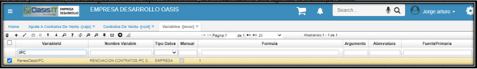

# Contratos de Venta - VCNT

* [Contratos de Venta - Registro](http://docs.oasiscom.com/Operacion/scm/ventas/vcontrato/vcnt#contratos-de-venta---registro)
* [Contratos de Venta - Cápita Evento](http://docs.oasiscom.com/Operacion/scm/ventas/vcontrato/vcnt#contratos-de-venta---cápita-evento)  
* [Contratos de Venta - Dispensación de medicamentos](http://docs.oasiscom.com/Operacion/scm/ventas/vcontrato/vcnt#contratos-de-venta---dispensación-de-medicamentos)
* [Contratos de Venta - Diferente IPC por Contrato](http://docs.oasiscom.com/Operacion/scm/ventas/vcontrato/vcnt#contratos_de_venta_-_diferente_ipc_por_contrato)

## [Contratos de Venta - Registro](http://docs.oasiscom.com/Operacion/scm/ventas/vcontrato/vcnt#contratos-de-venta---registro)

La aplicación **VCNT** permite realizar el registro de los contratos de venta. 

Para este ejemplo crearemos un contrato con el concepto de implementaciones.  Agregamos un nuevo registro **+**.  

**Documento:** En este campo seleccionamos *CV* que hace referencia a contratos de ventas.  
**Ubicación:** Número de ubicación de la empresa la cual realiza el documento.  
**Concepto:** Seleccionamos el concepto del contrato de venta, en este caso es *IM* que corresponde a implementación.  
**Fecha:** Fecha en que se está creando el contrato.  
**Tercero:** Identificación numérica del tercero al que se le realizará el contrato.   
**Vendedor:** Identificación numérica de la persona que se encargó de realizar la venta.  
**Fecha inicial:** Fecha la cual se inicia el contrato.  
**Fecha final:** Fecha final del contrato. Para este ejemplo como se requiere facturar una implementación es una única factura.  
**Tipo de liquidación:** Maestro.  
**Negocio:** Hace referencia a lo que se esta cobrando, en este caso es una implementación. Estos negocios se parametrizan en la aplicación **BNEG- básico de negocios**  
**Proyecto:** Esta previamente parametrizado en la aplicación **BPRY - básico de proyectos**  
**Tipo de contrato:** Tipo de contrato de venta, en este caso seleccionamos venta de servicio.   
**PeriodType:** Tipo de periodo facturación. En caso de que la factura fuera trimestral, semestral, anual en el campo Duración se debe seleccionar a cuantos periodos se requiere generar la factura.  
**CycleBliling:** Ciclo de facturación. Cuando se requiere generar el ciclo de facturación.  
**Renovación:** Como es una única factura sin renovar.  
**Lastinvoice:** fecha de la última factura emitida.   
**NextInvoice:** fecha de la siguiente factura a emitir.   
**Observación:** observación sobre el contrato si existe.   

Luego de llenar los datos requeridos damos clic en guardar. 

La aplicación **VCNT** Contratos de venta consta de una ventana inferior llamada _Detalle_ en la cual se puede observar información más explícita del contrato seleccionado.

**Producto:** Producto que se requiere facturar, en este caso hablamos de una implementación.  
**Cantidad:** Cantidad de contratos del producto que se va adquirir por parte del cliente.  
**Precio:** Precio registrado en el contrato del producto adquirido por el cliente.  
**Factura:** Activamos el campo  y guardamos los cambios   

Por último se debe confirmar el contrato de venta procesándolo. Así quedara el registro en el sistema.  

## [Contratos de Venta - Cápita Evento](http://docs.oasiscom.com/Operacion/scm/ventas/vcontrato/vcnt#contratos-de-venta---cápita-evento)

### Parametrización:  

El cliente maneja 2 tipos de contratos de venta para cada tercero **(Cápita - Evento)**, Esto por el programa **VCNT.**  

  

Sobre los conceptos del Programa **GMOV** (Programa **BDOC** - Detalle Conceptos), se tiene configurado a qué tipo pertenece: si es Cápita o Evento.  

  

Teniendo la anterior parametrizacion, se explica:  
Se realiza una personalización o customización sobre el Concepto del **GMOV** (Se muestra como Servicios).  

Para este proceso se toma como retrieves tanto el concepto como el tercero (Resaltados en Amarillo).  

Esto para retornar el Contrato de venta del tercero, que son los campos de referencia.(Resaltados en Rojo).  

  

Dado que por el concepto configurado del GMOV, tenemos identificado a qué tipo pertenece **Capita o Evento**.

Se realiza la búsqueda del contrato de venta cada vez que se cambie el valor sobre el campo.  

## [Contratos de Venta - Dispensación de medicamentos](http://docs.oasiscom.com/Operacion/scm/ventas/vcontrato/vcnt#contratos-de-venta---dispensación-de-medicamentos)  

En esta sección, se explica la creación de un Contrato de venta para dispensación de medicamentos.  

Ingresando a esta aplicación **VCNT**, se adiciona un nuevo registro (+).  

Se utiliza el _Documento_ **CV**; la _Ubicación_ que corresponda; _Concepto_ **DP** que corresponde a _**Dispensación de medicamentos**_; en _Fecha_, la fecha de registro del Contrato; en el campo _Tercero_, el tercero que corresponda; el _Vendedor_, si se tiene; en el _Tipo de precio_, se elige del menú (para la ilustración, se elige _**Evento**_); en el campo _Fecha Inicial_, se escribe la fecha inicial del contrato; y en _Fecha final_, la fecha final del contrato; en el campo _Contrato Cliente_, la referencia como tal del contrato; en el campo _Remisión factura_, se escribe cómo se va a facturar el contrato, es decir, si por ejemplo por cada dispensación se va a generar una factura o si se va a esperar todas las dispensaciones del mes para generar una sola factura (para la ilustración, se elige _Pre-factura_); en el campo _Tipo liquidación_, siempre se debe elegir la opción _**Maestro**_; en el campo _Clase_, se debe elegir si es un Contrato **_Capitado_** o un Contrato de _**Evento**_; en el campo _TipoContrato_, se elige la opción _**Dispensación**_; en el campo _NoAfiliados_, la cantidad de afiliados; y en el campo _Asegurado_, el valor del contrato.  Finalmente, se guarda el registro.  

  

En la parte inferior, en la pestaña _Detalle_, se adiciona un registro (+) y se registra únicamente el _Producto_ Cero (0), con _Cantidad_ Cero (0), _TipoContrato_ _**D**_ correspondiente a **Dispensación** y nuevamente su _T.Precio_ tipo de precio.  Se guarda el registro.  

   

En la pestaña _Ubicaciones_, se adiciona un registro (+) y se registra _UbicaciónUse_ Cero (0), el mismo _Cupo_ (muy importante resaltar que debe coincidir con el que se registró en el _Maestro_, también de nuevo en _T.Precio_ _**Evento**_.  Se guarda el registro.  

  

Con estos pasos, se termina el registro del contrato y se puede procesar.   

   

En este momento, ya queda listo el contrato para iniciar el proceso de Dispensación de medicamentos.  

## [Contratos de Venta - Diferente IPC por Contrato](http://docs.oasiscom.com/Operacion/scm/ventas/vcontrato/vcnt#contratos_de_venta_-_diferente_ipc_por_contrato)  

Para ingresar un IPC por cada servicio, se debe configurar la variable de empresa RenewDetailIPC, de esta forma tomara los datos ingresados en el detalle por servicio.  

   

Adicional los contratos deberán estar marcado que su incremento de renovación es por IPC, recomendamos también que las condiciones sean tomadas por detalle del contrato.  

   

Para asignar el porcentaje individual y marcar que contratos se van a renovar, se creó la opción **VCRD**, es similar al VCRC.  Esta opción listara el detalle de todos los contratos de venta por cada uno de sus servicios, los campos a diligenciar son renueva para indicar cuales servicios se renovarán el IPC donde se registra porcentaje de incremento.  

   

Diligenciada la información pertinente se procede a generar la renovación con el botón configurado de renovación.  Este botón generara documento de ajuste a contratos que actualizaran los precios pertinentes en el contrato por servicio.  

   

