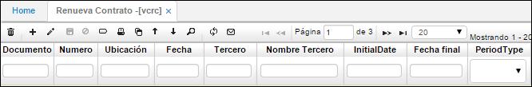
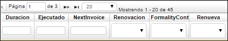

# Renueva Contrato - VCRC

La aplicación VCRC permite consultar los contratos de venta y así mismo renovarlos siendo el caso.  

**Documento:** tipo de documento CV - Renueva Contrato.  
**Número:** consecutivo generado automáticamente.  
**Ubicación:** Número de ubicación de la empresa la cual realiza el documento.  
**Fecha:** fecha en que se realiza la renovación del contrato.  
**Tercero:** identificación numérica del tercero al cual se renueva el contrato.  
**Nombre Tercero:** Nombre del tercero al cual se renueva el contrato.  
**InitialDate:** Fecha inicial del contrato renovado.  
**Fecha final:** fecha final o de vencimiento del contrato renovado.  
**PeriodType:** seleccionar tipo de periodo en que se acuerda la facturación (mensual, bimestral, trimestral, semestral, anual).  

**Duración:** Duración numérica según tipo de periodo asignado y fechas del contrato. Si el contrato se demora dos años y el pago es mensual tendrá una duración de 24 meses.  
**Ejecutado:** número de meses ejecutados del total de la duración del contrato.  
**NextInvoice:** fecha en la que se debe emitir la siguiente factura.  
**Renovación:** seleccionar de la lista el tipo de renovación (Automática, Previo Acuerdo, Sin renovación).  
**FormalityContract:** seleccionar la formalidad del contrato, si fue hecho verbalmente, en físico o ninguno.  
**Renueva:** seleccionar si el contrato se Renueva, se Termina o Ninguno.  

