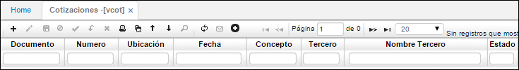
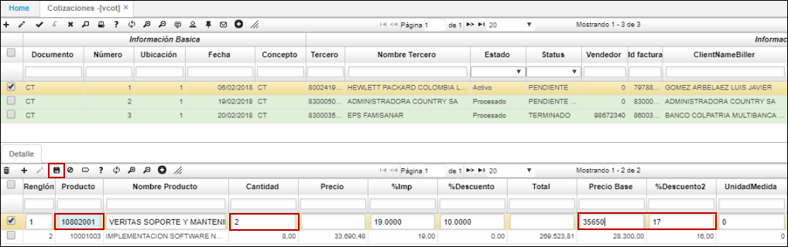
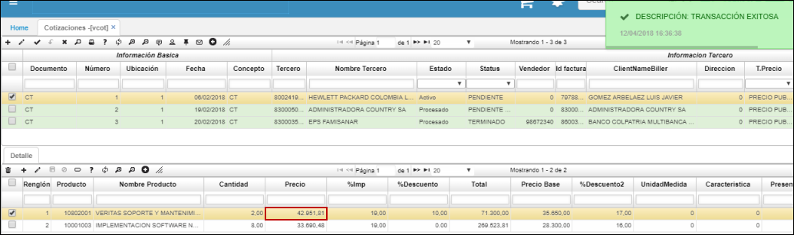
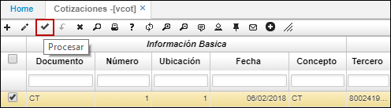
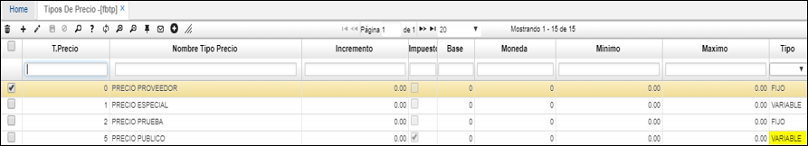
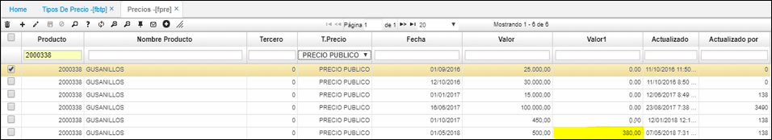
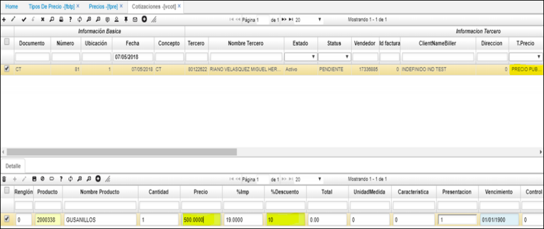
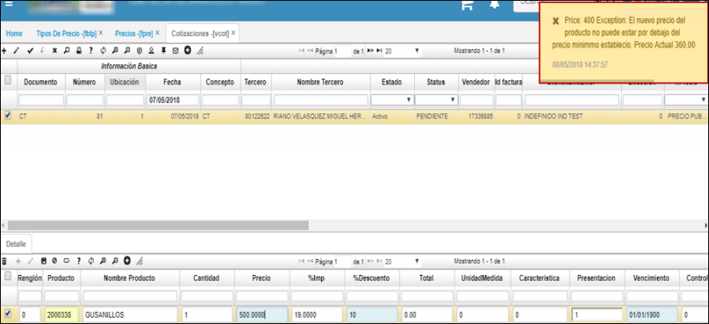
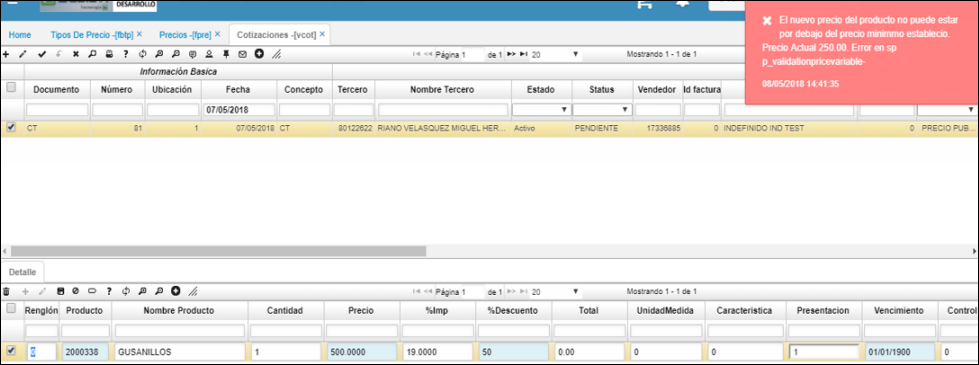

# Cotizaciones - VCOT

Pantalla maestra que sirve para adicionar, modificar y consultar las diferentes cotizaciones que ha elaborado la empresa a los clientes. Para ello el cliente debe estar creado previamente en la básica o maestro de terceros, no se pueden realizar cotizaciones a clientes que no existan o que no se le contengan sus datos básicos.

El maestro contiene la información básica tanto de la empresa como del cliente al cual se le cotiza, con las posibles condiciones comerciales con las que dicho cliente será vinculado como cliente de la empresa.

**Documento:** Tipo de documento que se desea registrar.  
**Número:** Consecutivo asignado a la cotización a realizar.  
**Ubicación:** Ubicación (empresa) donde se va a registrar la cotización.  
**Fecha:** Fecha en que se va a realizar la cotización.  
**Concepto:** Concepto por el cual se realizará la cotización.  
**Tercero:** Identificación numérica del tercero al que se le realizará la cotización.  
**Nombre Tercero:** Nombre del tercero al que se le realizará la cotización.  
**Estado:** Estado en el que se encuentra la cotización (Activo-Procesado-Anulado).  

**Vendedor:** Identificación numérica de la persona que realiza la cotización.  
**Tipo Precio:** Seleccionar tipo de precio con el que se va a realizar la cotización.  
**% Descuento:** Porcentaje del descuento que se haya acordado.  
**Condición Pago:** Seleccionar condición de pago que se haya acordado.  
**Moneda:** Tipo de moneda en la cual se va a realizar la cotización.  
**Bodega:**  
**PayFreight:** Pago de carga.  
**Bruto:** Valor bruto por el cual se va a hacer la cotización.  

Descuento: Descuento en cifras acordado para la cotización. 
Subtotal: Subtotal del valor bruto menos el descuento acordado para la cotización.

**TaxSale:** Valor del impuesto.  
**Total:** Suma del subtotal más el impuesto.  
**Documento:**  
**Impreso:** Marca cuando ya se ha impreso la cotización.  
**Observación:** Descripción de la cotización.  
**Status:**  

La aplicación **VCOT** Cotizaciones cuenta con un detalle.

**Renglón:** Consecutivo generado que se maneja al haber varios productos.  
**Producto:** Número asignado al producto que se desea cotizar.  
**Nombre Producto:** Nombre del producto que se desea cotizar.  
**Cantidad:** Cantidad del producto que se desea cotizar.  
**Precio:** Precio por unidad del producto que se desea cotizar.  
**% Imp:** Porcentaje de impuesto que tiene el producto.  
**% Descuento:** Porcentaje de descuento acordado al producto.  
**Total:** Precio total del producto cotizado.  

**UnidadMedida:** Unidad de medida del producto.  
**Característica:** Cualidad del producto.  
**Vencimiento:** Fecha de vencimiento de producto.  
**Control:** Permite controlar el inventario por un número de control, es decir, como un identificador.  
**Observación:** Observaciones acerca del producto cotizado.  
**Estado:** Estado Activo, Procesado o Anulado de la cotización.  

## [Cálculo de precio bajo márgenes](http://docs.oasiscom.com/Operacion/scm/ventas/vcotizacio/vcot#cálculo-de-precio-bajo-márgenes)

Al realizar una cotización, la aplicación permite calcular automáticamente el precio del producto o servicio con sólo ingresar el costo base y el porcentaje de margen.  

En el maestro se debe crear la cotización con documento CT e ingresar la demás información como se explica en la parte superior de este documento. En el detalle, agregamos un nuevo renglón y seleccionamos del zoom el producto o servicio a cotizar, ingresamos las cantidades, el precio base (costo) y el porcentaje de margen que aplica al producto. Seguidamente, damos click en el botón **Guardar** y con esto el sistema calculará el precio final.  

Al guardar el registro evidenciamos que el sistema asignó el precio del producto de acuerdo al costo y al porcentaje de margen ingresados.  

Finalmente, se debe procesar la cotización desde el botón _Procesar_  ubicado en la barra de herramientas del maestro.  

## [Itemchanged campos Precio y Porcentaje de Descuento](http://docs.oasiscom.com/Operacion/scm/ventas/vcotizacio/vcot#itemchanged-campos-precio-y-porcentaje-de-descuento)

El objetivo del itemchanged en el campo _Precio_ y _Porcentaje Descuento_, es que el sistema valide que al final el precio que coloque el usuario no esté por debajo del valor de referencia de la lista de precios. Este precio de referencia estará definido  en la aplicación FPRE en el campo _Valor1_.  

En la aplicación [**FBTP - Tipo de Precio**](http://docs.oasiscom.com/Operacion/scm/facturacion/fbasica/fbtp) debemos asignar al tipo de precio la característica _Variable_.  

En la aplicación [**FPRE - Precios**](http://docs.oasiscom.com/Operacion/scm/facturacion/fprecio/fpre) se definirá el precio.  

Con el nuevo precio y descuento asignado, el sistema deberá mostrar un mensaje de alerta y no se deberá poder salvar los cambios.  

En vcot intentamos ingresar un precio y un descuento.  

Al tratar de colocar el precio **400** y dar tab, el sistema muestra el mensaje de control, puesto que, quedaría un precio de 360, cual está por debajo de los 380 de la lista de precios. Lo mismo debe pasar si se asigna en % de descuento que haga que el precio quede por debajo del rango mínimo.  

Si se trata de guardar la información sin dar tab, el sistema debe mostrar el mensaje de control.  

