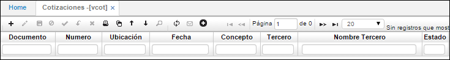
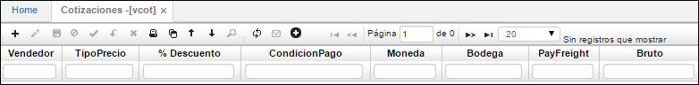
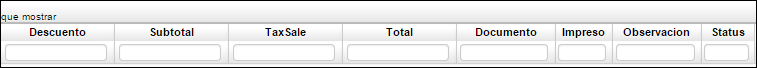
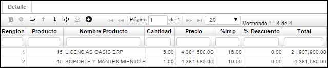
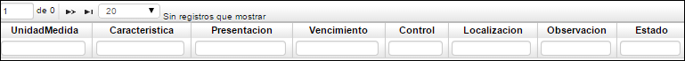

---
layout: default
title: Cotizaciones
permalink: /Operacion/scm/ventas/vcotizacio/vcot
editable: si

# Cotizaciones - VCOT

Pantalla maestra que sirve para adicionar, modificar y consultar las diferentes cotizaciones que ha elaborado la empresa a los clientes. Para ello el cliente debe estar creado previamente en la básica o maestro de terceros, no se pueden realizar cotizaciones a clientes que no existan o que no se le contengan sus datos básicos.

El maestro contiene la información básica tanto de la empresa como del cliente al cual se le cotiza, con las posibles condiciones comerciales con las que dicho cliente será vinculado como cliente de la empresa.

**Documento:** Tipo de documento que se desea registrar.  
**Número:** Consecutivo asignado a la cotización a realizar.  
**Ubicación:** Ubicación (empresa) donde se va a registrar la cotización.  
**Fecha:** Fecha en que se va a realizar la cotización.  
**Concepto:** Concepto por el cual se realizará la cotización.  
**Tercero:** Identificación numérica del tercero al que se le realizará la cotización.  
**Nombre Tercero:** Nombre del tercero al que se le realizará la cotización.  
**Estado:** Estado en el que se encuentra la cotización (Activo-Procesado-Anulado).  

**Vendedor:** Identificación numérica de la persona que realiza la cotización.  
**Tipo Precio:** Seleccionar tipo de precio con el que se va a realizar la cotización.  
**% Descuento:** Porcentaje del descuento que se haya acordado.  
**Condición Pago:** Seleccionar condición de pago que se haya acordado.  
**Moneda:** Tipo de moneda en la cual se va a realizar la cotización.  
**Bodega:**  
**PayFreight:** Pago de carga.  
**Bruto:** Valor bruto por el cual se va a hacer la cotización.  

Descuento: Descuento en cifras acordado para la cotización. 
Subtotal: Subtotal del valor bruto menos el descuento acordado para la cotización.

**TaxSale:** Valor del impuesto.  
**Total:** Suma del subtotal más el impuesto.  
**Documento:**  
**Impreso:** Marca cuando ya se ha impreso la cotización.  
**Observación:** Descripción de la cotización.  
**Status:**  

La aplicación **VCOT** Cotizaciones cuenta con un detalle.

**Renglón:** Consecutivo generado que se maneja al haber varios productos.  
**Producto:** Número asignado al producto que se desea cotizar.  
**Nombre Producto:** Nombre del producto que se desea cotizar.  
**Cantidad:** Cantidad del producto que se desea cotizar.  
**Precio:** Precio por unidad del producto que se desea cotizar.  
**% Imp:** Porcentaje de impuesto que tiene el producto.  
**% Descuento:** Porcentaje de descuento acordado al producto.  
**Total:** Precio total del producto cotizado.  

**UnidadMedida:** Unidad de medida del producto.  
**Característica:** Cualidad del producto.  
**Vencimiento:** Fecha de vencimiento de producto.  
**Observación:** Observaciones acerca del producto cotizado.  
**Estado:** Estado Activo, Procesado o Anulado de la cotización.  

