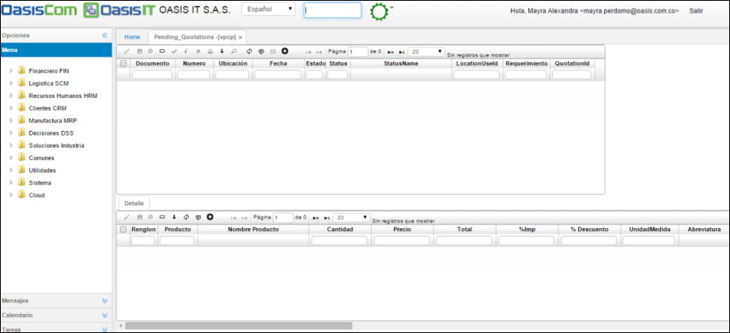
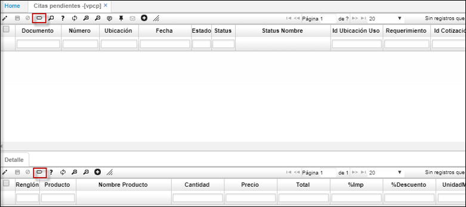
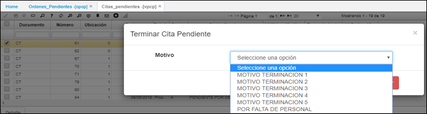
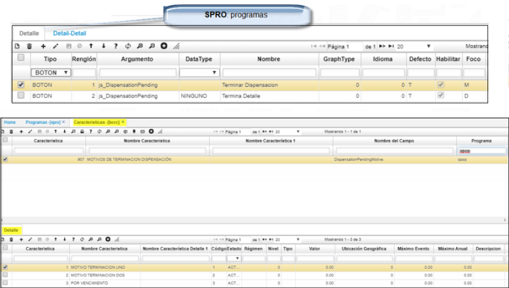

# Cotizaciones Pendientes - VPCP

Esta aplicación permite la consulta de las cotizaciones pendientes que se encuentran por confirmar.  

**Documento:** Especificación de la cotización.  
**Número:** Número consecutivo de cotización. El programa asigna automáticamente este número.  
**Ubicación:** Lugar desde donde se efectúa el requerimiento.  
**Fecha:** Fecha cuando se efectúa la cotización. El sistema asigna la fecha actual por defecto.  
**Estado:** Estado de la cotización, Activo, Procesado, Anulado.  
**Requerimiento:** Número consecutivo correspondiente al requerimiento.  

En el detalle se puede visualizar los productos y cantidades que se cotizaron, desde su precio, el total, porcentaje de impuestos, porcentaje de descuento, unidad de medida, vencimiento y otros aspectos inherentes a la cotización.

**Observaciones:** Con respecto a la cotización.  
**Estado:** Estado de la cotización, Activo, Procesado, Anulado.  
**Valores:** La tabla de valores muestra los estados por los que pasa el valor del producto desde su valor inicial pasando por descuentos, aplicación de impuestos hasta su valor real o final después de todos los ajustes necesarios.  

# Terminacion de cotizacion.  
Existen dos formas para terminar la cotizacion:  
Desde el **maestro** o por cada uno de los item en el **detalle**.  
Al ejecutar el boton indicado (terminar_cotizacion)*, se aplicara para todo el documento.  

  
* Para el primer caso desde el maestro:le indicaremos el motivo por el cual terminamos la orden.  
  

* Para terminar un ítem (detalle) se puede indicar el motivo por el cual se terminó, se crean lista desplegable del BCRC.  
	Se debe de realizar la siguiente parametrizacion desde el **SPRO** y desde las caracteristicas **BCRC**.  
	  
