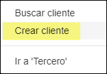
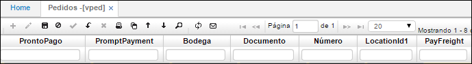

# Menú
## [**Ver Saldo Por Ubicación**](http://docs.oasiscom.com/Operacion/scm/ventas/vpedido/vped#Ver-Saldo-Por-Ubicación)

# VPED - Pedidos

Esta es la pantalla maestra que sirve para adicionar, consultar y modificar los pedidos que hacen los clientes a la empresa. Esta pantalla es fundamental para la captura de las órdenes de compra de los clientes ya que se encuentra integrada a los módulos de cartera e inventarios, con cartera en la validación del cupo y condiciones comerciales y con inventarios en la disponibilidad de los productos.  

**Documento:** PD de pedido.  
**Número:** consecutivo generado automáticamente.  
**Ubicación:** Número de ubicación de la empresa la cual realiza el documento.  
**Concepto:** PD de pedido.  
**Motivo:** Motivo parametrizado previamente en la aplicación **BMOT**.  
**Fecha:** Fecha en que se registra el pedido.  
**Tercero:** Número de identificación del tercero que solicita el pedido. Con clic derecho permite crear clientes abre un nuevo formulario:  
  
  

**Nombre Tercero:** Nombre del tercero que solicita el pedido.  

**Moneda:** Doble clic y seleccionar tipo de moneda utilizada para el pedido.  
**Estado:** Estado del pedido: Activo, Procesado, Anulado.  
**Vendedor:** Número de cédula del vendedor.  
**TipoPrecio:** Doble clic y seleccionar si es Normal y Minoristas.  
**% Descuento:** Número del porcentaje de descuento a realizar.  
**Ordencompra:** Número de la orden de compra.  
**Condición Pago:** Doble clic y seleccionar la condición de pago acordada.  

**Bruto:** Valor bruto del pedido.  
**Descuento:** Valor en cifras del descuento acordado.  
**Subtotal:** Resta del valor bruto menos el descuento acordado.  
**TaxSale:** Valor de impuestos.  
**Total:** Suma del subtotal más el valor de los impuestos.  
**Impreso:** Se marca cuando se ha impreso el documento.  
**DeliveryDateMax:** Fecha de entrega máxima.  

**Crédito:** Estado del crédito.  
**Comercial:** Estado de aprobación por comercial.  
**Liberación:** Si se liberó o no.  
**LiberationCommercial:** Si la liberación se realizó por comercial.  
**Consignación:** Si se realizó la consignación o no.  
**ProjectId:** Identificación del proyecto al que pertenece.  
**Observación:** Comentarios.  
***************
Esta aplicación consta de una ventana en la parte inferior llamada detalle:

**Renglón:** Número del renglón del detalle a registrar.  
**Producto:** doble clic y seleccionar número del producto.  
**Nombre Producto:** Nombre del producto arrojado automáticamente.  
**Cantidad:** Cantidad del producto del pedido.  
**Precio:** Precio del producto.  
**%Imp:** Número del porcentaje de impuesto.  
**%Descuento:** Número del porcentaje de descuento del pedido.  

**Total:** Valor total del pedido.  
**Bodega:** Bodega de donde proviene el producto.  
**Fecha Entrega:** Fecha de entrega del pedido.  
**Control:** Permite controlar el inventario por un número de control, es decir, como un identificador.  

************

**Localización:** Identificación numérica de la localización de un producto.  
**Característica:** Código de la característica que se puede atribuir al producto.  
**Presentación:** Forma de presentación del producto.  
**Vencimiento:** Fecha de vencimiento del producto.  
**Control:**  Número de serial o consecutivo asignado a productos que vende la empresa y 	poder así identificarlos y llevar un control sobre ellos.  
**Id Lote:** Si los productos pertenecen a un lote en específico.  
**Estado:**  activo, procesado o anulado.  
**Unidad Medida:** parametrización del BMED.   
**Observación:** campo a editar o comentar.  
**Código Antiguo:** referencia código del producto.  

## [Consultas dinámicas](http://docs.oasiscom.com/Operacion/scm/ventas/vpedido/vped#consultas-dinámicas)

Realización de una consulta dinámica en la aplicación _VPED - Pedidos_.  

## [Verificación de Pedidos](http://docs.oasiscom.com/Operacion/scm/ventas/vpedido/vped#verificación-de-pedidos)

Realizado el pedido en la aplicación [**Comprar**](http://docs.oasiscom.com/Operacion/marketplace/comprar), ingresaremos a la aplicación _VPED - Pedidos_ y filtraremos por la fecha en la que se realizó nuestro pedido. Si los productos y/o servicios seleccionados corresponden a diferentes proveedores, se generarán dos transacciones diferentes en VPED.  

En el ejemplo del pedido realizado en la aplicación [**Comprar**](http://docs.oasiscom.com/Operacion/marketplace/comprar), seleccionados una jarra y una maleta, estos dos artículos son de proveedores diferentes, por lo tanto se verán los pedidos en dos documentos diferentes como se muestra a continuación.  

Pedido de la Jarra

Pedido de la Maleta

## [Itemchanged campos Precio y Porcentaje de Descuento](http://docs.oasiscom.com/Operacion/scm/ventas/vpedido/vped#itemchanged-campos-precio-y-porcentaje-de-descuento)

El objetivo del itemchanged en el campo _Precio_ y _Porcentaje Descuento_, es que el sistema valide que al final el precio que coloque el usuario no esté por debajo del valor de referencia de la lista de precios. Este precio de referencia estará definido  en la aplicación FPRE en el campo _Valor1_.  

En la aplicación [**FBTP - Tipo de Precio**](http://docs.oasiscom.com/Operacion/scm/facturacion/fbasica/fbtp) debemos asignar al tipo de precio la característica _Variable_.  

En la aplicación [**FPRE - Precios**](http://docs.oasiscom.com/Operacion/scm/facturacion/fprecio/fpre) se definirá el precio.  

Con el nuevo precio y descuento asignado, el sistema deberá mostrar un mensaje de alerta y no se deberá poder salvar los cambios.  

En VPED intentamos ingresar un precio y un descuento.  

Al intentar ingresar el precio de 390 y dar tab, el sistema muestra el mensaje de control, puesto que, quedaría un precio de 360 cual está por debajo de los 380 de la lista de precios. Lo mismo debe pasar si se asigna en % de descuento que haga que el precio quede por debajo del rango mínimo.  

Si se trata de guardar la información sin dar tab, el sistema debe mostrar el mensaje de control.  

## [**Botón Info Ventas**](http://docs.oasiscom.com/Operacion/scm/ventas/vpedido/vped#botón-info-ventas)

Este botón permite visualizar la fecha de la última compra del producto así como el precio con el que fue vendido.  

El botón **info_ventas** en el detalle de la opción _VPED_, permite visualizar la fecha de la última compra del producto así como el precio con el que fue vendido.  

## [**Ver Saldo Por Ubicación**](http://docs.oasiscom.com/Operacion/scm/ventas/vpedido/vped#Ver-Saldo-Por-Ubicación)

Esta función permite ver el saldo por ubicación del detalle de un producto en especifico.

Para ver esta información se debe dar clic derecho sobre el detalle del producto que deseamos ver y seleccionamos "**Ver saldo por Ubicacion**"

Luego de esto nos aparecerá la siguiente ventana:

