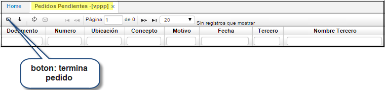
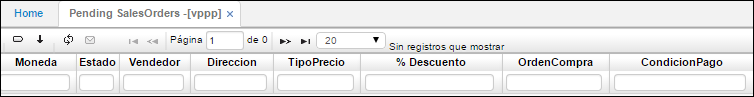
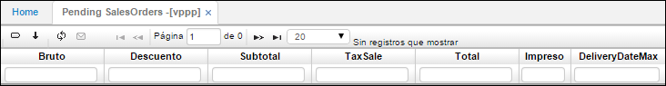
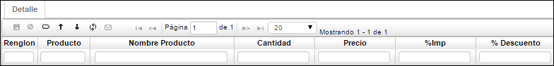
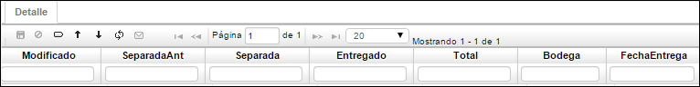

# Pedidos Pendientes - VPPP

Manejo de pedidos **[VPED]** pendientes de despacho por producto o fijaciones **[VFIJ]**; indica la ubicación de recepción, número, estado, y productos con sus respectivos precios de venta como la totalización del valor pendiente. Dichos pedidos pueden ser dados por terminados en **[VPPP]**. Esta aplicación es solo de consulta, nos va arrojar todos los pedidos que aún están pendientes y que anteriormente se suministraron en la aplicación **VPED** Pedidos o Fijaciones **[VFIJ]**.  

**Documento:** PD de pedido.  
**Número:** consecutivo generado automáticamente.  
**Ubicación:** Número de ubicación de la empresa la cual realiza el documento.  
**Concepto:** PD de pedido.  
**Motivo:** Motivo parametrizado previamente en la aplicación **BMOT**.  
**Fecha:** Fecha en que se registra el pedido.  
**Tercero:** Número de identificación del tercero que solicita el pedido.  
**Nombre Tercero:** Nombre del tercero que solicita el pedido.  

**Moneda:** Doble clic y seleccionar tipo de moneda utilizada para el pedido.  
**Estado:** Estado del pedido: Activo, Procesado, Anulado.  
**Vendedor:** Número de cédula del vendedor.  
**TipoPrecio:** Doble clic y seleccionar si es Normal y Minoristas.  
**% Descuento:** Número del porcentaje de descuento a realizar.  
**Ordencompra:** Número de la orden de compra.  
**Condición Pago:** Doble clic y seleccionar la condición de pago acordada.  

**Bruto:** Valor bruto del pedido.  
**Descuento:** Valor en cifras del descuento acordado.  
**Subtotal:** Resta del valor bruto menos el descuento acordado.  
**TaxSale:** Valor de impuestos.  
**Total:** Suma del subtotal más el valor de los impuestos.  
**Impreso:** Se marca cuando se ha impreso el documento.  
**DeliveryDateMax:** Fecha de entrega máxima.  

Esta aplicación consta de una ventana en la parte inferior llamada detalle:

**Renglón:** Número del renglón del detalle a registrar.  
**Producto:** doble clic y seleccionar número del producto.  
**Nombre Producto:** Nombre del producto arrojado automáticamente.  
**Cantidad:** Cantidad del producto del pedido.  
**Precio:** Precio del producto.  
**%Imp:** Número del porcentaje de impuesto.  
**%Descuento:** Número del porcentaje de descuento del pedido.  

**Total:** Valor total del pedido.  
**Bodega:**  Bodega de donde proviene el producto.  
**Fecha Entrega:** Fecha de entrega del pedido.  

