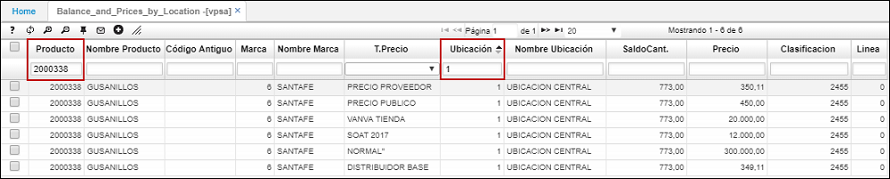

# VPSA - Saldos y Precios por Ubicación

La aplicación **VPSA** permite consultar la lista de precios por ubicación y los saldos de inventario.  

Podemos filtrar los precios de los productos por diferentes aspectos como: el producto, la marca, el tipo de precio, la ubicación, la clasificación y la línea, facilitando así la consulta de los precios de los productos.  

A continuación, como ejemplo consultaremos los precios del producto _2000338_ sólo para la ubicación 1. Podemos ver que el precio del producto cambia de acuerdo al tipo de precio y que en inventario exiten 773 unidades.  

