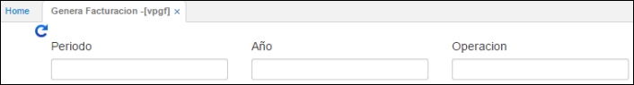
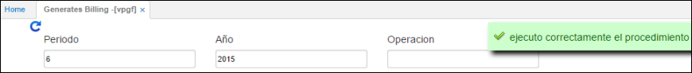
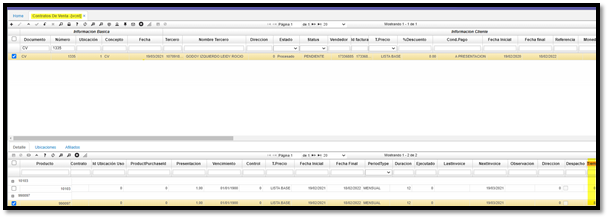
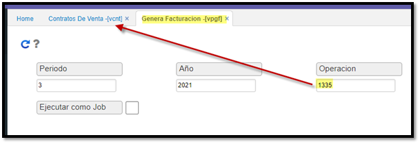
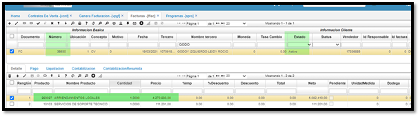

# Genera Facturación - VPGF

**Periodo:** Mes del cual se desea generar la facturación.  
**Año:** Año del cual se desea generar la facturación.  

Se ingresan los filtros solicitados, Periodo, Año y Operación para generar la facturación necesaria del mes y al dar clic en  actualizar arrojará el siguiente mensaje.  

# Periodos de Gracia.  

Proceso para manejo de: **periodos de gracia** en propiedad horizontal (Inmobiliaria).  
1 - Se crea el contrato 1335 con 8 días de gracia.  

  

2 - Se ejecuta el proceso del **VPGF** para ese contrato.  

  

3 - Se valida en el **FFAC** que se encuentre creada la factura y que el valor del arriendo descuente los 8 días de gracia.  
**Valor Arriendo Original= $5.824.000**  
Valor Arriendo día= $194.133  
=5.824.000  
**Valor Arriendo 8 días= $1.553.067**  

**Valor Original menos 8 días= $4.270.933  
Los valores corresponden con los cálculos efectuados**.  

  

