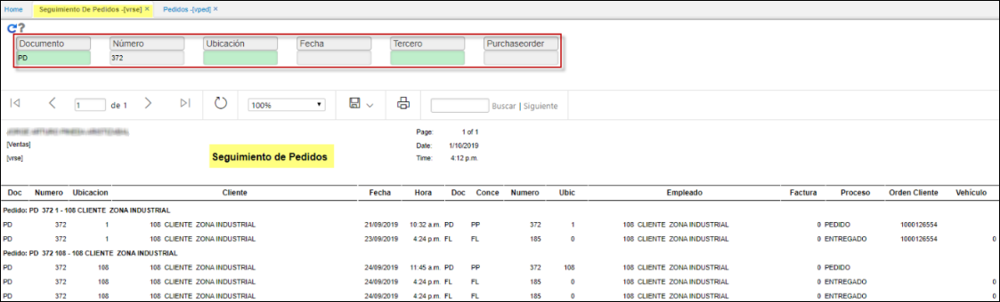

---

layout: default
title: Seguimiento de Pedidos
permalink: /Operacion/scm/ventas/vreporte/vrse
editable: si

---

# Seguimiento de Pedidos - VRSE

Reporte del modulo de ventas, donde se extrae la informacion de los **PEDIDOS - VPED.** Denominado seguimiento de Pedidos **VRSE.**

El campo proceso indica en que status se encuentra el pedido, realiza el filtro por orden del cliente, que proviene del **VPED.**

+ **Documento:** Parametrizacion del basico de documentos, **BDOC.**
+ **Numero:** Consecutivo automatico.
+ **Ubicación:** Parametrizacion del basico de Ubicaciones, **BUBI.**
+ **Fecha:** Data
+ **Tercero:** Parametrizacion del basico de terceros, BTER.
+ **Orden Compra:** Orden cliente.

