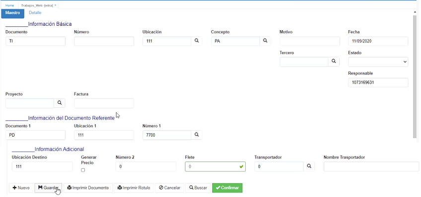
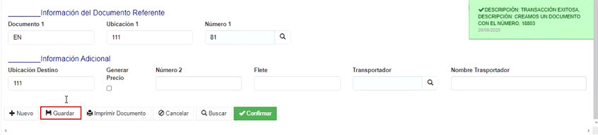
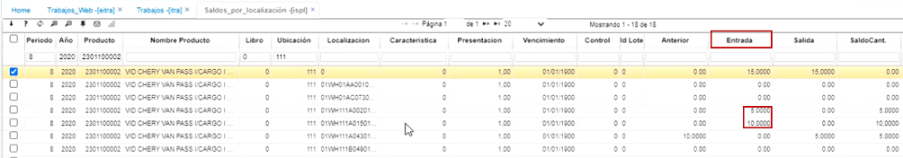

# EITRA - Trabajos Web

La aplicación EITRA permite realizar movimientos logísticos.  

## [Recoleccion]
La aplicación EITRA permite al usuario realizar el proceso de **recoleccion** de productos de forma rápida y evitar el tedioso proceso de realizarlo por medio de registros.  

Esta forma visual sólo está disponible cuando el concepto seleccionado sea un _PI - Recoleccion_.  

Para registrar la recoleccion de un pedido ingresamos a la aplicación EITRA y diligenciamos el formulario.  

## [Empaque](http://docs.oasiscom.com/Operacion/scm/wms/wmmovimient/eitra#empaque)

La aplicación EITRA permite al usuario realizar el proceso de empaque de productos de forma rápida y evitar el tedioso proceso de realizarlo por medio de registros.  

Esta forma visual sólo está disponible cuando el concepto seleccionado sea un _PA - Empaque_.  

Para registrar el empaque de un pedido ingresamos a la aplicación EITRA y diligenciamos el formulario.  

Los campos _**documento**_ y _**número**_ serán diligenciados por el sistema y no estarán habilitados para la edición. Se generará un documento _TI - Trabajos de Inventarios_.  

**Ubicación:** seleccionar del zoom la correspondiente.  
**Concepto:** Seleccionamos del zoom el concepto _PA_ referente a _EMPAQUE_.  

**Motivo:** ingresamos motivo 0.  
**Fecha:** seleccionar la fecha en que se realiza el registro del empaque.  
**Cliente Id:** este campo se diligenciará automáticamente en el momento que se haya seleccionado un pedido en el campo _NumberId1_.  
**DocumentId1:** el sistema traerá automáticamente el documento PD de Pedido.  
**LocationId1:** el sistema traerá automáticamente la ubicación 1.  
**NumberId1:** en este campo seleccionaremos del zoom el pedido que se desea empacar.  

Ingresamos los anteriores campos, damos click en _Guardar_. Inmediatamente el sistema arrojará un mensaje de control informando el número del registro.  

Ahora, nos desplazamos a la pestaña del detalle. Aquí encontraremos el esquema gráfico en donde podremos decidir en cuentas cajas se despachará el pedido y que cantidad de cada producto se irá en cada una.  

Si deseamos crear varias cajas de despacho, damos click en el botón **+**.  

**Botones:** 

 Este botón permite agregar productos parcialmente. Al dar click, se habilitará una ventana en donde podemos ingresar la cantidad de productos que se agregarán en la caja.  

 Este botón permite agregar el total de productos disponibles.  

En el siguiente ejemplo, agregaremos a la caja 1: 
* 3 unidades del producto 101
* 5 unidades del producto 102
* 1 unidad del producto 102 segundo renglón.  

El sistema irá restando y mostrando la cantidad de producto restantes de cada uno.  

Ahora, agregaremos el resto de productos a la caja 2. Para ello, podemos hacer uso del botón .  

Una vez distribuídos los productos en las cajas, el sistema deshabilitará los renglones de los productos, ya que no cuenta con más unidades disponibles y habilitará el botón _Terminar empaque_. Damos click en este botón, la ventana se cerrá y mostrará una nueva ventana de registro.  

En la aplicación _IRLE - Lista de empaque_ podemos visualizar la distribución que se realizó anteriormente.  

## [Almacenamiento WMS](http://docs.oasiscom.com/Operacion/scm/wms/wmmovimient/eitra#almacenamiento-wms)

Permite registrar el almacenamiento de mercancía en las bodegas que tengan disponibilidad.  

Para realizar el registro de un almacenamiento de mercancía, ingresamos a la aplicación EITRA y diligenciamos el formulario.  

El documento para los movimientos en la aplicación EITRA siempre será _TI_ y por lo tanto el sistema no lo dejará modificar.  

**Ubicación Id:** seleccionamos del zoom la ubicación en la cual se está registrando el almacenamiento.  
**Concepto:** abrimos el zoom y seleccionamos el concepto _AL - Almacenamiento_.  

**Motivo Id:** ingresamos motivo 0.  
**Fecha:** seleccionar la fecha en la cual se realiza el registro.  
**Número Id1:** abrimos el zoom y seleccionamos el pedido del cual realizaremos el almacenamiento de la mercancía. Al seleccionar el pedido, los campos _Cliente Id, Documento Id1_ y _Location Id1_ se diligenciarán automáticamente.  

  

Diligenciados los datos damos click en el botón _Guardar_. El sistema arrojará un mensaje de control indicando el número de consecutivo con el cual se registró.  

  

A continuación, nos dirigimos a la pestaña _Detalle_ en donde realizaremos la distribución del almacenamiento de la mercancía. En esta zona se deberán trasladar los productos (que están a la izquierda) que se desean almacenar en las posiciones que tienen definidas las bodegas.  

Para realizar el almacenamiento en las bodegas damos click en el botón . Se debe almacenar el total de la mercancía del pedido seleccionado.  

  

Se abrirá una ventana en donde se visualizarán las bodegas de almacenamiento. 

* Las posiciones en color _**Verde**_ son bodegas disponibles para almacenar mercancía ya que su capacidad no he llegado al 100%.  

* Las posiciones en color _**Naranja**_ son bodegas no disponibles ya que están con su capacidad al 100%.  

  

Para los escenarios donde existe gran cantidades de localizaciones, puede utilizar la **paginación** con los botones de desplazamiento: siguiente y atrás.  

Una vez realizado el almacenamiento, los productos se distribuirán según la localizacion seleccionada.  

Finalizado el almacenamiento, damos click en el botón _Terminar almacenamiento_.  

Al terminar el almacenamiento, se creará un registro por cada localización de las bodegas seleccionadas en el detalle de la aplicación **ITRA - Trabajos**, en donde filtraremos por el número de consecutivo del registro.  

Finalmente, procesamos el documento.  

