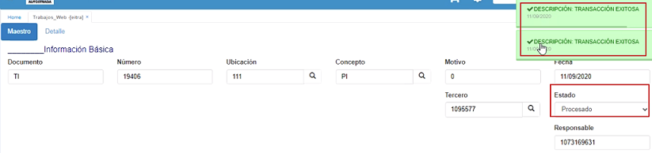
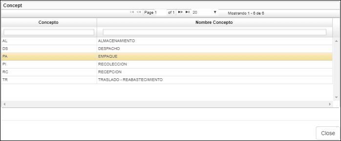
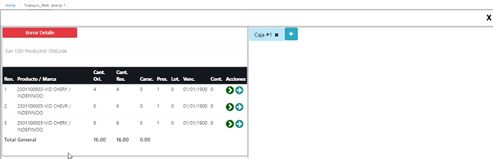

# EITRA - Trabajos Web

La aplicación **EITRA** permite realizar movimientos logísticos.  

## [Recoleccion]
La aplicación EITRA permite al usuario realizar el proceso de **recoleccion** de productos de forma rápida y evitar el tedioso proceso de realizarlo por medio de registros.  

Esta forma visual sólo está disponible cuando el concepto seleccionado sea un _PI - Recoleccion_.  

Para registrar la recoleccion de un pedido ingresamos a la aplicación EITRA y diligenciamos el formulario.  

  

Los campos _**documento**_ y _**número**_ serán diligenciados por el sistema y no estarán habilitados para la edición. Se generará un documento _TI - Trabajos de Inventarios_.  

**Ubicación:** seleccionar del zoom la correspondiente.  
**Concepto:** Seleccionamos del zoom el concepto _PI_ referente a _recoleccion_.  
**Motivo:** ingresamos motivo 0.  
**Fecha:** seleccionar la fecha en que se realiza el registro del empaque.  
**Cliente Id:** este campo se diligenciará automáticamente en el momento que se haya seleccionado un pedido en el campo _NumberId1_.  
**DocumentId1:** el sistema traerá automáticamente el documento PD de Pedido.  
**LocationId1:** el sistema traerá automáticamente la ubicación 1.  
**NumberId1:** en este campo seleccionaremos del zoom el pedido que se desea recolectar; puede visualizar, por medio de un zoom extraer datos únicamente para el recolector. ResponbleId en el documento TI x PI. como se visualiza:  
  
**Desplega el siguiente zoom, con los pedidos pendientes por recolección.**  
  

Ingresamos los anteriores campos, damos click en _Guardar_. Inmediatamente el sistema arrojará un mensaje de control informando el número del registro. Como se ilustra en la parte superior.  

En el detalle aparecen relacionados cada uno de los productos del pedido tomado como ejemplo (85).  
  
**Importante:** se debe de validar el **[VDAR]**, en el detalle campo: Idresponsable debe de ser  parametrizado en el **AREC** Recurso.  
VDAR.  

  

Ya en el detalle del **EITRA**, se ingresan la posicion campo leer posicion y en le campo Quantity edita la cantidad.  
clic en siguiente.  
Realiza la misma labor, segun la cantidad de productos que se realacionen.  Para este caso fueron tres (3).  
Por ultimo aplica el boton verde de confirmar.  

  

Se visualizara el **EITRA** asi:  

  

De esta forma finaliza el proceso de **Recoleccion.**  

## [Empaque](http://docs.oasiscom.com/Operacion/scm/wms/wmmovimient/eitra#empaque)

La aplicación EITRA permite al usuario realizar el proceso de empaque de productos de forma rápida y evitar el tedioso proceso de realizarlo por medio de registros.  

Esta forma visual sólo está disponible cuando el concepto seleccionado sea un _PA - Empaque_.  

Para registrar el empaque de un pedido ingresamos a la aplicación EITRA y diligenciamos el formulario.  

Los campos _**documento**_ y _**número**_ serán diligenciados por el sistema y no estarán habilitados para la edición. Se generará un documento _TI - Trabajos de Inventarios_.  

**Ubicación:** seleccionar del zoom la correspondiente.  
**Concepto:** Seleccionamos del zoom el concepto _PA_ referente a _EMPAQUE_.  

**Motivo:** ingresamos motivo 0.  
**Fecha:** seleccionar la fecha en que se realiza el registro del empaque.  
**Cliente Id:** este campo se diligenciará automáticamente en el momento que se haya seleccionado un pedido en el campo _NumberId1_.  
**DocumentId1:** el sistema traerá automáticamente el documento PD de Pedido.  
**LocationId1:** el sistema traerá automáticamente la ubicación 1.  
**NumberId1:** en este campo seleccionaremos del zoom el pedido que se desea empacar.  

Ingresamos los anteriores campos, damos click en _Guardar_. Inmediatamente el sistema arrojará un mensaje de control informando el número del registro.  

Ahora, nos desplazamos a la pestaña del detalle. Aquí encontraremos el esquema gráfico en donde podremos decidir en cuentas cajas se despachará el pedido y que cantidad de cada producto se irá en cada una.  

El foco se posiciona sobre el detalle de productos; cada vez que se realiza el filtro del producto.  
Se adiciona directamente el registro filtrado.  

  

Si deseamos crear varias cajas de despacho, damos click en el botón **+**.  

**Botones:** 

 Este botón permite agregar productos parcialmente. Al dar click, se habilitará una ventana en donde podemos ingresar la cantidad de productos que se agregarán en la caja.  

 Este botón permite agregar el total de productos disponibles.  

En el siguiente ejemplo, agregaremos a la caja 1: 
* 3 unidades del producto 101
* 5 unidades del producto 102
* 1 unidad del producto 102 segundo renglón.  

El sistema irá restando y mostrando la cantidad de producto restantes de cada uno.  

Ahora, agregaremos el resto de productos a la caja 2. Para ello, podemos hacer uso del botón .  

Una vez distribuídos los productos en las cajas, el sistema deshabilitará los renglones de los productos, ya que no cuenta con más unidades disponibles y habilitará el botón _Terminar empaque_. Damos click en este botón, la ventana se cerrá y mostrará una nueva ventana de registro.  

En la aplicación _IRLE - Lista de empaque_ podemos visualizar la distribución que se realizó anteriormente.  

## [Almacenamiento WMS](http://docs.oasiscom.com/Operacion/scm/wms/wmmovimient/eitra#almacenamiento-wms)

Permite registrar el almacenamiento de mercancía en las bodegas que tengan disponibilidad.  

Para realizar el registro de un almacenamiento de mercancía, ingresamos a la aplicación EITRA y diligenciamos el formulario.  

El documento para los movimientos en la aplicación EITRA siempre será _TI_ y por lo tanto el sistema no lo dejará modificar.  

**Ubicación Id:** seleccionamos del zoom la ubicación en la cual se está registrando el almacenamiento.  
**Concepto:** abrimos el zoom y seleccionamos el concepto _AL - Almacenamiento_.  

**Motivo Id:** ingresamos motivo 0.  
**Fecha:** seleccionar la fecha en la cual se realiza el registro.  
**Número Id1:** abrimos el zoom y seleccionamos el pedido del cual realizaremos el almacenamiento de la mercancía. Al seleccionar el pedido, los campos _Cliente Id, Documento Id1_ y _Location Id1_ se diligenciarán automáticamente.  

  

Diligenciados los datos damos click en el botón _Guardar_. El sistema arrojará un mensaje de control indicando el número de consecutivo con el cual se registró.  

  

A continuación, nos dirigimos a la pestaña _Detalle_ en donde realizaremos la distribución del almacenamiento de la mercancía. En esta zona se deberán trasladar los productos (que están a la izquierda) que se desean almacenar en las posiciones que tienen definidas las bodegas.  

Para realizar el almacenamiento en las bodegas damos click en el botón . Se debe almacenar el total de la mercancía del pedido seleccionado.  

  

Se abrirá una ventana en donde se visualizarán las bodegas de almacenamiento. 

* Las posiciones en color _**Verde**_ son bodegas disponibles para almacenar mercancía ya que su capacidad no he llegado al 100%.  

* Las posiciones en color _**Naranja**_ son bodegas no disponibles ya que están con su capacidad al 100%.  

  

Para los escenarios donde existe gran cantidades de localizaciones, puede utilizar la **paginación** con los botones de desplazamiento: siguiente y atrás.  
* Se coloca el foco sobre el detalle de productos cada vez que se realiza el filtro del producto. EAN 128  

*   

Una vez realizado el almacenamiento, los productos se distribuirán según la localizacion seleccionada.  

Finalizado el almacenamiento, damos click en el botón _Terminar almacenamiento_.  

Al terminar el almacenamiento, se creará un registro por cada localización de las bodegas seleccionadas en el detalle de la aplicación **ITRA - Trabajos**, en donde filtraremos por el número de consecutivo del registro.  

Finalmente, procesamos el documento.  

## [Acta Técnica Recepcion](http://docs.oasiscom.com/Operacion/scm/wms/wmmovimient/eitra#acta-tecnica-recepcion)

Lo primero que debemos hacer es configurar la variable en la aplicación **WVAR**, en el campo columna *Formula* debemos bien sea **(1)** para activo o **(0)** para desactivar la funcionalidad. 
  

El siguiente paso sera crear la orden en la aplicación Eitra con el concepto de recepción**(RC)**.
  

Luego damos clic en guardar y nos dirigimos a la pestaña detalle donde nos va a cargar el listado de productos que corresponden a la orden o pedido que se ha registrado previamente.
  

En la imagen previa podemos ver el icono de color amarillo en el cual solo podremos crear defectos técnicos.  

Una vez damos clic en el botón de color amarillo llamado *Acta Técnica* nos muestra el formulario para ser diligenciado en 3 partes como lo es Acta Técnica, Producto y Detalle de defectos.  
  
Una vez damos clic en el botón guardar él nos llevara de forma automática a la siguiente sección.
  
Nota: Para realizar la parametrización del campo **Lote** lo demos realizar en la aplicación**(BCRC)**.  

Para ir terminando damos clic en guardar y nos llevara a la última sección donde encontraremos los defectos que se hallan creado para esta orden de compra o pedido.
  
Al igual que en la sección de Producto podremos configurar la lista desplegable de estos dos últimos campos.  

**Defecto:** Esta lista se carga del programa **(BFAL)**, Carga solo registros activos, imputables y Tipo T.
**Gravedad:** Esta lista al igual que para el campo lote  se carga de la opción  características **(BCRC)**.  

## [Acta Técnica OACT](http://docs.oasiscom.com/Operacion/scm/wms/wmmovimient/eitra#acta-tecnica-oact)

Con el fin de consultar los registros creados por concepto recepción en la aplicación Eitra se creó la aplicación Acta Técnica **(OACT)**, la cual está diseñada tanto para consultar información de cada una de las actas que hayamos creado como también nos va a permitir crear novedades de tipo administrativo en las pestañas del detalle del registro del maestro.  

**Crear Registro Nuevo**  
Se podrá crear un registro nuevo a través de la opción ***oact*** de forma sencilla.
  

**Tipos de Defectos**  

A diferencia de la opción de [Acta Técnica Recepcion](http://docs.oasiscom.com/Operacion/scm/wms/wmmovimient/eitra#acta-tecnica-recepcion) en esta aplicación se pueden crear tanto Defectos Técnicos como Defectos Administrativos en las pestañas del detalle.

  

Hay que recordar que para la parametrización de la lista desplegable del campo Criterio se debe realizar dentro de la aplicación características **(BCRC)**. 
  

* Se crea la vista previa: para visualizar el reporte de fallas en el acta técnica, estas fallas se dividen en dos
  grandes campos, los defectos técnicos y los defectos administrativos.  
  Estos dos defectos se pueden visualizar a nivel de aplicativo en el **OACT** en las pestañas correspondientes.  
  Y finalmente estas pestañas son las que están resumidas en el reporte, clasificando **BCLA** las fallas como: criticas 
  mayores y menores.  
  
  
  Al descargar a PDF se visualiza asi:  
  
    
  
  

