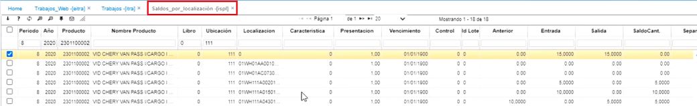
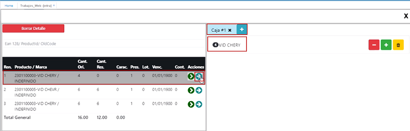
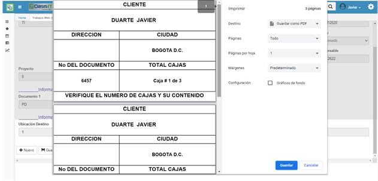
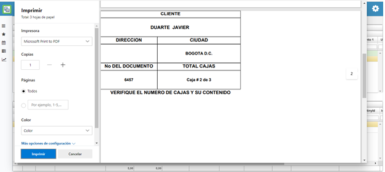

# Trabajos Web - EITRA

La aplicación **EITRA** permite realizar movimientos logísticos.  

* [Almacenamiento WMS](http://docs.oasiscom.com/Operacion/scm/wms/wmmovimient/eitra#almacenamiento-wms)  
* [Recoleccion](http://docs.oasiscom.com/Operacion/scm/wms/wmmovimient/eitra#recoleccion)
* [Empaque](http://docs.oasiscom.com/Operacion/scm/wms/wmmovimient/eitra#empaque)  
* [Despacho](http://docs.oasiscom.com/Operacion/scm/wms/wmmovimient/eitra#despacho)
* [Acta Técnica Recepcion](http://docs.oasiscom.com/Operacion/scm/wms/wmmovimient/eitra#acta-técnica-recepcion)
* [Acta Técnica OACT](http://docs.oasiscom.com/Operacion/scm/wms/wmmovimient/eitra#acta-tecnica-oact)

Para todo este proceso, se parte de la elaboración de un pedido que se crea con anticipación, el cual se debe encontrar con el Status _Pendiente por despacho_.  

## [Almacenamiento WMS](http://docs.oasiscom.com/Operacion/scm/wms/wmmovimient/eitra#almacenamiento-wms)

Permite registrar el almacenamiento de mercancía en las bodegas que tengan disponibilidad.  

Para realizar el registro de un almacenamiento de mercancía, ingresamos a la aplicación EITRA y diligenciamos el formulario.  

El **Documento** para los movimientos en la aplicación EITRA siempre será _TI_ y por lo tanto el sistema no lo dejará modificar.  

**Número:** el sistema genera el consecutivo automáticamente.  
**Ubicación:** seleccionamos del zoom la ubicación en la cual se está registrando el almacenamiento, es decir, el número que representa la bodega en la que voy a ingresar los productos.  
**Concepto:** abrimos el zoom y seleccionamos el concepto _AL - Almacenamiento_.  

**Fecha:** seleccionar la fecha en la cual se realiza el almacenamiento.    
**Tercero:** se registra el NIT del proveedor.  

Posteriormente, se registra la información del Documento Referente:  

Para esta ilustración, se crea un _Documento_ de entrada **_EN_**, en la _Ubicación_ **111**, se crea la entrada con el _Número_ **81**.  

  

Diligenciados los datos, damos click en el botón _Guardar_. El sistema arrojará un mensaje de control indicando que la transacción fue exitosa.  

  

A continuación, nos dirigimos a la pestaña _Detalle_ en donde realizaremos la distribución del almacenamiento de la mercancía. En esta pestaña se puede visualizar la siguiente información:  El producto y la cantidad de producto que se va a almacenar.  También se encuentran 2 botones en la parte derecha. El primero, sirve para agregar cantidades parciales  y el segundo para agregar la cantidad total en una posición .  

  

Para realizar el almacenamiento en las bodegas damos click en el botón .  Se abrirá una ventana en donde se visualizarán las bodegas de almacenamiento.  

* Las posiciones en color _**Verde**_ o **_Naranja_**, son bodegas disponibles para almacenar mercancía ya que su capacidad no ha llegado al 100%.  

* Las posiciones en color _**Rojo**_ son bodegas no disponibles ya que están con su capacidad al 100%.  

  

De igual manera, si se conoce el número o el nombre de la posición, se puede ingresar en el campo _Buscar Posición_, de lo contrario, se da click en las flechas que se encuentran en la parte inferior derecha para que el sistema muestre todas las posiciones que contiene la bodega.  

Una vez definida la posición, se da click en la posición y el sistema muestra otra ventana en la que se indica la cantidad de unidades a ingresar o almacenar.  Para la ilustración, se van a almacenar 5 unidades en una posición.  

  

Después de dar click en aceptar, aparece un aviso indicando que: _Se agregaron las cantidades a esta posición_.   

  

Como son 15 unidades en total, se agregan 10 unidades en otra posición.  

  

Luego de dar click en aceptar, aparece otro aviso que indica que _Ya se agregaron todas las cantidades de este producto_ y además una ventana mostrando las cantidades y la posición donde quedaron almacenadas; además, la ventana inicial donde se muestra que hay 0 productos para almacenar.  

 
Para el otro producto de la ventana, se da click en el botón  que es para almacenar todo en una misma ubicación.  

Aparece el aviso de control indicando que  _Ya se agregaron todas las cantidades de este producto_ y la ventana que muestra los productos y la posición donde quedaron almacenados; además, la ventana inicial donde se muestra que hay 0 productos para almacenar.   

Finalizado el almacenamiento, aparece en la parte inferior, el botón _Terminar almacenamiento_.  Cuando ya se está seguro de que todo quedó almacenado en el lugar correcto, se da click en este botón.    

  

Si me doy cuenta que algún producto no quedó almacenado en el lugar correcto, puedo borrar con el botón  y volver a almacenarlos.  

Después de dar click en el botón _Terminar almacenamiento_, el sistema arroja un aviso que dice: _Almacenamiento terminado correctamente_ y se creará un registro (campo _Número_) por cada localización de las bodegas seleccionadas.  

Este registro, aparece en el detalle de la aplicación **Trabajos - ITRA**, en donde filtraremos por el número de consecutivo del registro.  

Esta misma información, también se puede corroborar a través de la aplicación **Saldos por localización - ISPL**, se consulta por _Producto_ y _Ubicación_.  

  

## [Recoleccion](http://docs.oasiscom.com/Operacion/scm/wms/wmmovimient/eitra#recoleccion)
La aplicación EITRA permite al usuario realizar el proceso de **recoleccion** de productos de forma rápida y evitar el tedioso proceso de realizarlo por medio de registros.  

Esta forma visual sólo está disponible cuando el concepto seleccionado sea un _PI - Recoleccion_.  

Para registrar la recoleccion de un pedido ingresamos a la aplicación EITRA y diligenciamos el formulario.  

  

Los campos _**documento**_ y _**número**_ serán diligenciados por el sistema y no estarán habilitados para la edición. Se generará un documento _TI - Trabajos de Inventarios_.  

**Ubicación:** seleccionar del zoom la correspondiente.  
**Concepto:** Seleccionamos del zoom el concepto _PI_ referente a _recoleccion_.  
**Motivo:** ingresamos motivo 0.  
**Fecha:** seleccionar la fecha en que se realiza el registro del empaque.  
**Tercero:** este campo se diligenciará automáticamente en el momento que se haya seleccionado un pedido en el campo _NumberId1_.  
**Documento1:** el sistema traerá automáticamente el documento PD de Pedido.  
**Ubicación1:** el sistema traerá automáticamente la ubicación 1.  
**Número1:** en este campo seleccionaremos del zoom el pedido que se desea recolectar; puede visualizar, por medio de un zoom extraer datos únicamente para el recolector. Responsable en el documento TI x PI. como se visualiza:  
  

**Desplega el siguiente zoom, con los pedidos pendientes por recolección.**  
  

Nota:  El campo **Empaque** hace referencia a si un pedido debe pasar por zona de empaque o no. Si debe pasar por zona de empaque, debe tener el check activado.  

Ingresamos los anteriores campos, damos click en _Guardar_. Inmediatamente el sistema arrojará un mensaje de control informando el número del registro. Como se ilustra en la parte superior.  

En el detalle aparecen relacionados cada uno de los productos del pedido.  
   

**Importante:** Antes de comenzar el proceso, se debe ingresar a la aplicación **VDAR** para asignar el recolector de ese pedido.  En la parte inferior, en el detalle, se encuentra el campo: Idresponsable y es el campo en el que se debe ingresar el número de cédula de la persona responsable de realizar el proceso.  Debe de ser parametrizado en el **AREC** Recurso.  

  

Al dar click en editar, el sistema abre una ventana.  En esta ventana, lo primero que se debe hacer es colocar la posición en la que se encuentra diligenciando el campo _Leer posición_ para que se habilite el campo _Quantity_.  Se puede copiar la localización y colocarla en el campo _Leer posición_. Una vez ingresado el dato, inmediatamente habilita el campo _Quantity_ (Cantidad) para ingresar las cantidades del producto que se está recolectando.  En el renglón de abajo, hay un campo llamado _LocalizationDestinyId_ (localización destino), que hace referencia a la localización donde voy a llevar los productos una vez realizado el proceso de recolección o Picking. Ya que pare este ejercicio se dijo que esta recolección es con empaque, aparece en la imagen la localización correspondiente a esa zona de empaque.  Una vez realizado este proceso, se da click en siguiente. Realiza la misma labor, segun la cantidad de productos que se relacionen.  Para este caso fueron tres (3).  Como ya no hay más productos, se deshabilita la función _siguiente_. 
Por último, aplica el botón verde de confirmar.  

  

Una vez se confirma la transacción, el sistema regresa a la pantalla del maestro y el estado del documento aparece en _Procesado_

  

De esta forma finaliza el proceso de **Recoleccion.**  

Una vez se realiza y se termina este documento, se da click en nuevo para comenzar con el proceso de Empaque (Packaging).

## [Empaque](http://docs.oasiscom.com/Operacion/scm/wms/wmmovimient/eitra#empaque)

La aplicación EITRA permite al usuario realizar el proceso de empaque de productos de forma rápida y evitar el tedioso proceso de realizarlo por medio de registros.  

Esta forma visual sólo está disponible cuando el concepto seleccionado sea un _PA - Empaque_.  

Para registrar el empaque de un pedido ingresamos a la aplicación EITRA y diligenciamos el formulario.  

Los campos _**documento**_ y _**número**_ serán diligenciados por el sistema y no estarán habilitados para la edición. Se generará un documento _TI - Trabajos de Inventarios_.  

**Ubicación:** seleccionar del zoom la correspondiente.  
**Concepto:** Seleccionamos del zoom el concepto _PA_ referente a _EMPAQUE_.  

**Motivo:** ingresamos motivo 0.  
**Fecha:** seleccionar la fecha en que se realiza el registro del empaque.  
**Cliente Id:** este campo se diligenciará automáticamente en el momento que se haya seleccionado un pedido en el campo _NumberId1_.  
**DocumentId1:** el sistema traerá automáticamente el documento PD de Pedido.  
**LocationId1:** el sistema traerá automáticamente la ubicación 1.  
**NumberId1:** en este campo seleccionaremos del zoom el pedido que se desea empacar.  

Ingresamos los anteriores campos, damos click en _Guardar_. Inmediatamente el sistema arrojará un mensaje de control informando el número del registro.  

Ahora, nos desplazamos a la pestaña del detalle. Aquí encontraremos los productos que se recolectaron y que ahora se van a empacar.  En esta ventana encontramos información como nombre de los productos, cantidad pendiente por empacar y también otra información como lote y fecha de vencimiento si el producto tiene ese control y además se encuentran dos botones.   Este botón permite agregar productos parcialmente. Al dar click, se habilitará una ventana en donde podemos ingresar la cantidad de productos que se agregarán en la caja.   Este botón permite agregar el total de productos disponibles.  

Al lado derecho de la ventana, encontramos unas pestañas donde podemos crear varias cajas de despacho, dependiendo de la necesidad y para esto, damos click en el botón **+**.  

En esta ilustración, se van a agregar todos los productos del primer renglón en la caja # 1.  Para ello, se da click en el botón  de agregar todas las cantidades.  
  

Del siguiente renglón, se van a empacar 3 unidades en una segunda caja.  Se da click en (+) del lado derecho de la ventana para crear la segunda caja y posteriormente se da click en el botón  para agregar 3 unidades de las 6 que hay en ese lote.  

  

Del lote del tercer renglón, también empacamos 3 unidades en la misma caja con el mismo procedimiento.  

Ahora, agregaremos el resto de productos a la caja 3 con el mismo procedimiento.  

Si me doy cuenta que la distribción en las cajas no quedó bien, existen 3 botones al lado derecho que me permiten: _Eliminar cantidades_ , _Agregar cantidades_  o _Eliminar todas las cantidades_ . Una vez distribuídos los productos en las cajas, el sistema deshabilitará los renglones de los productos, ya que no cuenta con más unidades disponibles y habilitará el botón _Terminar empaque_. Damos click en este botón, la ventana se cerrará y mostrará una nueva ventana de registro.  

En la aplicación _IRLE - Lista de empaque_ podemos visualizar la distribución que se realizó anteriormente.  

**Impresión de Rótulos**  

Esta funcionalidad se puede encontrar en la lista de botones en la función de **PA - Empaque**, opción *Imprimir Rotulo*.  
  

Una vez damos clic en este botón se visualiza una vista previa de los datos del rotulo del pedido que deseamos realizar.  
  

Posterior a esto nos muestra la opción para poder imprimirlo ya sea directamente o algún otro formato como PDF.  
  

También es importante conocer que dentro de la aplicación **ITRA - Trabajos** encontramos esta misma funcionalidad de impresión de rótulos.  
  

Al dar clic en el botón imprimir rotulo ubicado en el detalle del registro se visualizará la opción para imprimir el rotulo en el formato que se desee.  

## [Despacho](http://docs.oasiscom.com/Operacion/scm/wms/wmmovimient/eitra#despacho)  

Para registrar el despacho de un pedido, ingresamos a la aplicación EITRA y diligenciamos el formulario.  En esta ocasión, en el campo _Concepto_, elegimos la opción _**DS**_ que corresponde a _Despacho_ y en el campo _Número1_, se relaciona nuevamente el pedido.  

  

Se da click en guardar y aparece el aviso de transacción exitosa.  

  

Ahora, lo que se hace es verificar en el detalle que efectivamente los productos que se solicitaron en el pedido, sean los mismos que aparecen en el registro para despachar.  En esta ventana, la localización en la que se encuentran los productos es la _**99**_ que es la que corresponde a la salida.  

Ahora se regresa al _Maestro_ y se da click en confirmar.  Aparece el aviso de transacción exitosa.  Con este proceso, se realiza la salida de los productos de la bodega.  

  

## [Acta Técnica Recepcion](http://docs.oasiscom.com/Operacion/scm/wms/wmmovimient/eitra#acta_técnica_recepcion)

Lo primero que debemos hacer es configurar la variable en la aplicación **WVAR**, en el campo columna *Formula* debemos bien sea **(1)** para activo o **(0)** para desactivar la funcionalidad. 
  

El siguiente paso sera crear la orden en la aplicación Eitra con el concepto de recepción**(RC)**.
  

Luego damos clic en guardar y nos dirigimos a la pestaña detalle donde nos va a cargar el listado de productos que corresponden a la orden o pedido que se ha registrado previamente.
  

En la imagen previa podemos ver el icono de color amarillo en el cual solo podremos crear defectos técnicos.  

Una vez damos clic en el botón de color amarillo llamado *Acta Técnica* nos muestra el formulario para ser diligenciado en 3 partes como lo es Acta Técnica, Producto y Detalle de defectos.  
  
Una vez damos clic en el botón guardar él nos llevara de forma automática a la siguiente sección.
  
Nota: Para realizar la parametrización del campo **Lote** lo demos realizar en la aplicación**(BCRC)**.  

Para ir terminando damos clic en guardar y nos llevara a la última sección donde encontraremos los defectos que se hallan creado para esta orden de compra o pedido.
  
Al igual que en la sección de Producto podremos configurar la lista desplegable de estos dos últimos campos.  

**Defecto:** Esta lista se carga del programa **(BFAL)**, Carga solo registros activos, imputables y Tipo T.
**Gravedad:** Esta lista al igual que para el campo lote  se carga de la opción  características **(BCRC)**.  

- Los campos: Lote, **Temperatura**, Vencimiento, Localización se reflejaran en la vista previa del ITRA, al procesar el documento.  
  
Para imprimir **ITRA**:  
  

## [Acta Técnica OACT](http://docs.oasiscom.com/Operacion/scm/wms/wmmovimient/eitra#acta-tecnica-oact)

Con el fin de consultar los registros creados por concepto recepción en la aplicación Eitra se creó la aplicación Acta Técnica **(OACT)**, la cual está diseñada tanto para consultar información de cada una de las actas que hayamos creado como también nos va a permitir crear novedades de tipo administrativo en las pestañas del detalle del registro del maestro.  

**Crear Registro Nuevo**  
Se podrá crear un registro nuevo a través de la opción ***oact*** de forma sencilla.
  

**Detalle:**  
Se relacionan los productos y se descripcion.  
Vida util: este campo realiza el calculo, cuando no se conoce la fecha de fabricación; se toma que la vida útil del medicamento es de 2 años o 24 meses. Y se refleja en EITRA.  

**Tipos de Defectos**  

A diferencia de la opción de [Acta Técnica Recepcion](http://docs.oasiscom.com/Operacion/scm/wms/wmmovimient/eitra#acta-tecnica-recepcion) en esta aplicación se pueden crear tanto Defectos Técnicos como Defectos Administrativos en las pestañas del detalle.

  

Hay que recordar que para la parametrización de la lista desplegable del campo Criterio se debe realizar dentro de la aplicación características **(BCRC)**. 
  

* Se crea la vista previa: para visualizar el reporte de fallas en el acta técnica, estas fallas se dividen en dos
  grandes campos, los defectos técnicos y los defectos administrativos.  
  Estos dos defectos se pueden visualizar a nivel de aplicativo en el **OACT** en las pestañas correspondientes.  
  Y finalmente estas pestañas son las que están resumidas en el reporte, clasificando **BCLA** las fallas como: criticas 
  mayores y menores.  
  
  
  Al descargar a PDF se visualiza asi:  
  
    
  
  

