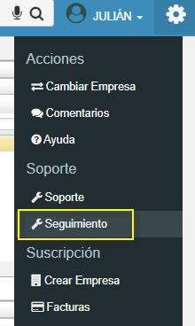
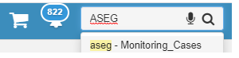
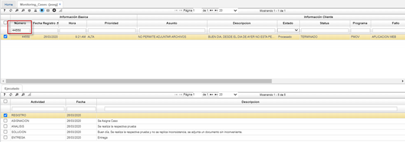
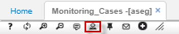
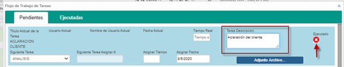

# Seguimiento - ASEG

Para hacer seguimiento a los casos de soporte reportados desde la aplicación [**ASOP - Soporte**](http://docs.oasiscom.com/Operacion/system/sacceso/asop) en el sistema OasisCom, ingresaremos a la aplicación **ASEG - Monitoring Cases**, en donde se podrán observar las etapas en las que se encuentra el caso reportado. Para ingresar a esta aplicación hay dos opciones: Consultando en el buscador del sistema por el nemótecnico de la aplicación, es decir, ASEG o vamos a ir al botón de configuración y la opción seguimiento.  

O por la barra de búsqueda ingresamos la opción “ASEG”.  

Se abrirá la ventana y podremos filtrar por el numero del caso. En la parte del maestro (parte superior) encontraremos la información suministrada por parte de la empresa y en la parte del detalle (parte inferior) encontraremos las respuestas por parte del consultor.   

Recordemos que podemos realizar aclaraciones por si el consultor requiere mas información acerca del caso o si ya la empresa quiere realizar una aclaración para averiguar por la validación del caso o alguna otra aclaración que se requiera.   

Esta aclaración la podemos realizar en el botón “WORKFLOW” que se encuentra en nuestra barra de herramientas en la parte superior.   

Se abrirá una ventana, y en el campo descripción realizaremos nuestra aclaración. Luego damos clic en el botón ejecutado.   

Y esta respuesta se emitirá al consultor de soporte y adicionalmente aparecerá en el detalle del programa ASEG.   

