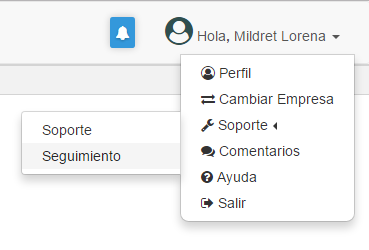
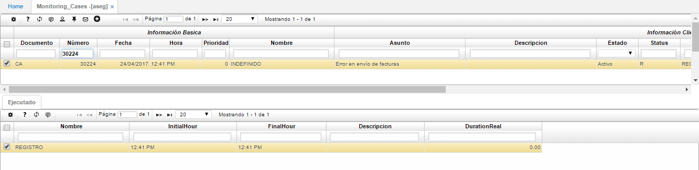

## Monitoring Cases - ASEG

Para hacer seguimiento a los casos de soporte reportados desde la aplicación [**ASOP - Soporte**](http://docs.oasiscom.com/Operacion/system/sacceso/asop) en el sistema OasisCom, ingresaremos a la aplicación **ASEG - Monitoring Cases**, en donde se podrán observar las etapas en las que se encuentra el caso reportado. Para ingresar a esta aplicación hay dos opciones:  

 * Consultando en el buscador del sistema por el nemótecnico de la aplicación, es decir, ASEG.  

 * Dando click en el nombre del usuario, ubicado en la parte superior derecha de la pantalla, se desplegará una ventana con diferentes opciones, allí seleccionaremos la pestaña de _Soporte_ y seguidamente la opción _Seguimiento_.  

Ubicados en la aplicación **ASEG** consultamos por el número de caso arrojado en la aplicación [**ASOP - Soporte**](http://docs.oasiscom.com/Operacion/system/sacceso/asop) y damos _Enter_.  

En el detalle, irán apareciendo las etapas en que se encuentra el caso de soporte cargado una vez sea asignado a un técnico por parte de OasisCom, igualmente, cada etapa estará acompañada de una descripción de lo que se hizo en esta. La persona delegada por el cliente como contacto con el soporte de OasisCom, recibirá correos electrónicos donde se informará del cambio de etapa.  

