# Soporte - ASOP 

## Creación de casos 

Para realizar la creación de casos de soporte en el sistema OasisCom ingresaremos a la aplicación **ASOP - Soporte**. Para ingresar a esta aplicación hay dos opciones: Consultando en el buscador del sistema por el nemótecnico de la aplicación, es decir, ASOP o en el botón de configuraciones que se encuentra en la parte superior derecha.   

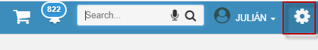

Se despliega una lista de opciones y seleccionaremos la opción “Soporte”.   

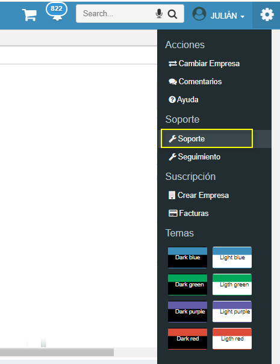

O desde la barra de búsqueda podemos escribir la opción “ASOP” 

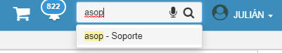

A continuación, se abrirá la aplicación para comenzar a diligenciar los datos pertinentes que se solicita para la creación del caso.   

Tendremos cuatro partes: Contrato, Problema, Contacto y envío.  

### Contrato  

En esta ventana elegiremos el tipo de contrato de soporte, por lo general los campos “Tipo de soporte” y “Contrato” traen la información automáticamente de la siguiente manera  

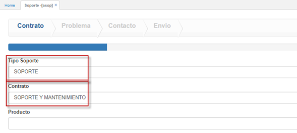

Seleccionaremos la opción de producto y se desplegará los productos contratados, en este caso elegiremos “SOPORTE SEGUNDO NIVEL OASISCOM”  

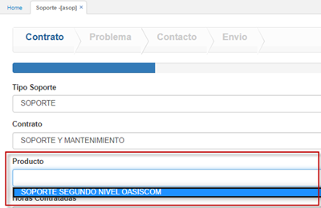

Automáticamente se evidenciará las horas contratadas de soporte y en la parte inferior derecha se habilitará el botón “NEXT” para continuar con el diligenciamiento.   

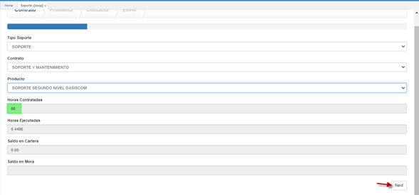

En algunos navegadores el botón “NEXT” aparecerá oculto  

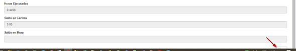

En este caso es necesario bajar el porcentaje de zoom del navegador. Esto se realiza en el botón de configuraciones de cada navegador que aparece al terminar la barra de url y podrán visualizar el botón.   

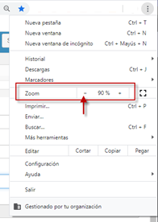  

### Problema   

En esta ventana diligenciaremos en donde se presenta el problema y realizaremos una descripción del inconveniente presentado. En este caso haremos un ejemplo de un error presentado en factura electrónica.   
Primero indicaremos la gravedad del inconveniente, esta gravedad la indicará cada empresa. (Recordemos que una vez llega el caso al área de soporte, se le asignara una prioridad según la criticidad de este). Para nuestro ejemplo elegiremos la opción “ALTA”.   

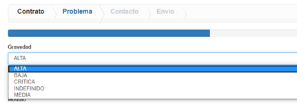  

Luego indicaremos el tipo de fallo según las opciones que nos indica el sistema.  

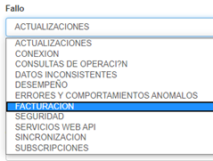 

Después elegiremos el modulo donde se presenta la falla. Ejemplo: facturación, tesorería, contabilidad, inventario, etc. Para nuestro ejemplo elegiremos “Factura electrónica”.  

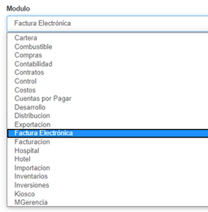 

Luego, elegiremos el programa donde se presenta el inconveniente según el modulo que se escogió.  

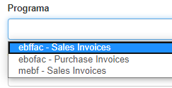 

El siguiente que elegiremos será la categoría, en este caso elegiremos para nuestro ejemplo “Factura Electrónica”.  

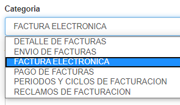 

Después de diligenciar estos datos, indicaremos el asunto y la descripción del inconveniente presentado, recodemos que en el campo asunto debe ir una descripción breve del error y en la descripción un detallado del inconveniente.  

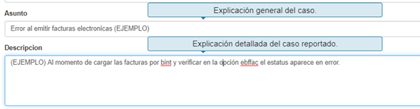 

Después nos solicitará la fecha de inicio del problema, el cual por defecto deja la fecha del mismo día en el cual se coloca el caso, nos pide también la causa del problema el cual podemos elegir de las varias opciones que nos arroja el sistema y también podemos adjuntar archivos, ya sean imágenes de pantalla del error o algún otro tipo de archivo que pueda ayudar a identificar más rápido el inconveniente.  

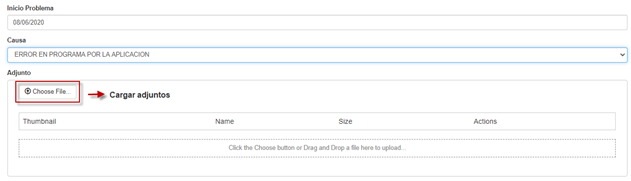

Para cargar los archivos adjuntos únicamente se oprime el botón “Choose File”, se abrirá una ventana para seleccionar el archivo que cargaremos, luego se oprime el botón “Abrir” y quedara cargado el archivo. Y finalizado estos pasos damos nuevamente en el botón “NEXT”.   

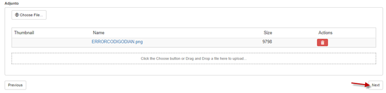

### Contacto  

En esta ventana únicamente se verificarán los datos del usuario quien esta colocando el caso de soporte. En este caso solamente daremos clic en el botón “NEXT”   

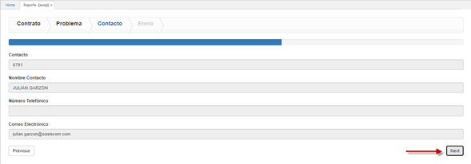

### Envio

En esta ultima ventana, indicaremos con el check que aceptamos los términos y condiciones de soporte y damos clic en el botón “SUBMIT”.   

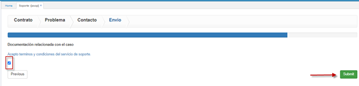

Al momento de oprimir el botón “SUBMIT” nos aparecerá un letrero en la parte superior derecha confirmando el cargue y el numero de caso.   

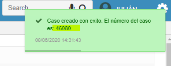
