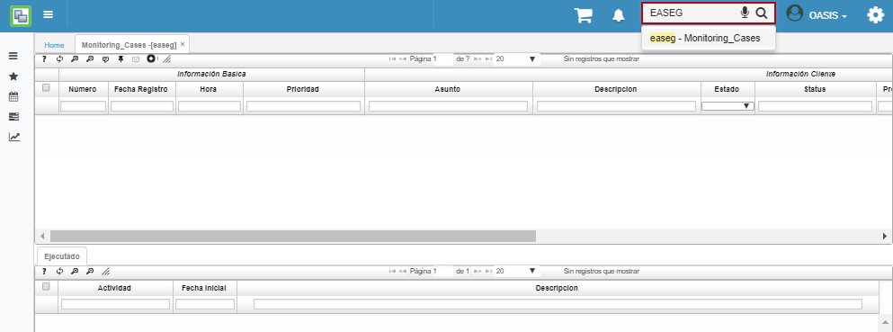
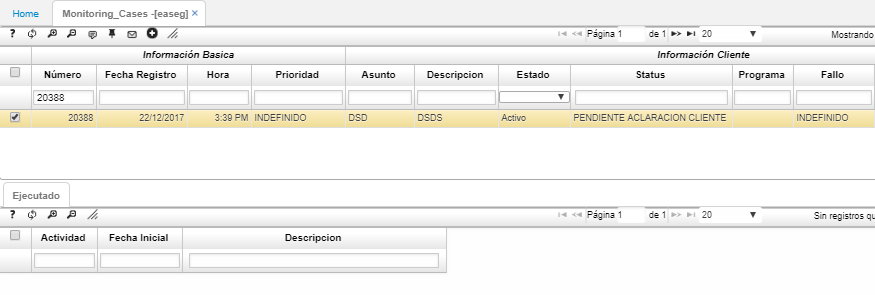

## EASEG - Monitoreo de Casos

Para hacer seguimiento a los casos de soporte reportados desde la aplicación [**EACAS - Colocar Casos de Soporte**](http://docs.oasiscom.com/Operacion/crm/portal/cliente/eacas) en el sistema OasisCom, ingresaremos a la aplicación **EASEG - Monitoreo de Casos**, en donde se podrán observar las etapas en las que se encuentra el caso reportado.  

Ingresamos a la aplicación consultando en el buscador del sistema por el nemótecnico de la aplicación, es decir, EASEG.  

Ubicados en la aplicación **EASEG** consultamos por el número de caso arrojado en la aplicación [**EACAS - Colocar Casos de Soporte**](http://docs.oasiscom.com/Operacion/crm/portal/cliente/eacas) y damos _Enter_.  

En el detalle, irán apareciendo las etapas en que se encuentra el caso de soporte cargado una vez sea asignado a un técnico por parte de la empresa, igualmente, cada etapa estará acompañada de una descripción de lo que se hizo en esta. La persona delegada por el cliente como contacto con el soporte de la empresa, recibirá correos electrónicos donde se informará del cambio de etapa.  
