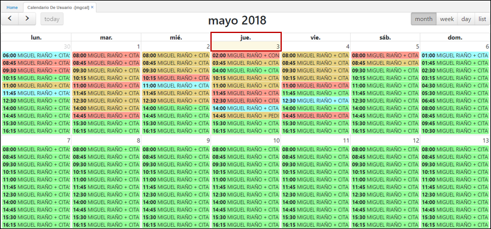
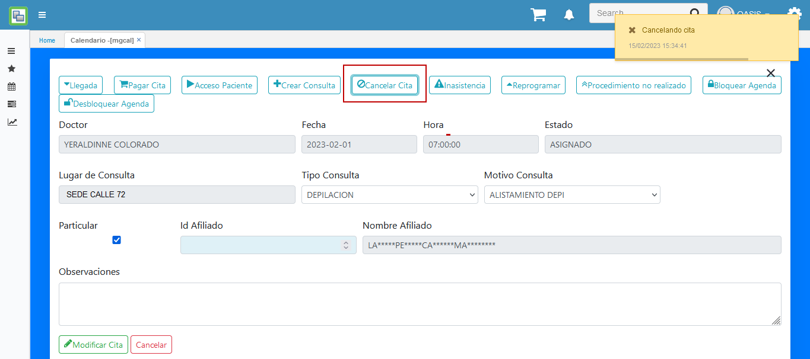
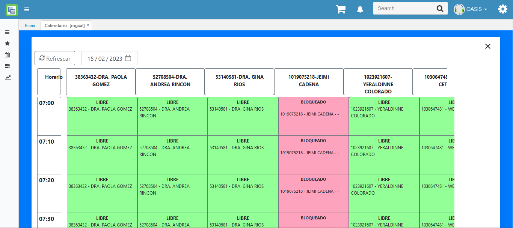

# MGCAL - Calendario de Usuario

La opción MGCAL - Calendario de Usuario, muestra la planeación actual de los recursos (Doctores) que se encuentran asociados a la entidad de forma más dinámica y sencilla. 

* [Crear Cita](http://docs.oasiscom.com/Operacion/is/hospital/gcita/mgcal#Crear-Cita)
* [Cancelar Cita](http://docs.oasiscom.com/Operacion/is/hospital/gcita/mgcal#Cancelar-Cita)
* [Inasistencia](http://docs.oasiscom.com/Operacion/is/hospital/gcita/mgcal#Inasistencia)
* [Botón Recurso por Día](http://docs.oasiscom.com/Operacion/is/hospital/gcita/mgcal#Botón-Recurso-por-Día)
* [Filtro por Semana](http://docs.oasiscom.com/Operacion/is/hospital/gcita/mgcal#Filtro-por-Semana) 

En la aplicación se visualiza los horarios del día los cuales puenden estar en cuatro status diferentes:  

* Libre  
* Asignado  
* Paciente en sala  
* En atención  

Estos estados van cambiando dependiendo de la acción realizada por un usuario para asignar una cita a un paciente, indicar la llegada de un paciente o indicar que ya se está atendiendo al mismo.  

## [Crear Cita](http://docs.oasiscom.com/Operacion/is/hospital/gcita/mgcal#Crear-Cita)

Para crear una cita ingresamos a la aplicación MGCAL y seleccionamos el dia.  

Seleccionamos un horario del día seleccionado.  

A continuación diligenciamos los datos del formulario y damos click en el botón _Crear cita_. El sistema indicará mendiente un mensaje de control que la cita fue creada correctamente.  

En el momento en que llegue el paciente a cumplir su cita, se deberá dar click en el botón **_Llegada_**.  

Seguidamente damos click en el botón **_Pagar Cita_** y el sistema creará automáticamente la factura en la aplicación GFAC - Facturas.  

Debemos ingresar a la aplicación GFAC a consultar la factura generada.  

Una vez pagada la factura, damos acceso al paciente mediante el botón **_Acceso paciente_**.  

Una vez ingresa el paciente al consultorio, creamos una nueva consulta dando click en el botón **_Crear Consulta_**. La consulta la debemos diligenciar en la aplicación _GCON - Consultas_ con datos como: motivo de consulta, la enfermedad actual,antecedentes, entre otros.

En GCON - Consultas.  

## [Cancelar Cita](http://docs.oasiscom.com/Operacion/is/hospital/gcita/mgcal#Cancelar-Cita)

Para cancelar una cita, esta se debe encontrar en status _ASIGNADO_.  

Ingresamos a la cita y damos click en el botón **_Cancelar Cita_**.  

## [Inasistencia](http://docs.oasiscom.com/Operacion/is/hospital/gcita/mgcal#Inasistencia)

Para reportar que el paciente no asistió a la cita, ingresamos a la cita asignada y damos click en el botón **_Inasistencia_**.  

El status de la cita cambiará a **_Inasistencia_**.  

## [Botón Recurso por Día](http://docs.oasiscom.com/Operacion/is/hospital/gcita/mgcal#Botón-Recurso-por-Día) 

 Esta funcionalidad sirve para visualizar los recursos asignados en un día especifico.
 
 
 
 Se muestra las citas y recursos segun el status de cada registro.
 
   
 
 
 ## [Filtro por Semana](http://docs.oasiscom.com/Operacion/is/hospital/gcita/mgcal#Filtro-por-Semana)

 Permite realizar el filtro por semana diferente a
la actual, siempre y cuando este activo el *flag*
en el *WVAR – Variables*. Como se indica en la
siguiente imagen, se tiene la sección de filtros.

Para este caso es necesario usar el filtro de
DateInitial y diligenciar el día de la semana que
se quiere mostrar con formato **DD/MM/YYYY**. Al
realizar el filtro se muestra la semana según el
día filtrado.

Al realizar una búsqueda por otro día se agrega
un nuevo filtro, en este caso es necesario
eliminar el filtro anterior, es decir el día 
10/01/2023, ya que el proceso debe encontrar solo 
un registro con el dato *DateInitial*.

Una vez eliminado el filtro (10/01/2023) se
realiza la carga de los datos de manera correcta 
tal como se observa en la imagen del ejemplo (05/01/2023).

**Nota**: El filtro aplica solo cuando la configuración de calendario por semana este marcado como 1, de lo contrario el mostrará el calendario por mes

 
