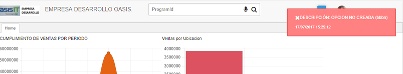
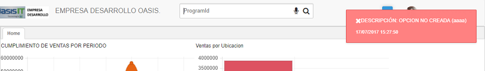
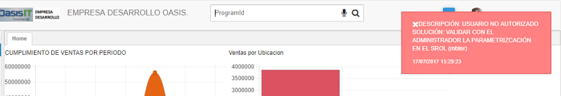

# SEGURIDAD

OasisCom cuenta con una seguridad de ingreso por cada usuario en la cual se debe diligenciar una contraseña para ingresar al sistema, a nivel interno se tienen roles para los usuarios en donde se les otorga o restringe el acceso a las aplicaciones del sistema y así mismo dentro de las aplicaciones se les puede otorgar o restringir permisos para modificación, creación o eliminación de documentos o de un campo en específico.

Es por esto, que OasisCom cuenta con mensajes de control en donde les indica a los usuarios el porque no pueden ingresar a una aplicación específica, los mensajes que se pueden obtener son:

- Si la opción no está creada en la aplicación SPRO - Programas, se muestra el siguiente mensaje de control cuando el usuario digite el nombre de la aplicación:

- Si la opción está creada en la aplicación SPRO - Programas, pero no contiene las características correspondientes, en este caso el campo vista, se mostrará el siguiente mensake:

- Si la opción está creada en la aplicación SPRO - Programas y contiene sus características correspondientes (campo vista), pero no esta asociada al rol del usuario que consulta la aplicación, se mostrará el siguiente mensaje:

